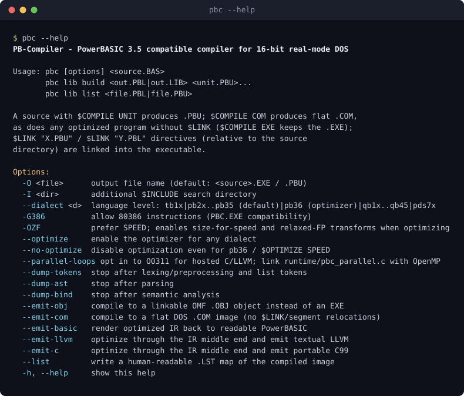

Warning: truncated output (original token count: 28453)
Total output lines: 953

# PB-Compiler

[](https://github.com/Hawkynt/PB-Compiler/blob/main/LICENSE)
[](https://github.com/Hawkynt/PB-Compiler)

[](https://github.com/Hawkynt/PB-Compiler/actions/workflows/ci.yml)


[](https://github.com/Hawkynt/PB-Compiler/stargazers)
[](https://github.com/Hawkynt/PB-Compiler/network/members)
[](https://github.com/Hawkynt/PB-Compiler/issues)


[](https://github.com/Hawkynt/PB-Compiler/releases/latest)
[](https://github.com/Hawkynt/PB-Compiler/releases)
[](https://github.com/Hawkynt/PB-Compiler/releases)

> A from-scratch PowerBASIC-family compiler that turns vintage BASIC into real 16-bit DOS
> executables — written in modern C#, runnable on any 64-bit host, and driven against the
> original compilers until its programs behave identically, documented bugs and all.

<p align="center">
  
</p>

PB-Compiler (`pbc`) reads unmodified BASIC source from the DOS era and emits real
binaries you can run on actual DOS or in DOSBox:

- **`.EXE`** — DOS MZ executables for 8086+ real mode,
- **`.PBU`** — compiled units (`$COMPILE UNIT`),
- **`.PBL`** — unit libraries (linkable via `$LINK`).

Two things make it interesting. First, **fidelity**: for the historic dialects
it doesn't merely *resemble* the genuine compilers — it is driven against the
original binaries and produces **byte-identical output**, documented bugs and
all. Second, **a forward path**: a real SSA-based optimization pipeline and
lean-output backend — available in *every* dialect via `--optimize` and on by
default in the `pb36` language-features superset — that drops a hello world from a
fat always-linked runtime to a 25-byte image while every existing program keeps
behaving exactly as it did.

("Byte-identical" here and below always means the program's **output**, which the oracle harness
diffs after running both executables. Nothing compares compiled images; the contract is that a
program behaves the same and its artefacts are usable the same way.)

## 🧭 Vision

PowerBASIC for DOS is proprietary, 16-bit and long out of print, which means the programs written in
it are slowly becoming unbuildable. This is a compiler for that language family written from scratch
in C#, running on hardware that still exists and emitting binaries that still run.

Fidelity is the contract, not the aspiration: the historic dialects are driven against the original
compilers until behaviour matches, documented bugs included, because a compiler that is *nearly*
compatible is a compiler you cannot trust with old source. On top of that sits a forward path — a
real optimization pipeline and a lean backend — that existing programs opt into without changing.

## ✨ Features

- Reads unmodified DOS-era BASIC and emits real DOS MZ `.EXE`, compiled units (`.PBU`) and unit libraries (`.PBL`)
- Fidelity as a hard contract: the historic dialects are driven against the original binaries until program behaviour matches, documented bugs included
- An SSA-based optimization pipeline available in every dialect via `--optimize`
- A `pb36` superset that adds language features while leaving existing programs behaving as they did
- Runs on any 64-bit host; the output runs on real DOS or in DOSBox

## 🧩 Support matrix

The dialect is chosen with `--dialect` (default `pb35`). Selecting an older
dialect both **gates** newer language features (they raise a diagnostic) and
**re-enables that version's documented bugs** — bug compatibility is part of
fidelity (see [docs/QUIRKS.md](docs/QUIRKS.md)). Two product families share the
flag: the Borland lineage (Turbo Basic → PowerBASIC, same author, Bob Zale) and
the Microsoft lineage (QuickBASIC → BASIC PDS).

| Dialect | Flag | Family / era | Notes |
|---|---|---|---|
| Turbo Basic 1.0 / 1.1 | `tb10` `tb11` | Borland, 1987 | PowerBASIC's direct ancestor; 16-significant-digit "double-everything" runtime, three-digit exponents. Output verified against genuine TB.EXE. |
| PowerBASIC 2.0 / 2.1 | `pb20` `pb21` | Borland | Core BASIC baseline (no inline `!` asm, no QUAD, no pointers). `pb21` output verified against PB.EXE 2.10. |
| PowerBASIC 3.0 | `pb30` | Borland, 1993 | Inline assembler, 80386 codegen, unsigned types, QUAD, TYPE/UNION, HUGE arrays. Output verified against PBC.EXE 3.0c. |
| PowerBASIC 3.1 | `pb31` | Borland | Typed radix literals, whole-UDT compare, `ALIAS`, `ANY` parameters. |
| PowerBASIC 3.2 | `pb32` | Borland | Data and code pointers, `VARPTR32`/`STRPTR32`/`CODEPTR32`, identifier underscores. |
| **PowerBASIC 3.5** | **`pb35`** | Borland, 1997 | **The reference dialect (default).** ASCIIZ, `&` concat, VIRTUAL arrays, `REDIM PRESERVE`, indexed pointers, STDIN/STDOUT, `TRIM$`, `SIZEOF`, and more. Output verified against PBC.EXE 3.50. |
| **PowerBASIC 3.6** | **`pb36`** | Hawkynt | **The language-features superset.** A strict superset of `pb35`: every `pb35` program compiles unchanged and behaves identically, plus opt-in modern syntax. |
| BASICA / GW-BASIC | `basica` `gw` | Microsoft (interpreters) | The classic line-numbered interpreters. SINGLE is stored in genuine Microsoft Binary Format (MBF) with x87 conversion on load/store; DOUBLE (MBF 8-byte) and the interpreter-oracle harness are in progress (see roadmap below). |
| QuickBASIC 1.0–4.5 | `qb10` `qb20` `qb30` `qb40` `qb45` | Microsoft | QB display model (D exponents), BASCOM runtime heritage (^Z, half-away rounding) through 3.0. Output verified against the genuine BASCOM/BC/QB toolchains. |
| QBasic | `qbasic` | Microsoft (interpreter) | The MS-DOS 5.0+ interpreter — the QuickBASIC 4.5 language (IEEE floats) minus the compiler. Compiles via the QB 4.5 front end; oracle-verified by interpreter output diff (in progress). |
| BASIC PDS 7.0 / 7.1 | `pds70` `pds71` | Microsoft | "QB Extended"; 15-digit DOUBLE display. Output verified against BC.EXE 7.0/7.1. |

The historic dialects (everything except `pb36`) are validated by an
oracle-driven **differential harness**: when the genuine compiler is dropped into
`tools/<dialect>/`, `scripts/run-diff-tests.sh` compiles each test program with
both `pbc` and the original and asserts the outputs match byte for byte. See
[docs/DIALECTS.md](docs/DIALECTS.md) for the PowerBASIC feature matrix,
[docs/CONFORMANCE.md](docs/CONFORMANCE.md) for the positive, negative, syntax-oracle and runtime-oracle test lanes, and
[docs/BASIC-FAMILY.md](docs/BASIC-FAMILY.md) for the cross-family lineage.

## 📦 Installation

### Build

```bash
git clone https://github.com/Hawkynt/PB-Compiler
cd PB-Compiler
dotnet build -c Release
```

`pbc` (the CLI front end) is built from `pbc/`; the compiler itself lives in the
`PowerBasic.Compiler/` library.

### Compile a program

```basic
' HELLO.BAS
PRINT "Hello, World!"
```

```bash
dotnet run --project pbc -- HELLO.BAS        # -> HELLO.EXE (DOS MZ, real mode)
```

Then run the result in DOSBox:

```bash
dosbox -c "mount c ." -c "c:" -c "HELLO.EXE"
```

### Usage

```bash
pbc HELLO.BAS                 # -> HELLO.EXE (DOS MZ, real mode)
pbc --dialect pb36 HELLO.BAS  # pb36 syntax features (optimizer on by default)
pbc --dialect qb45 OLD.BAS    # compile a QuickBASIC 4.5 source
pbc --optimize OLD.BAS        # run the optimizer for any dialect
pbc --no-optimize APP.BAS     # disable the optimizer (faithful codegen)
pbc --no-x-backend OLD.BAS    # rejected: the routed backend is mandatory
pbc -G386 TEST.BAS            # allow 80386 instructions ($CPU 80386)
pbc UNIT.BAS                  # $COMPILE UNIT inside -> UNIT.PBU
pbc MAIN.BAS                  # $LINK "UNIT.PBU" / "MY.PBL" inside -> linked EXE
pbc --emit-c PROG.BAS         # optimize through the IR and emit portable C99
pbc --emit-llvm PROG.BAS      # ... or textual LLVM for the native toolchain
pbc lib build MY.PBL *.PBU    # bundle units into a library
pbc lib list MY.PBL           # show exports/imports of a library or unit
```

Useful options: `-O <file>` (output name), `-I <dir>` (`$INCLUDE` search path),
`-L <dir>` (`$LINK` search path), the runtime-check switches `-EB`/`-EN`/`-EO`/`-ES`
(bounds/numeric/overflow/stack), and `-OZF` (`$OPTIMIZE SPEED`). The full list is
`pbc --help`, shown [at the top of this page](#pb-compiler).

## 🚀 Quick start

```bash
pbc HELLO.BAS -o HELLO.EXE          # a DOS MZ executable
pbc HELLO.BAS -o HELLO.EXE --optimize
```

Run the result on DOS or in DOSBox. [Getting started](#-installation) below covers the dialect
selection and the unit/library forms.

## ❓ Why

PowerBASIC for DOS is proprietary, 16-bit and long out of print — it cannot run
on modern 64-bit hosts. PB-Compiler is a clean-room, cross-platform
reimplementation so that PB codebases (such as
[PB-SvgaLibrary](https://github.com/Hawkynt/PB-SvgaLibrary)) can be built and
verified on modern machines and CI, while the binaries it produces still run on
the original target: 8086+ real mode under DOS or DOSBox. Along the way it grew
into a broader DOS-BASIC toolchain — Turbo Basic, QuickBASIC and BASIC PDS — and
into `pb36`, a what-if "next PowerBASIC" that keeps the language but rebuilds the
back end around modern optimization.

## 🆕 PowerBASIC 3.6 — what's new

`pb36` answers a simple question: *what if there had been one more DOS release?*
It is the **language-features** dialect — a strict superset of `pb35` that adds
opt-in modern syntax and compiler sugar while keeping the same observable behavior.
Every `pb36` construct is rejected below 3.6 with a `requires PowerBASIC 3.6`
diagnostic, and none of it changes the meaning of an existing `pb35` program. Full
detail in [docs/PB36.md](docs/PB36.md); the highlights:

> **Optimization is a separate, dialect-independent axis.** The full optimization
> pipeline (below) is always reachable from the command line in *any* dialect via
> `--optimize`; `pb36` simply turns it on by default. So you can compile faithful
> `pb35` (or QuickBASIC, or Turbo Basic) source with the optimizer on, or compile
> `pb36` with `--no-optimize` — syntax level and optimization level are chosen
> independently.

**Declarations and initialization**
- **`DIM` with initializer** — `DIM x = value` (type inferred) or
  `DIM x AS type = value`.
- **Array initializer literals** — `DIM a%() = {10, 20, 30}`, with inclusive
  ranges (`lo..hi`) and spread of a static array (`..arr`); the same literal in
  square brackets — `DIM a%() = [99..105]` — doubles as a range/collection literal.
- **Object initializers** — `DIM p = NEW Udt { .field = value, ... }`.
- **`ENUM` blocks** — named compile-time integer constants in their own
  namespace; the enum name aliases its underlying integer type.

**Expressions and operators**
- **Compound assignment** — `+= -= *= /= \= ^= &=`, and the shift/rotate
  operators below (e.g. `n% += 1`, `s$ &= t$`, `n% <<= 1`).
- **Short-circuit ternary `IF()`** — `IF(cond, whenTrue, whenFalse)` evaluates
  only the taken branch.
- **`ANDALSO` / `ORELSE`** — short-circuiting boolean operators (vs. PB's bitwise
  `AND`/`OR`).
- **Shift / rotate / bitwise operators** — `<<`, `>>`, `<<<`, `>>>`, `<<>`,
  `<>>`, `|`, each with a compound-assignment form (`n% <<= 1`). These are the
  3.6 spelling; the wordy `SHIFT LEFT`/`SHIFT RIGHT` and `ROTATE LEFT`/`ROTATE
  RIGHT` statements are older (PB 3.0) and still accepted. They are not quite
  synonyms: the statements shift **logically**, so `SHIFT RIGHT n%, 1` is
  `n% >>>= 1` rather than the arithmetic `n% >>= 1`.
- **Scaled pointer arithmetic** — `ptr +* index` / `ptr -* index` step a typed
  pointer by element size (leaving raw `ptr + n` unscaled, as before).
- **From-end array index** — `arr(^1)` is the last element.

**Procedures**
- **Expression-bodied `FUNCTION`** — `FUNCTION F(...) AS T = expression`.
- **`FUNCTION` returning a TYPE by value** — `FUNCTION MakeP(...) AS Point`; the result
  is written straight into the assignment target (struct return, no copy).
- **Tuples / multiple return values** — `FUNCTION DivMod(...) AS (LONG, LONG)` returns an
  anonymous tuple (struct return); `q, r = DivMod(a, b)` destructures it. A tuple type
  `(T1, T2, …)` is an ordinary value aggregate (fields `Item1`…`ItemN`).
- **Overloading** — several SUBs/FUNCTIONs may share a name with different
  signatures; calls resolve to the best match.
- **Default and named parameters** — `SUB Foo(x%, y% = 10)` and `Foo(y := 5)`.
- **Nested local SUB/FUNCTION** — defined inside another proc, with true
  stack capture of the enclosing proc's locals (lifted, captured BYREF).
- **Lambdas and closures** — `FUNCTION(params) AS T => expr`, with concise
  `(a, b) => a + b` and single-parameter `x => 2 * x` forms (the `=>` arrow is a
  distinct token from `>=`), and parameter/result types inferred from the delegate
  they're bound to. A lambda may **capture** the enclosing proc's locals by
  reference (a stack closure: the environment travels with the delegate value).
- **Typed procedure pointers (delegates)** — `DIM f AS FUNCTION(types) AS type`,
  assignable from a lambda or `CODEPTR32` and **callable directly** (`PRINT f(7)`).
- **Named delegate types** — a `DECLARE`d SUB/FUNCTION name doubles as a
  procedure-pointer type, usable as a variable type or a parameter type for
  statically-checked higher-order procedures.
- **`NOINLINE`** — a procedure modifier (next to `STATIC`/`PUBLIC`/`CDECL`) that
  keeps the optimizer from substituting the body at call sites, so the procedure
  survives as its own inspectable code.

**Object model (compile-time, no vtables)**
- **TYPE methods and properties** — declare `SUB` / `FUNCTION` / `PROPERTY GET` /
  `PROPERTY SET` *inside* the `TYPE` block; the receiver is the keyword **`THIS`**.
  Each lifts to a plain procedure with the instance passed BYREF, fully resolved
  at compile time (no inheritance, no late binding). `o.Method(a)`, `o.Prop`, and
  `o.Prop = x` desugar to those calls.
- **Auto-implemented properties** — a `PROPERTY GET`/`SET` with no body gets a
  hidden backing field; inside a body, **`FIELD`** is that backing field and
  **`VALUE`** is the setter's incoming value. Expression bodies use `=>`:
  `PROPERTY GET Area AS LONG => THIS.W * THIS.H`, `PROPERTY SET Size() => FIELD = 2 * VALUE`.
- **Anonymous full properties** — `PROPERTY Count AS LONG` (no `GET`/`SET`)
  synthesizes *both* a trivial getter and setter over one backing field.
- **Trivial methods inline** — the optimizer inlines *any* trivial method body
  (auto-generated accessor or hand-written), treating the `THIS` receiver as the
  ordinary BYREF argument it is; a method inlined at every call site is purged. So
  `o.Count` (an anonymous property) is as cheap as a field, and a hand-written
  `FUNCTION Sum() = THIS.x + THIS.y` inlines the same way — no property-specific path.
- **Constructors** — a `SUB` named like the `TYPE` is its constructor (with `THIS`
  access); `p = Point(3, 4)` runs it with the target as the BYREF receiver.
- **`READONLY` types** — `TYPE Point READONLY … END TYPE` makes every field
  write-once: assignable only inside the type's own constructor, rejected
  elsewhere at compile time.
- **Bit-field members** — `Mode AS BIT * 3` / `Enabled AS BIT` (1..16 bits) packs
  consecutive bit-fields into a hidden 16-bit storage word; a read becomes a
  shift-and-mask and a write a read-modify-write that preserves the neighbouring
  fields — pure binder desugar over WORD arithmetic, ideal for register/hardware structs.
- **Layout control** — `TYPE T PACKED` (the byte-packed default), `TYPE T ALIGN n`
  (each field on an n-byte boundary capped at its natural alignment, total rounded to n),
  `TYPE T SIZE n` (fix the total size), and per-field `field AS LONG AT 8` (explicit
  placement, with gaps or overlapping/union-style views) — for hardware registers and
  file/wire formats. Pure binder layout, so field access and block copies follow the offsets.
- **Nullable types** — `DIM x AS LONG?` is a value plus a presence flag; `x = v` sets it,
  `x = NOTHING` empties it, `x ?? d` is null-coalescing (value or fallback), and a nullable
  auto-unwraps to `.Value` in arithmetic / plain assignment (`.HasValue` / `.Value` also
  explicit). The lexer disambiguates `?`/`??` from the BYTE/WORD suffixes by context (an operand after `??` makes it the coalescing operator).
- **Wide integer types** — `INT128`/`INT256`/`INT512` and unsigned `UINT128/256/512`,
  emulated as multi-word values (8/16/32 little-endian words) so they run on any 8086+ target.
  Covers declaration/sizing, conversions to/from the native scalars (constant and runtime
  sign-/zero-extension, `wide = wideVar` copy, truncation), and **add/subtract** via multi-word
  ADC/SBB chains (carry/borrow propagates across all words); compare, multiply and decimal print
  are follow-ups.
- **`OPERATOR` overloading** — define `OPERATOR + (other AS Vec) AS Vec` (and `=`, `<`,
  `MOD`, …) inside a `TYPE`; `THIS` is the left operand, the body sets the `RESULT`. `a + b`
  resolves to the overload at compile time (a value-type feature, no dispatch). A
  TYPE-returning operator writes through struct return (`c = a + b`); a scalar-returning
  one (`a = b`) works in any expression.
- **Compile-time generics** — generic types `TYPE Stack OF T … END TYPE`
  (`DIM s AS Stack OF LONG`) and generic procedures `FUNCTION Max OF T (…) AS T`
  (the type argument is **inferred** from the call: `Max(3, 9)`, `Max("a", "b")`).
  Each instantiation is monomorphized into ordinary concrete code (fully resolved at
  compile time, no runtime type info or boxing), so methods, properties and the
  trivial-method inliner all apply per instantiation.

**Generators (`YIELD` coroutines)**
- **First-class generators** — any `SUB`/`FUNCTION` whose body contains `YIELD` is
  automatically a generator; calling it returns a synthesized **enumerator** value
  (a UDT named after it) you can store in a variable and drive with
  `.MoveNext` / `.Current` / `.Reset`, or consume with `FOR EACH`. Parameters and
  locals persist across suspensions as enumerator fields.
- **`YIELD` anywhere in structured control flow** — inside `FOR`, `WHILE`/`DO`
  loops, `IF`, `SELECT CASE`, a `FOR EACH` over *another* generator (the inner
  iterator's state is preserved across the outer yields), and `TRY`/`CATCH`/`FINALLY`
  (the ON ERROR handler is saved in enumerator fields and re-armed per resume, since a
  yield unwinds the frame); all flattened to a resumable state machine. (Only a `TRY`
  that yields while nested inside another yielding `TRY` is not yet supported.)

**Structured exception handling**
- **`TRY` / `CATCH` / `FINALLY`** — block-structured error handling lowered onto the
  ON ERROR trap; `FINALLY` runs on every exit path.
- **`DEFER <statement>`** — scope guard: runs the statement when the enclosing block
  exits, on normal completion or while a fault unwinds; nested DEFERs run last-in-first-out.
- **Filtered / typed `CATCH`** — `CATCH <errnum>`, `CATCH WHEN <cond>`, or
  `CATCH <errnum> WHEN <cond>`; several filtered clauses are tried in order (the
  `WHEN` guard is evaluated only when the number matches), an unfiltered `CATCH` is
  the catch-all, and if no clause matches the error re-raises to the outer handler
  *after* `FINALLY`. It's sugar over the handler switch (an `IF`/`ELSEIF` chain).

**Memory and control flow**
- **`WITH expr … END WITH`** — leading-dot member access on a subject.
- **`FOR EACH v IN source`** — iterate an array's elements, a `[lo..hi]` range, or
  a generator's yielded sequence.
- **XMS / EMS arrays** — `DIM XMS a(...)` / `DIM EMS a(...)` storage classes
  alongside `VIRTUAL`.

> Closures are stack-based for now — a closure that *escapes* its defining
> procedure (e.g. returned to outlive its frame) is roadmap, to be backed by a
> heap environment (see [docs/PB36.md](docs/PB36.md)).

## ⚡ Optimizations

The optimizer sits between the binder and the emitter, working on the bound
`SemanticModel` — the shared intermediate representation every dialect produces.
Because it reads each dialect's own types, wrap rules and semantics, it preserves
observable behavior for *all* dialects, not just PB. It is therefore
**dialect-agnostic machinery** (the *what if there had been one more release?* point
of `pb36`), driven entirely by the `--optimize` / `--no-optimize` switches described
above. Even with the optimizer forced on for every historic dialect, all
differential batteries still pass byte-identically — so optimization never costs
fidelity.

At its center is a real SSA mid-end (`CodeGen/Ssa/`): control-flow graph →
dominator tree and dominance frontiers → SSA construction → sparse conditional
constant propagation → dead-store elimination. A second, LLVM-shaped mid-end
(`Ir/Passes/`) runs on the SSA IR that feeds the C and LLVM back ends.

Every pass has its own reference page in
[docs/optimizations/](docs/optimizations/README.md): what it recognizes, the
BASIC source it fires on, the assembly it emits **with and without** the
optimizer, and the equivalent BASIC the transformed program behaves like.

**Legend** — ✅ implemented and oracle- or execution-verified; 🟡 partial, part
of the pass ships and the page's header table says which cases are done; ⬜
planned, an idea on the roadmap that the compiler does not do yet. The icon here
is the one on the optimization's own page - that page is the source of truth.

**Where it stands.** Counted from the pages themselves, so this table and the
status column below cannot drift apart:

| Family | ✅ implemented | 🟡 partial | ⬜ planned | total |
|---|---:|---:|---:|---:|
| C — target-CPU code generation | 3 | 0 | 0 | 3 |
| O — optimization passes | 200 | 67 | 140 | 407 |
| P — lean output | 7 | 0 | 0 | 7 |
| R — runtime speed | 4 | 0 | 0 | 4 |
| **all** | **214** | **67** | **140** | **421** |


**One entry, one optimization.** Where a single ID used to cover a family — "peephole",
"strength reduction", "value-fact analysis" — the family is dissected: the
original entry keeps one member and names its siblings in a *Split into* row.
The IDs are stable identifiers, not an ordering, so a pass added later gets the
next free number rather than displacing anything.

### O — mid-end and code-generation passes

| | # | Optimization | What it does |
|---|---|---|---|
| ✅ | [O0001](docs/optimizations/O0001-constant-folding.md) | Constant folding | Folds pure integral expressions at the emitter, wrapped to the bound type (bit-equal to the runtime ALU). |
| ✅ | [O0002](docs/optimizations/O0002-dead-code-elimination.md) | Dead-code / dead-store elimination | Drops unreachable statements (`OptPruner`) and, over SSA, removes stores whose value is never really read (`Ssa/DeadStore`). |
| ✅ | [O0003](docs/optimizations/O0003-common-subexpression-elimination.md) | Common-subexpression elimination | Block-local CSE, with inheritance into dominated branches, past merges and through loop preheaders (`OptCommonSubexpr`). |
| ✅ | [O0004](docs/optimizations/O0004-strength-reduction.md) | Strength reduction | `x * 2^n`, `x \ 2^n`, `x MOD 2^n` lower to shift/mask sequences (with PB's truncation fix-ups); richer multiplier shapes under `$OPTIMIZE SPEED`; subscript scaling becomes shifts, not the 80186 `IMUL r,r,imm`. |
| ✅ | [O0005](docs/optimizations/O0005-register-residency.md) | Register residency | Keeps a FOR counter in SI and a hot integer accumulator in DI across a loop; nested counters, DO loops and dual accumulators included. |
| ✅ | [O0006](docs/optimizations/O0006-inlining.md) | Procedure inlining | Inlines a small leaf SUB/FUNCTION body at its call sites; a procedure inlined everywhere is purged from the image. |
| ✅ | [O0007](docs/optimizations/O0007-loop-unrolling.md) | Loop unrolling | Fully unrolls small constant-trip INTEGER FOR loops under `$OPTIMIZE SPEED`. |
| ✅ | [O0008](docs/optimizations/O0008-peephole-zero-idiom.md) | Peephole / zero-idiom | `XOR r,r` for zero, immediate-folded ALU ops, `INC`/`DEC` and `OR AX,AX` collapses (16- and 32-bit paths). |
| ✅ | [O0009](docs/optimizations/O0009-string-temp-economy.md) | String-temp economy | Folds literal concatenations into one pooled literal; self-append grows the topmost heap block in place instead of recopying. |
| ✅ | [O0010](docs/optimizations/O0010-redundant-statement-elimination.md) | Redundant-statement / statement coalescing | Drops a `DEF SEG`/`LOCATE` whose window contains only segment-transparent statements. |
| ✅ | [O0011](docs/optimizations/O0011-literal-overlap-pooling.md) | Literal overlap pooling | Overlapping/contained string literals share bytes in one pool. |
| ✅ | [O0012](docs/optimizations/O0012-float-demotion.md) | Float demotion | Re-types accidental SINGLE/DOUBLE loop counters back to INTEGER/LONG when every use is value-exact (`OptFloatDemotion`). |
| ✅ | [O0013](docs/optimizations/O0013-promotion-lowering.md) | Promotion lowering | PB computes `+ - *` over integral operands in floating point; those trees run on the plain 16- or 32-bit ALU whenever that is bit-identical. |
| ✅ | [O0014](docs/optimizations/O0014-tail-call-optimization.md) | Tail-call optimization | A tail self-call jumps to frame entry, a tail `CALL B` reuses the caller's frame — recursion in constant stack space. |
| ✅ | [O0015](docs/optimizations/O0015-udt-zero-cost.md) | UDT zero-cost copy/compare | Word/DWORD-wide block copy & compare; self-copy elided, self-compare folded. |
| ✅ | [O0016](docs/optimizations/O0016-value-fact-analysis.md) | Value-fact analysis (ranges, bits, congruences) | Three domains per value remove provably-safe `$ERROR` checks, fold impossible comparisons, drop identity operations and narrow 32-bit work onto the 16-bit ALU. |
| ✅ | [O0017](docs/optimizations/O0017-sccp.md) | SCCP / branch folding | Sparse conditional constant propagation over SSA folds constant branches and proves zero-initialized reads (`Ssa/Sccp`). |
| ✅ | [O0018](docs/optimizations/O0018-interprocedural-constant-propagation.md) | Interprocedural constant propagation | A parameter that is the same constant at every call site and never written reads as that literal inside the callee (`OptIpcp`). |
| ✅ | [O0019](docs/optimizations/O0019-zero-elision.md) | Definite-assignment zero elision | Drops per-invocation frame zeroing when a straight-line proof shows no local is read before assignment. |
| ✅ | [O0020](docs/optimizations/O0020-idiom-replacement.md) | Algorithmic idiom replacement | An empty loop becomes its counter end value, a constant fill one `REP STOSW`, an arithmetic series its closed form. |
| ✅ | [O0021](docs/optimizations/O0021-register-parameters.md) | Register parameters | Leading word-sized `BYVAL` parameters of a fully-owned procedure travel in AX/DX/BX/CX instead of on the stack. |
| ✅ | [O0022](docs/optimizations/O0022-dead-procedure-elimination.md) | Dead procedure elimination | Procedures unreachable from the program entry are not emitted, transitively (`OptReachability`). |
| ✅ | [O0023](docs/optimizations/O0023-dead-global-elimination.md) | Dead global / data tree-shaking | A module global nothing reachable ever reads loses its data slot and every pure store to it (`OptDeadGlobals`). |
| ✅ | [O0024](docs/optimizations/O0024-multi-concat.md) | Multi-concat single allocation | Three or more concatenated strings build with one heap allocation and one copy per operand instead of N−1 allocations. |
| ✅ | [O0025](docs/optimizations/O0025-pure-function-folding.md) | Pure-function compile-time evaluation | An inferred-pure integer `FUNCTION` called with constant arguments is interpreted at compile time and replaced by the literal (`OptPureFold`). |
| ✅ | [O0026](docs/optimizations/O0026-auto-vectorization.md) | Auto-vectorization | `FOR i: c(i) = a(i) OP b(i)` over 2-byte arrays becomes 4/8/16/32-wide MMX/SSE2/AVX/AVX-512 with a scalar tail. |
| ✅ | [O0027](docs/optimizations/O0027-copy-propagation.md) | Copy propagation | A copy `y = x` redirects reads of `y` to `x`'s cell and drops the copy (`OptCopyProp`). |
| ✅ | [O0028](docs/optimizations/O0028-loop-invariant-code-motion.md) | Loop-invariant code motion | Hoists a pure loop-invariant subexpression to the FOR/DO preheader under `$OPTIMIZE SPEED`. |
| ✅ | [O0029](docs/optimizations/O0029-select-jump-table.md) | `SELECT CASE` → jump table | A dense integer `SELECT CASE` dispatches through a word jump table instead of a compare chain. |
| ✅ | [O0030](docs/optimizations/O0030-induction-variable-strength-reduction.md) | Induction-variable strength reduction | An array loop steps a pointer by the element size instead of recomputing `base + (i−lbound)*size` each iteration. |
| ✅ | [O0031](docs/optimizations/O0031-branch-fusion.md) | Branch fusion | A comparison that *is* a condition drives the branch on its own flags — no −1/0 truth value is materialized. |
| ✅ | [O0032](docs/optimizations/O0032-short-circuit-conditions.md) | Short-circuit `AND`/`OR`/`NOT` | An `AND`/`OR` tree of comparisons over pure operands becomes a chain of branches instead of bitwise truth-value arithmetic. |
| ✅ | [O0033](docs/optimizations/O0033-constant-store.md) | Constant store as immediate | `x = <constant>` writes the immediate straight into the cell instead of staging it through the accumulator (or the FPU). |
| ✅ | [O0034](docs/optimizations/O0034-redundant-load-elimination.md) | Redundant-load elimination | `MOV [BP-8],AX … MOV AX,[BP-8]` drops the reload — the register still holds the value (`Asm/Assembler.LoadForward.cs`). |
| ✅ | [O0035](docs/optimizations/O0035-jump-relaxation.md) | Jump relaxation & threading | Forward branches take the 2-byte short form, and a `JMP` to the next instruction disappears. |
| ✅ | [O0036](docs/optimizations/O0036-constant-subscript-folding.md) | Constant subscript folding | `a(7)` on a static array is a bare displacement — the whole scale-and-add sequence disappears. |
| ✅ | [O0037](docs/optimizations/O0037-fixed-point-for-counters.md) | Fixed-point FOR counters | A float counter on a power-of-two-fraction grid runs as a scaled 16-bit integer — `CMP` instead of `FCOM`/`FSTSW`/`SAHF`. |
| ✅ | [O0038](docs/optimizations/O0038-instruction-scheduling.md) | Instruction scheduling | The final byte stream is reordered inside fixup-free windows to issue loads first and cluster memory/ALU work (output-preserving). |
| ✅ | [O0039](docs/optimizations/O0039-inline-asm-scheduling.md) | Inline-asm scheduling | A run of `!` lines is reordered by a conservative dependency model so independent chains interleave. |
| ✅ | [O0040](docs/optimizations/O0040-identical-code-folding.md) | Identical-code folding | Byte- and fixup-identical procedure regions fold to one copy under `$OPTIMIZE SIZE` (`Assembler.TailMerge`). |
| ✅ | [O0041](docs/optimizations/O0041-branch-layout.md) | Branch layout & loop alignment | Forward-not-taken / backward-taken layout by construction; hot loop tops NOP-pad to 16 bytes under `$CPU 80486`+. |
| ✅ | [O0042](docs/optimizations/O0042-ir-mem2reg.md) | IR: mem2reg | Promotes stack slots to SSA values with phis at the iterated dominance frontier (`Ir/Passes/Mem2Reg.cs`). |
| ✅ | [O0043](docs/optimizations/O0043-ir-instcombine.md) | IR: instruction combining | Constant folding plus the algebraic identities (`x+0`, `x*1`, `x^x`, …) to a fixpoint. |
| ✅ | [O0044](docs/optimizations/O0044-ir-sccp.md) | IR: SCCP | Wegman-Zadeck constants + reachability on the IR; unreachable blocks are deleted. |
| ✅ | [O0045](docs/optimizations/O0045-ir-correlated-value-propagation.md) | IR: correlated value propagation | Inside the region guarded by `x = C`, every use of `x` becomes `C`. |
| ✅ | [O0046](docs/optimizations/O0046-ir-gvn.md) | IR: global value numbering | Congruent pure computations collapse to the dominating leader across blocks. |
| ✅ | [O0047](docs/optimizations/O0047-ir-redundant-memory.md) | IR: load/store forwarding | A load returns the value most recently stored to the same address; repeated loads reuse the first. |
| ✅ | [O0048](docs/optimizations/O0048-ir-dead-store-elimination.md) | IR: dead-store elimination | A store overwritten before any possible observation is removed. |
| ✅ | [O0049](docs/optimizations/O0049-ir-licm.md) | IR: loop-invariant code motion | Pure, non-trapping loop-invariant instructions sink into the preheader. |
| ✅ | [O0050](docs/optimizations/O0050-ir-dce.md) | IR: dead-code elimination | Instructions with no users and no side effects disappear, cascading through operands. |
| ✅ | [O0051](docs/optimizations/O0051-ir-if-conversion.md) | IR: if-conversion | A branchless diamond becomes `select` — two branches and a join removed. |
| ✅ | [O0052](docs/optimizations/O0052-ir-simplify-cfg.md) | IR: CFG simplification | Trivial phis collapse and single-predecessor blocks splice into their predecessor. |
| ✅ | [O0053](docs/optimizations/O0053-ir-inliner.md) | IR: function inlining | Direct calls to non-recursive callees within a size budget are cloned into the caller. |
| ✅ | [O0054](docs/optimizations/O0054-ir-global-dce.md) | IR: global DCE | Unreferenced functions and globals are removed from the module, to a fixpoint. |
| ✅ | [O0055](docs/optimizations/O0055-ir-integer-recovery.md) | IR: integer recovery | The float form of PB's integral `+ - *` is rewritten back to integer arithmetic for the IR back ends. |
| 🟡 | [O0056](docs/optimizations/O0056-reciprocal-division.md) | Reciprocal-multiply division | `x \ 10` becomes a magic-number multiply plus a shift instead of the runtime divide. |
| 🟡 | [O0057](docs/optimizations/O0057-storage-narrowing.md) | Storage narrowing | A value whose facts prove it fits a narrower type is *stored* as one, converting only at the boundaries. |
| ⬜ | [O0058](docs/optimizations/O0058-386-register-allocation.md) | 386/486 register allocation | Several hot LONG/INTEGER locals resident at once in EAX–EDX/ESI/EDI, plus 8-bit sub-register packing. |
| 🟡 | [O0059](docs/optimizations/O0059-scalar-replacement.md) | Scalar replacement of aggregates | A non-escaping TYPE decomposes into independent field variables that allocate like plain locals. |
| ✅ | [O0060](docs/optimizations/O0060-memory-ssa.md) | Memory SSA / alias analysis | Dependency edges for loads and stores, so loads hoist and GVN sees through memory. |
| 🟡 | [O0061](docs/optimizations/O0061-reassociation.md) | Reassociation | Integer chains reassociate to expose common subexpressions and `LEA` shapes. |
| 🟡 | [O0062](docs/optimizations/O0062-loop-restructuring.md) | Loop rotation, IV simplification, fusion | Rotate pre-test loops, simplify derived induction variables, fuse adjacent same-trip loops. |
| ✅ | [O0063](docs/optimizations/O0063-duff-unrolling.md) | Duff's-device unrolling | Variable-trip loops unroll by 2/4/8 with a computed-jump entry instead of a scalar prologue. |
| ✅ | [O0064](docs/optimizations/O0064-lea-fusion.md) | `LEA` multiply-add fusion | `a + b + const` becomes one `LEA`; scaled 386 forms cover `x*3`, `x*5`, `x*9` and `y*320+x`. |
| 🟡 | [O0065](docs/optimizations/O0065-dead-frame-store-elimination.md) | Dead frame-store elimination | Once load forwarding removes a spill cell's last reader, the store into it is dead. |
| ✅ | [O0066](docs/optimizations/O0066-unrolled-counter-propagation.md) | Unrolled-counter propagation | Each unrolled copy sees its counter as a literal, so subscripts and arithmetic fold. |
| ✅ | [O0067](docs/optimizations/O0067-if-chain-jump-table.md) | `IF`-chain → jump table | A chain of mutually exclusive `IF x = k` tests dispatches like a dense `SELECT CASE`. |
| 🟡 | [O0068](docs/optimizations/O0068-array-zero-fill-elision.md) | Array zero-fill elision | Skip an array's allocation zero-fill when an initializing loop provably dominates every read. |
| ✅ | [O0069](docs/optimizations/O0069-dead-parameter-elimination.md) | Dead parameters & call-shape cloning | Drop parameters no callee reads; clone a procedure for a single dominant argument shape. |
| 🟡 | [O0070](docs/optimizations/O0070-leaf-frame-elision.md) | Leaf-frame elision | IR-routed procedures with no surviving fixed stack slots can omit the BP frame; 8086 stack-parameter cases still need BP. |
| ⬜ | [O0071](docs/optimizations/O0071-segment-register-allocation.md) | Segment-register allocation | Pin ES to the string/array heap across a statement run instead of reloading per access. |
| ⬜ | [O0072](docs/optimizations/O0072-register-reassignment.md) | Register reassignment | Break the AX-centric serialization so independent statement chains interleave across registers. |
| ⬜ | [O0073](docs/optimizations/O0073-algorithmic-idiom-catalog.md) | Wider idiom catalog | MIN/MAX scans, bubble-sort shapes → `ARRAY SORT`, series and fill recognitions beyond the first wave. |
| ⬜ | [O0074](docs/optimizations/O0074-wider-vectorization.md) | Wider auto-vectorization | Reductions, `a(i) OP scalar`, 4-byte elements and the SSE/AVX widths of the existing recognizer. |
| ⬜ | [O0075](docs/optimizations/O0075-silent-fixed-point.md) | Silent fixed-point arithmetic | Float chains carrying a provable constant scale compute in scaled LONG and convert at the observation boundary. |
| ✅ | [O0076](docs/optimizations/O0076-algebraic-identities.md) | Algebraic identities & annihilators | `x+0`, `x*1`, `x AND -1` fold to `x`; `x*0`, `x AND 0`, `x MOD 1` fold to zero when the operand is discardable. |
| ✅ | [O0077](docs/optimizations/O0077-negation-idioms.md) | Negation idioms | `0-x` and `x*-1` become `NEG`, `-(-x)` disappears — with the `-32768` semantics preserved. |
| 🟡 | [O0078](docs/optimizations/O0078-multiply-decomposition.md) | General multiply decomposition | Any small constant multiplier lowers to a shift/add chain chosen by the target cost model. |
| ✅ | [O0079](docs/optimizations/O0079-shared-divide.md) | Shared divide | `n \ d` and `n MOD d` come from one `IDIV`'s AX and DX instead of two divides. |
| ✅ | [O0080](docs/optimizations/O0080-division-special-cases.md) | Division special cases | `\ 1`, `MOD 1`, `\ -1`, and divisors beyond the proven dividend range fold away; `MOD 2^n` masks for any provably non-negative value. |
| ✅ | [O0081](docs/optimizations/O0081-flag-reuse.md) | Flag reuse | `CMP x,0` becomes `TEST x,x` — or disappears entirely when the preceding ALU op already set the flags. |
| ✅ | [O0082](docs/optimizations/O0082-memory-operand-folding.md) | Memory operand folding | `MOV AX,[x] / ADD DI,AX` becomes `ADD DI,[x]` as a general lowering rule, not per loop shape. |
| ✅ | [O0083](docs/optimizations/O0083-store-to-load-forwarding.md)…8453 tokens truncated…f-range lanes masked off. |
| ⬜ | [O0255](docs/optimizations/O0255-overlapping-vector-tail.md) | Overlapping final vector | Process the last full vector's worth of elements *including some already processed ones*, so one extra vector iteration replaces the entire tail. |
| ⬜ | [O0256](docs/optimizations/O0256-vector-blend-select.md) | Vector select / blend | Per-lane conditional assignment — the vector form of `x = IF(c, a, b)` — lowers to `PAND`/`PANDN`/`POR` over a compare-generated mask on MMX/SSE2. |
| ⬜ | [O0257](docs/optimizations/O0257-vector-minmax.md) | Packed min/max | `PMAXSW`/`PMINSW` (and the byte/unsigned variants) compute a per-lane min or max in one instruction. |
| ⬜ | [O0258](docs/optimizations/O0258-vector-abs.md) | Packed absolute value | A loop that takes the absolute value of every element — a branch per element today. |
| ⬜ | [O0259](docs/optimizations/O0259-scatter-stores.md) | Scatter stores | The write counterpart of a gather: one instruction stores N lanes to N independent addresses, vectorizing loops that write through an index array. |
| ⬜ | [O0260](docs/optimizations/O0260-escape-analysis.md) | Escape analysis | Prove that a value — an array, a string, a `TYPE` instance — never escapes the procedure that creates it. |
| ⬜ | [O0261](docs/optimizations/O0261-termination-analysis.md) | Termination analysis | "Does this call always return?" is a precondition several transformations quietly need. |
| ⬜ | [O0262](docs/optimizations/O0262-type-based-alias.md) | Type-based alias analysis | Two accesses through incompatible element types cannot touch the same storage. |
| ⬜ | [O0263](docs/optimizations/O0263-allocation-site-alias.md) | Allocation-site alias analysis | Two objects created at different allocation sites are distinct, and stay distinct through copies of their descriptors. |
| ⬜ | [O0264](docs/optimizations/O0264-live-range-splitting.md) | Live-range splitting around calls | A value that is live across a call currently loses its register for its entire lifetime, because the calling convention lets the callee clobber it. |
| ⬜ | [O0265](docs/optimizations/O0265-vector-lane-coalescing.md) | Vector lane register coalescing | Vector code pays for data movement between lanes: a shuffle to bring operands into matching positions, a move to satisfy a two-operand instruction's destination. |
| ✅ | [O0266](docs/optimizations/O0266-zero-length-intrinsic-folding.md) | Zero-length string intrinsic folding | String intrinsics with a provably zero length produce the empty string and need no runtime call at all:. |
| ⬜ | [O0267](docs/optimizations/O0267-modulo-scheduling.md) | Modulo scheduling | The general form of software pipelining: choose an initiation interval II — one new logical iteration started every II cycles. |

### O — profile-guided optimization

| | # | Optimization | What it does |
|---|---|---|---|
| 🟡 | [O0268](docs/optimizations/O0268-profile-collection.md) | Profile collection and representation | Every profile-guided optimization needs the same two things: a way to produce execution counts, and a stable way to attach them to compiler objects. |
| ✅ | [O0269](docs/optimizations/O0269-profile-guided-inlining.md) | Profile-guided inlining | Inline hot calls aggressively and leave cold ones alone. |
| ✅ | [O0270](docs/optimizations/O0270-value-profile-specialization.md) | Value-profile specialization | Record the common runtime values of selected arguments, then clone the procedure for them. |
| ✅ | [O0271](docs/optimizations/O0271-indirect-call-promotion.md) | Indirect call promotion | A `CALL DWORD` through a procedure pointer blocks everything: no inlining, no interprocedural facts, and — in this compiler — it disables O0018 and O0021 program-wide. |
| 🟡 | [O0272](docs/optimizations/O0272-profile-guided-loop-optimization.md) | Profile-guided loop optimization | Unroll factors, vector widths, peeling decisions and loop versioning are all guesses without trip-count data. |
| ✅ | [O0273](docs/optimizations/O0273-profile-guided-register-allocation.md) | Profile-guided register allocation | Spill cost is not uniform: a reload inside a loop that runs a million times costs a million memory accesses, and one on an error path costs one. |
| 🟡 | [O0274](docs/optimizations/O0274-profile-guided-code-layout.md) | Profile-guided code layout | Arrange functions and blocks by observed execution so that the hot path is contiguous. |
| ✅ | [O0275](docs/optimizations/O0275-cold-code-outlining.md) | Cold-code outlining | Extract error paths, rare cases and exceptional cleanup out of a hot procedure into a separate cold procedure, so the hot body shrinks. |
| ✅ | [O0276](docs/optimizations/O0276-post-link-optimization.md) | Post-link optimization | Reorder and rewrite the final executable using its actual addresses and a sampled profile. |

### O — whole-program optimization

| | # | Optimization | What it does |
|---|---|---|---|
| 🟡 | [O0277](docs/optimizations/O0277-link-time-optimization.md) | Link-time optimization | Most of this compiler's interprocedural passes are restricted to a self-contained main. |
| ✅ | [O0278](docs/optimizations/O0278-global-variable-localization.md) | Global variable localization | A `DIM SHARED` global that only one procedure ever touches is not really global. |
| ✅ | [O0279](docs/optimizations/O0279-whole-program-devirtualization.md) | Whole-program devirtualization | When the complete set of possible targets of an indirect call is known, the call can be resolved statically. |
| 🟡 | [O0280](docs/optimizations/O0280-argument-structure-reduction.md) | Argument structure reduction | A procedure that takes a whole `TYPE` (or a descriptor) but reads only two of its fields does not need the aggregate. |
| 🟡 | [O0281](docs/optimizations/O0281-return-structure-reduction.md) | Return structure reduction | A `FUNCTION` returning a `TYPE` by value (or a tuple — `FUNCTION DivMod(...) AS (LONG, LONG)`) writes the whole aggregate through a struct return. |
| 🟡 | [O0282](docs/optimizations/O0282-internal-calling-convention.md) | Internal calling-convention specialization | Fully owned one-word parameters use the WATCALL register layout; wider pairs and multi-register returns remain planned. |
| ✅ | [O0283](docs/optimizations/O0283-context-sensitive-cloning.md) | Context-sensitive cloning | Interprocedural facts are joined over all callers, so one imprecise caller destroys the precision for everybody. |
| ✅ | [O0284](docs/optimizations/O0284-semantic-function-merging.md) | Semantic function merging | O0040 merges procedures whose bytes are identical. |
| ✅ | [O0285](docs/optimizations/O0285-constant-data-merging.md) | Program-wide constant data merging | O0011 packs *string* literals within one compilation. |

### O — allocation and ownership

| | # | Optimization | What it does |
|---|---|---|---|
| 🟡 | [O0286](docs/optimizations/O0286-allocation-elimination.md) | Allocation elimination | A heap allocation whose contents can live entirely in registers or a frame slot should not happen at all. |
| 🟡 | [O0287](docs/optimizations/O0287-stack-promotion.md) | Stack promotion | A non-escaping dynamic allocation of bounded size can live in the frame instead of the heap. |
| 🟡 | [O0288](docs/optimizations/O0288-allocation-sinking.md) | Allocation sinking | An allocation performed unconditionally but used only on a rare path should happen on that path. |
| ✅ | [O0289](docs/optimizations/O0289-allocation-coalescing.md) | Allocation coalescing | Several short-lived allocations with overlapping lifetimes become one block, carved up internally. |
| 🟡 | [O0290](docs/optimizations/O0290-loop-temporary-reuse.md) | Temporary reuse across loop iterations | A temporary allocated and freed inside a loop body is allocated and freed once per iteration. |
| ✅ | [O0291](docs/optimizations/O0291-handle-ownership-elision.md) | Handle ownership elision | The string manager's discipline is: assigning a value duplicates it and frees the old handle; leaving scope frees it. |
| ✅ | [O0292](docs/optimizations/O0292-ownership-batching.md) | Ownership operation batching | Where a dup/free pair cannot be removed, it can often be moved out of a loop: acquire once before, release once after, instead of per iteration. |
| 🟡 | [O0293](docs/optimizations/O0293-copy-on-write-elision.md) | Copy-on-write elision | A copy made only because two names might both be live is unnecessary when ownership is provably exclusive: the source is dead, or neither party ever mutates the value. |

### O — strings

| | # | Optimization | What it does |
|---|---|---|---|
| 🟡 | [O0294](docs/optimizations/O0294-string-builder-recognition.md) | String-builder recognition | Repeated concatenation in a loop is quadratic when each step reallocates and recopies. |
| ✅ | [O0295](docs/optimizations/O0295-string-result-buffer-forwarding.md) | String result-buffer forwarding | A string-returning `FUNCTION` builds its result in a fresh allocation, returns the handle, and the caller assigns it — freeing whatever was there. |
| ✅ | [O0296](docs/optimizations/O0296-string-move-instead-of-copy.md) | String move instead of copy | When the source of an assignment is a temporary about to be destroyed, the copy is pure waste: transfer the handle instead. |
| 🟡 | [O0297](docs/optimizations/O0297-substring-view.md) | Substring as a view | `LEFT$`, `RIGHT$` and `MID$` allocate a copy. |
| 🟡 | [O0298](docs/optimizations/O0298-string-compare-length-guard.md) | String comparison length guard | For `=` and `<>`, two strings of different lengths are unequal — no byte needs to be examined. |
| ✅ | [O0299](docs/optimizations/O0299-interned-literal-identity.md) | Interned literal identity comparison | The literal pool is deduplicated and packed (O0011), so two occurrences of the same literal have the same address. |
| ✅ | [O0300](docs/optimizations/O0300-ascii-string-specialization.md) | ASCII string specialization | `UCASE$`, `LCASE$` and case-insensitive comparison have to consider the whole byte range, including the DOS code-page characters above 127. |
| 🟡 | [O0301](docs/optimizations/O0301-encoding-conversion-elimination.md) | Encoding-conversion elimination | Back-to-back conversions that cancel out should not happen, and a value should be kept in the representation its consumers want. |
| ✅ | [O0302](docs/optimizations/O0302-search-algorithm-selection.md) | Search algorithm selection by pattern | `INSTR` uses one algorithm for every pattern. |
| 🟡 | [O0303](docs/optimizations/O0303-formatted-print-specialization.md) | Formatted-print specialization | `PRINT USING` and `PRINT` with mixed operands go through a general formatting engine that interprets the format at run time. |

### O — speculative optimization

| | # | Optimization | What it does |
|---|---|---|---|
| ✅ | [O0304](docs/optimizations/O0304-guarded-specialization.md) | Guarded specialization | Check a profitable assumption once, then execute a version compiled under it:. |
| 🟡 | [O0305](docs/optimizations/O0305-basic-block-versioning.md) | Basic-block versioning | Create specialized copies of a CFG region for different fact sets — a range, an alignment, a known value — and route execution into the right one. |
| 🟡 | [O0306](docs/optimizations/O0306-loop-versioning.md) | Loop versioning | Keep the fully general loop, and generate a second one with no alias, bounds, alignment or overflow checks at all. |
| ✅ | [O0307](docs/optimizations/O0307-speculative-devirtualization.md) | Speculative devirtualization | Where the target set of an indirect call is not provably complete, optimize for the likely target anyway and keep the indirect call as the fallback. |
| ✅ | [O0308](docs/optimizations/O0308-speculative-overflow-elimination.md) | Speculative overflow elimination | O0219 drops a check only when the range proof succeeds. |
| 🟡 | [O0309](docs/optimizations/O0309-speculative-narrowing.md) | Speculative integer narrowing | O0221 narrows a 32-bit operation when the lattice proves both operands fit a word. |
| ✅ | [O0310](docs/optimizations/O0310-side-exit-deoptimization.md) | Side exits and deoptimization | Enter optimized code under an assumption and exit to generic code the moment it fails — mid-loop, not only at the entry guard. |

### O — automatic parallelization (hosted back ends only)

| | # | Optimization | What it does |
|---|---|---|---|
| ✅ | [O0311](docs/optimizations/O0311-parallel-loop-versioning.md) | Parallel loop versioning | A sufficiently large loop whose iterations are provably independent can run across worker threads, with a runtime decision on the trip count. |
| 🟡 | [O0312](docs/optimizations/O0312-parallel-reduction.md) | Parallel reduction | Each worker keeps a private accumulator over its slice, and the partial results are combined at the end. |
| 🟡 | [O0313](docs/optimizations/O0313-parallel-prefix-scan.md) | Parallel prefix scan | A cumulative sum — `t(i) = t(i-1) + a(i)` — looks strictly sequential, but it is a scan, and a scan parallelizes in two passes. |
| ⬜ | [O0314](docs/optimizations/O0314-task-graph-extraction.md) | Task-graph extraction | Independent calls or loop regions run concurrently. |
| ⬜ | [O0315](docs/optimizations/O0315-pipeline-parallelization.md) | Pipeline parallelization | Producer, transformer and consumer stages of a loop run concurrently, with buffering between them. |
| ⬜ | [O0316](docs/optimizations/O0316-parallel-loop-collapse.md) | Parallel loop collapse | A nest of loops whose individual trip counts are too small to divide among workers becomes one flattened iteration space with the product of the counts. |
| ⬜ | [O0317](docs/optimizations/O0317-false-sharing-avoidance.md) | False-sharing avoidance | Per-worker accumulators placed adjacently share a cache line, so every worker's write invalidates every other worker's copy. |
| ⬜ | [O0318](docs/optimizations/O0318-numa-partitioning.md) | NUMA-aware partitioning | On a multi-socket host, memory has locality: a worker should process the slice of the data that lives in its own node's memory. |
| ⬜ | [O0319](docs/optimizations/O0319-gpu-offload.md) | Automatic GPU offload | A large, regular, dependence-free loop nest over arrays is offloaded to a GPU, including the transfer-cost analysis that decides whether the round trip is worth it at all. |

### O — data layout

| | # | Optimization | What it does |
|---|---|---|---|
| ✅ | [O0320](docs/optimizations/O0320-aos-to-soa.md) | Array of structs → struct of arrays | `DIM p(0 TO 9999) AS Particle` interleaves the fields, so a loop touching only `x` strides by the record size and drags the other fields through memory with it. |
| ✅ | [O0321](docs/optimizations/O0321-field-reordering.md) | Field reordering | Place frequently accessed fields together — ideally within one cache line or one 16-bit displacement — and order fields to minimize padding under `TYPE T ALIGN n`. |
| ✅ | [O0322](docs/optimizations/O0322-hot-cold-field-splitting.md) | Hot/cold field splitting | Separate the frequently used fields from the large, rarely used ones: the hot record shrinks, so more of them fit per cache line or per 64 KiB segment. |
| ✅ | [O0323](docs/optimizations/O0323-structure-packing-by-range.md) | Structure packing by range | A field whose values provably fit fewer bits is stored in fewer bits. |
| 🟡 | [O0324](docs/optimizations/O0324-pointer-compression.md) | Pointer compression | When every object a pointer can address lies inside a bounded region, the pointer can be stored as a narrower offset or index into that region and widened only when… |
| ✅ | [O0325](docs/optimizations/O0325-array-padding-alignment.md) | Array padding for alignment | Two cheap layout choices remove two whole classes of run-time work:. |
| ✅ | [O0326](docs/optimizations/O0326-cache-conflict-padding.md) | Cache-conflict padding | Arrays whose stride is an exact multiple of the cache size map onto the same cache sets, so a loop touching several of them evicts each on every iteration. |
| ✅ | [O0327](docs/optimizations/O0327-data-transposition.md) | Data transposition | Store multidimensional data in the order the program traverses it, so the innermost loop walks contiguous memory. |
| ✅ | [O0328](docs/optimizations/O0328-temporary-array-fusion.md) | Temporary array elimination by fusion | A producer loop that fills an intermediate array, followed by a consumer loop that reads it once, does not need the array at all. |
| ✅ | [O0329](docs/optimizations/O0329-array-contraction.md) | Array contraction | When only a sliding window of an array is ever live — later iterations read just the last one or two elements — the array contracts to that many scalars. |

### O — library and algorithm substitution

| | # | Optimization | What it does |
|---|---|---|---|
| 🟡 | [O0330](docs/optimizations/O0330-library-call-recognition.md) | Library call recognition | Hand-written loops that reimplement a runtime primitive are replaced by the primitive: `memcpy`, `memset`, `memcmp`, `strlen`, a search, a math routine. |
| 🟡 | [O0331](docs/optimizations/O0331-bitset-substitution.md) | Bitset substitution | An array of Booleans (or of a very small domain) stored one element per `INTEGER` wastes 15 bits out of 16. |
| 🟡 | [O0332](docs/optimizations/O0332-lookup-table-generation.md) | Lookup-table generation | A pure function over a small domain can be evaluated at compile time for every input and emitted as a table. |
| 🟡 | [O0333](docs/optimizations/O0333-lookup-table-elimination.md) | Lookup-table elimination | The reverse trade. |
| 🟡 | [O0334](docs/optimizations/O0334-binary-search-recognition.md) | Binary-search recognition | A linear scan over compile-time-sorted constant data is O(n) for no reason: the compiler knows the data is sorted, because it emitted it. |
| 🟡 | [O0335](docs/optimizations/O0335-perfect-hash-data.md) | Perfect-hash generation for static key sets | A fixed set of keys — keyword tables, enum names, command strings, file extensions — admits a collision-free hash computed at compile time. |
| 🟡 | [O0336](docs/optimizations/O0336-fsm-compilation.md) | Finite-state-machine compilation | Character-classification chains — `IF c >= "0" AND c <= "9" THEN … ELSEIF c = " " THEN …` — are a state machine written as branches. |
| ✅ | [O0337](docs/optimizations/O0337-polynomial-evaluation.md) | Horner / Estrin polynomial evaluation | `a*x^3 + b*x^2 + c*x + d` evaluated literally costs three powers and three multiplies. |
| ✅ | [O0338](docs/optimizations/O0338-reciprocal-sequence-reuse.md) | Reciprocal reuse across repeated divisions | Dividing repeatedly by the same loop-invariant value computes the reciprocal once and multiplies thereafter. |
| 🟡 | [O0339](docs/optimizations/O0339-memory-routine-by-size.md) | Memory routine specialization by size | One copy routine is wrong for every size. |

### O — floating point

| | # | Optimization | What it does |
|---|---|---|---|
| ✅ | [O0340](docs/optimizations/O0340-fma-contraction.md) | Fused multiply-add contraction | `a*b + c` becomes a single fused multiply-add: one instruction, one rounding instead of two — usually *more* accurate, but different. |
| ✅ | [O0341](docs/optimizations/O0341-reciprocal-approximation.md) | Reciprocal approximation with refinement | Replace a division with an approximate reciprocal plus one or two Newton-Raphson refinement steps. |
| 🟡 | [O0342](docs/optimizations/O0342-rsqrt-approximation.md) | Reciprocal square-root approximation | `1 / SQR(x)` — the normalization step of every vector length computation. |
| ✅ | [O0343](docs/optimizations/O0343-transcendental-specialization.md) | Transcendental function specialization | `SIN`, `COS`, `EXP`, `LOG` and `ATN` are computed to full precision by the x87 or by a runtime routine. |
| 🟡 | [O0344](docs/optimizations/O0344-fp-reassociation.md) | Floating-point reassociation | Rebalancing a float reduction into a tree, or splitting it into several accumulators, exposes the parallelism that O0120 and O0145 need. |
| ✅ | [O0345](docs/optimizations/O0345-common-denominator-factoring.md) | Common-denominator factoring | Several divisions by the same expression become one division and several multiplications:. |
| ✅ | [O0346](docs/optimizations/O0346-fp-classification-simplification.md) | Floating-point classification simplification | Float code carries defensive cases — NaN checks, sign tests, zero comparisons — that value facts can often decide. |
| 🟡 | [O0347](docs/optimizations/O0347-mixed-precision.md) | Mixed-precision computation | Compute parts of an expression at narrower precision where error analysis proves it acceptable: `SINGLE` instead of `DOUBLE`, or `DOUBLE` instead of `EXT`. |
| ✅ | [O0348](docs/optimizations/O0348-x87-stack-scheduling.md) | x87 stack scheduling | The x87 is a stack machine, so the evaluation order determines how many `FXCH` instructions, spills and reloads a expression costs. |
| 🟡 | [O0349](docs/optimizations/O0349-x87-value-retention.md) | x87 value retention across expressions | Every float expression today ends with a store and the next one begins with a load. |

### O — checked-operation elimination

| | # | Optimization | What it does |
|---|---|---|---|
| ✅ | [O0350](docs/optimizations/O0350-overflow-check-coalescing.md) | Overflow-check coalescing | A chain of checked operations emits a `JNO` after each one. |
| ✅ | [O0351](docs/optimizations/O0351-pointer-check-elimination.md) | Pointer and handle check elimination | PB has no null-pointer *fault*, but it has the same shape of redundant test: a pointer or string handle checked for zero, dereferenced, then checked again. |
| ✅ | [O0352](docs/optimizations/O0352-conversion-range-check-elimination.md) | Conversion range-check elimination | A narrowing conversion under `$ERROR NUMERIC` checks that the value fits the destination. |
| ✅ | [O0353](docs/optimizations/O0353-string-capacity-hoisting.md) | String capacity check hoisting | Every append checks whether the block can grow — the topmost-block test and the `$STRING` cap check in `rt_strcatlit`/`rt_strcatvar`. |

### O — machine-level synthesis

| | # | Optimization | What it does |
|---|---|---|---|
| ✅ | [O0354](docs/optimizations/O0354-equality-saturation.md) | Equality saturation | Rewrite rules applied in sequence are order-dependent: applying one can destroy the opportunity for another, and the peephole pass has to guess a good order. |
| ✅ | [O0355](docs/optimizations/O0355-superoptimized-peepholes.md) | Superoptimizer-generated peepholes | Search exhaustively (or with SMT assistance) for the shortest instruction sequence computing a given function, and prove the replacement equivalent. |
| ✅ | [O0356](docs/optimizations/O0356-machine-combiner.md) | Machine combiner | Some target patterns only become visible after selection, when the actual instructions and registers are known. |
| ✅ | [O0357](docs/optimizations/O0357-post-ra-peepholes.md) | Post-register-allocation peepholes | Once physical registers are assigned, patterns appear that no earlier pass could see. |
| ✅ | [O0358](docs/optimizations/O0358-late-load-store-optimization.md) | Late load/store optimization | Spilling creates memory traffic that the mid-end never saw, and some of it is immediately redundant. |
| ✅ | [O0359](docs/optimizations/O0359-verified-arithmetic-lowering.md) | Verified arithmetic lowering | Constant multiply, divide and modulo sequences are exactly the place where a clever lowering is most tempting and most dangerous. |

### O — executable layout (the BBT / LEGO class)

| | # | Optimization | What it does |
|---|---|---|---|
| ✅ | [O0360](docs/optimizations/O0360-basic-block-fragments.md) | Relocatable basic-block fragments | Layout optimization needs to move code around. |
| ⬜ | [O0361](docs/optimizations/O0361-weighted-call-graph-clustering.md) | Weighted call-graph function clustering | Build a call graph weighted by observed transitions and place procedures that frequently call one another adjacent in the image. |
| ⬜ | [O0362](docs/optimizations/O0362-temporal-function-clustering.md) | Temporal function clustering | Procedures that execute during the same time window belong together, even when neither calls the other. |
| ⬜ | [O0363](docs/optimizations/O0363-interprocedural-block-placement.md) | Interprocedural basic-block placement | Stop treating a procedure as an indivisible unit. |
| ⬜ | [O0364](docs/optimizations/O0364-hot-path-block-chaining.md) | Hot-path block chaining | Order blocks by following the highest-frequency control-flow edge out of each. |
| ⬜ | [O0365](docs/optimizations/O0365-maximum-weighted-fallthrough.md) | Maximum weighted fall-through | State the layout problem as an objective rather than a heuristic: choose the block order that maximizes the execution-weighted number of fall-through edges. |
| ⬜ | [O0366](docs/optimizations/O0366-hot-cold-function-splitting.md) | Hot/cold function splitting | Split one procedure into two independently placeable fragments — a hot part and a cold part — connected by a jump. |
| ⬜ | [O0367](docs/optimizations/O0367-exception-handler-outlining.md) | Exception-handler outlining | `ON ERROR` handlers, `TRY`/`CATCH`/`FINALLY` bodies, `DEFER` guards, bounds and overflow error stubs, and assertion failures are cold by construction. |
| ⬜ | [O0368](docs/optimizations/O0368-unlikely-case-arm-outlining.md) | Unlikely `CASE` arm outlining | A `SELECT CASE` with many arms spreads its rare arms through the middle of the dispatch region. |
| ⬜ | [O0369](docs/optimizations/O0369-cold-return-path-outlining.md) | Cold return-path outlining | Early returns — the argument-validation `EXIT SUB`, the "nothing to do" guard, the failure return. |
| ⬜ | [O0370](docs/optimizations/O0370-startup-code-clustering.md) | Startup code clustering | Everything that runs once, at startup — argument parsing, table initialization, file opening, mode setting. |
| ⬜ | [O0371](docs/optimizations/O0371-steady-state-clustering.md) | Steady-state code clustering | The counterpart of startup clustering: the blocks executed repeatedly after initialization — the main loop, the event dispatch, the inner computation. |
| ⬜ | [O0372](docs/optimizations/O0372-shutdown-code-isolation.md) | Shutdown code isolation | Termination and cleanup — closing files, restoring the video mode, freeing the heap, the `END`/`SYSTEM` path and the runtime's exit sequence — run once, at the end. |
| ⬜ | [O0373](docs/optimizations/O0373-phase-aware-layout.md) | Phase-aware layout | Programs have more than two phases. |
| ⬜ | [O0374](docs/optimizations/O0374-hot-page-packing.md) | Hot page packing | Pack the hottest code densely into as few virtual-memory pages as possible. |
| ⬜ | [O0375](docs/optimizations/O0375-working-set-minimization.md) | Working-set minimization | Minimize the number of code pages touched during a representative workload — not the binary's size. |
| ⬜ | [O0376](docs/optimizations/O0376-itlb-aware-placement.md) | Instruction-TLB-aware placement | Keep mutually active blocks within fewer instruction-TLB entries. |
| ⬜ | [O0377](docs/optimizations/O0377-icache-set-aware-placement.md) | Instruction-cache-set-aware placement | A set-associative instruction cache maps addresses to sets by their middle bits. |
| ⬜ | [O0378](docs/optimizations/O0378-cache-line-block-placement.md) | Cache-line-aware block placement | Prevent a hot block's entry — a loop header, a branch target, a procedure prologue — from straddling a cache-line boundary unnecessarily. |
| ⬜ | [O0379](docs/optimizations/O0379-selective-loop-alignment.md) | Selective loop alignment | O0231 pads every loop top to 16 bytes under `$CPU 80486` + `$OPTIMIZE SPEED`. |
| ⬜ | [O0380](docs/optimizations/O0380-selective-function-alignment.md) | Selective function alignment | Aligning every procedure entry to 16 bytes costs, on average, eight bytes per procedure. |
| ⬜ | [O0381](docs/optimizations/O0381-branch-distance-minimization.md) | Branch distance minimization | Minimize the execution-weighted distance between branches and their targets. |
| ✅ | [O0382](docs/optimizations/O0382-post-layout-branch-relaxation.md) | Post-layout branch relaxation | Layout must not be the last step. |
| ⬜ | [O0383](docs/optimizations/O0383-call-displacement-optimization.md) | Call displacement optimization | Place callers and callees so that direct calls use the compact encoding. |
| ⬜ | [O0384](docs/optimizations/O0384-branch-island-minimization.md) | Branch island minimization | When a branch cannot reach its target directly, the toolchain inserts a veneer — a trampoline that jumps the rest of the way. |
| ⬜ | [O0385](docs/optimizations/O0385-cross-function-fallthrough.md) | Cross-function fall-through | Where the ABI and the symbol rules permit, place two fragments so that execution flows directly from one into the other without a jump at all. |
| ⬜ | [O0386](docs/optimizations/O0386-caller-callee-colocation.md) | Caller/callee hot-path co-location | Clustering by function start (O0361) places two procedures near each other. |
| ⬜ | [O0387](docs/optimizations/O0387-return-continuation-clustering.md) | Return-continuation clustering | A call's continuation — the block that runs when the callee returns — is fetched immediately after the callee's last instruction. |
| ⬜ | [O0388](docs/optimizations/O0388-tail-call-layout.md) | Tail-call layout | A tail call is a jump (O0213), so its target should be near: a short jump instead of a near one, and — in the best case — no jump at all (O0385). |
| ⬜ | [O0389](docs/optimizations/O0389-hot-trace-layout.md) | Cross-function hot-trace layout | Construct long, mostly branch-free traces across several procedures — the sequence of blocks a typical execution actually walks. |
| ⬜ | [O0390](docs/optimizations/O0390-superblock-side-entry.md) | Superblock formation by side-entry duplication | A trace with side entries — blocks reachable from outside it — cannot be treated as a single unit. |
| ⬜ | [O0391](docs/optimizations/O0391-cold-code-deduplication.md) | Cold-code deduplication | Identical error and cleanup sequences are merged aggressively when they are cold. |
| ⬜ | [O0392](docs/optimizations/O0392-hot-code-duplication.md) | Hot-code duplication | The exact opposite of deduplication, applied where the temperature is opposite. |
| ⬜ | [O0393](docs/optimizations/O0393-jump-table-near-dispatch.md) | Jump tables near their dispatch | A jump table is data read by hot code: the dispatch loads from it on every execution. |
| ⬜ | [O0394](docs/optimizations/O0394-literal-pool-placement.md) | Literal pool placement | Constants are placed near their hot consumers, while cold constants are pooled and deduplicated more aggressively elsewhere. |
| ⬜ | [O0395](docs/optimizations/O0395-runtime-helper-clustering.md) | Runtime helper clustering | Runtime routines that are used together should sit together: string allocation, concatenation and release; the number formatter and its digit helpers. |
| ⬜ | [O0396](docs/optimizations/O0396-import-thunk-placement.md) | Import thunk placement | Calls into linked units, foreign OMF objects and C-runtime routines go through stubs. |
| ⬜ | [O0397](docs/optimizations/O0397-indirect-target-clustering.md) | Indirect target clustering | The set of procedures reachable through a procedure pointer — the targets of a dispatch table, a callback array, a delegate. |
| ⬜ | [O0398](docs/optimizations/O0398-branch-target-alignment.md) | Branch target alignment | Loop tops are aligned today (O0231); other heavily taken branch destinations are not — a hot `SELECT` arm, a common indirect target, the merge point of a hot diamond. |
| ⬜ | [O0399](docs/optimizations/O0399-profile-weighted-tail-merging.md) | Profile-weighted tail merging | Tail merging (O0095) trades a jump for the bytes of a duplicate. |
| ⬜ | [O0400](docs/optimizations/O0400-page-boundary-outlining.md) | Page-boundary outlining | Outline a cold fragment specifically because keeping it would push an otherwise hot procedure across a page boundary. |
| ⬜ | [O0401](docs/optimizations/O0401-layout-aware-inlining.md) | Layout-aware inlining | The inliner's cost model counts call overhead against callee size. |
| ⬜ | [O0402](docs/optimizations/O0402-layout-aware-outlining.md) | Layout-aware outlining | Outline code specifically so that the remaining hot region fits into one cache line, one page, or one segment. |
| ⬜ | [O0403](docs/optimizations/O0403-scenario-weighted-layout.md) | Scenario-weighted layout | Optimizing for one profiling run produces a layout that is excellent for that run and arbitrary for everything else. |
| ⬜ | [O0404](docs/optimizations/O0404-stale-profile-matching.md) | Stale profile matching | A profile is collected from one build and used by the next. |
| 🟡 | [O0405](docs/optimizations/O0405-sample-based-reordering.md) | Sample-based binary reordering | Consume sampled execution data — a timer interrupt recording the instruction pointer, or hardware branch history where it exists. |
| ⬜ | [O0406](docs/optimizations/O0406-layout-assertion-battery.md) | Executable-layout assertion battery | ## What it needs. |

### P — lean output: pay only for what you use

| | # | Pass | What it does |
|---|---|---|---|
| ✅ | [P0001](docs/optimizations/P0001-runtime-trimming.md) | Runtime trimming | Emits only the runtime sections a reachability closure from the user program's label references selects (`RuntimeTrimmer`). |
| ✅ | [P0002](docs/optimizations/P0002-data-on-demand.md) | Data on demand | Descriptor table, capture buffer, file table and DATA pool are emitted per subsystem, only when referenced. |
| ✅ | [P0003](docs/optimizations/P0003-bss.md) | BSS instead of image bytes | Zero-initialized data moves behind the image via the MZ `MinAlloc` instead of being written as zero bytes. |
| ✅ | [P0004](docs/optimizations/P0004-right-sized-memory.md) | Right-sized memory footprint | Unused string/array heap segments are never reserved — hello world drops from ~192 KiB resident to 64 KiB. |
| ✅ | [P0005](docs/optimizations/P0005-com-output.md) | `.COM`-style output | A trimmed program with no relocations is emitted as a raw, header-less image (via P0007); `$COMPILE COM` as an explicit switch is still planned. |
| ✅ | [P0006](docs/optimizations/P0006-header-squeeze.md) | Header & padding squeeze | Minimal MZ header, no padding between trimmed sections, literal dedup and code folding. |
| ✅ | [P0007](docs/optimizations/P0007-trivial-io-lowering.md) | Trivial-I/O lowering | A program that only PRINTs compile-time values becomes a 25-byte raw image with one DOS call. |

### R — runtime speed: drawing, text, strings

| | # | Pass | What it does |
|---|---|---|---|
| ✅ | [R0001](docs/optimizations/R0001-fast-text-output.md) | Fast text output | `$OPTION VIDEO` writes printable runs straight to B800h text memory with one BIOS cursor resync. |
| ✅ | [R0002](docs/optimizations/R0002-fast-graphics.md) | Fast graphics primitives | SCREEN 13 `PSET`/`PRESET`/`POINT` are direct `A000:y*320+x` accesses — no BIOS per-pixel path. |
| ✅ | [R0003](docs/optimizations/R0003-string-engine.md) | String engine | DWORD-wide string and block moves under `$CPU 80386`; in-place append paths in the heap. |
| ✅ | [R0004](docs/optimizations/R0004-asm-intrinsics.md) | Inline-asm intrinsics | `BSWAP`, `CMOVcc` and the MMX/SSE2/AVX/AVX-512 integer-SIMD sets are available to `!` statements. |

### C — target-CPU code generation

| | # | Pass | What it does |
|---|---|---|---|
| ✅ | [C0001](docs/optimizations/C0001-386-codegen.md) | `$CPU 80386` codegen | 32-bit value flow: hardware `IDIV`/`DIV` for constant divisors, inline 64-bit bitwise, `SHLD`/`SHRD`, `MOVZX`/`MOVSX`, `REP STOSD`. |
| ✅ | [C0002](docs/optimizations/C0002-486-codegen.md) | `$CPU 80486` gate | `BSWAP`/`XADD`/`CMPXCHG`, 16-byte-aligned procedure entries and hot loop tops. |
| ✅ | [C0003](docs/optimizations/C0003-x87-scheduling.md) | x87 scheduling | FPU instructions serialize on a pseudo-resource so independent integer work schedules around them. |

Several passes are implemented as verified subsets with deeper forms on the
roadmap — each page says which. The switches that select pass sets
(`$OPTIMIZE SPEED|SIZE|OFF`, `$CPU`, `$ERROR`) are described on the pages that
depend on them and in [docs/PB36.md](docs/PB36.md).

## 📋 Status

Under construction — see [REQUIREMENTS.md](REQUIREMENTS.md) for the MoSCoW
breakdown and [CHANGELOG.md](CHANGELOG.md) for progress. In short: the full
PowerBASIC 3.5 surface (lexer/preprocessor, parser, semantics, 8086–386 + x87
assembler, MZ/PBU/PBL emitters and DOS runtime) is in place and exercised against
the [PB-SvgaLibrary](https://github.com/Hawkynt/PB-SvgaLibrary) corpus; the
cross-vendor dialects, the `pb36` language features, and the optimizer (run across
every dialect) are validated by the oracle differential harness and DOSBox
execution tests.

## 📁 Layout

| Path | What |
|------|------|
| `PowerBasic.Compiler/` | Compiler library: lexer, parser, semantics, 8086 assembler, code generator, optimizer, MZ/PBU/PBL emitters, DOS runtime |
| `pbc/` | Command-line front end |
| `PowerBasic.Compiler.Tests/` | NUnit test suite (TDD, Given-When-Then) |
| `tests/` | PowerBASIC test battery executed under DOSBox (incl. `tests/diff/` differential oracles) |
| `scripts/` | DOSBox integration & differential harness |
| `docs/` | Dialect matrices, quirks, the `pb36` design, and [one page per optimization](docs/optimizations/README.md) |
| [`docs/ROADMAP.md`](docs/ROADMAP.md) | The open frontier, and the evidence behind each closed item |
| [`INDEX.md`](INDEX.md) | Symbol locator - every type, method and global with its `file:line` |

## 🔤 Keywords

PowerBASIC compiler · PB 3.5 · PowerBASIC 3.x · Turbo Basic · QuickBASIC · QBasic ·
GW-BASIC · BASICA · Microsoft BASIC PDS 7.1 · BASIC compiler · retro BASIC ·
16-bit DOS compiler · MS-DOS executable · MZ EXE · real mode x86 · 8086 assembler ·
DOSBox · retrocomputing · vintage programming languages · BASIC dialects ·
transpiler / decompiler back to BASIC · optimizing compiler (SSA, GVN, LICM, SCCP,
peephole, instruction scheduling) · written in C# / .NET · cross-platform DOS
toolchain · OMF object files · PBU units · PBL libraries · EMS/XMS memory ·
coroutines, generics and pattern matching for BASIC (the pb3.6 dialect).

## 🛠️ Building

```bash
dotnet build -c Release
dotnet test
```

The oracle harness additionally needs DOSBox: it runs this compiler's output and the original
compiler's output side by side and diffs what the programs actually do.

## 🤝 Contributing

Contributions are welcome. The bar is the same one the project holds itself to:
historic-dialect changes must stay byte-identical under the differential harness,
and the test suite (NUnit, Given-When-Then) must stay green. Start with
[REQUIREMENTS.md](REQUIREMENTS.md) and the docs above; [docs/ROADMAP.md](docs/ROADMAP.md)
carries the open items and what closing the earlier ones actually took.

## ❤️ Support

If this project saves you time or money, consider supporting its development:

[](https://github.com/sponsors/Hawkynt)
[](https://www.paypal.me/hawkynt)

## 📜 License

Licensed under LGPL-3.0-or-later — see [LICENSE](LICENSE).
