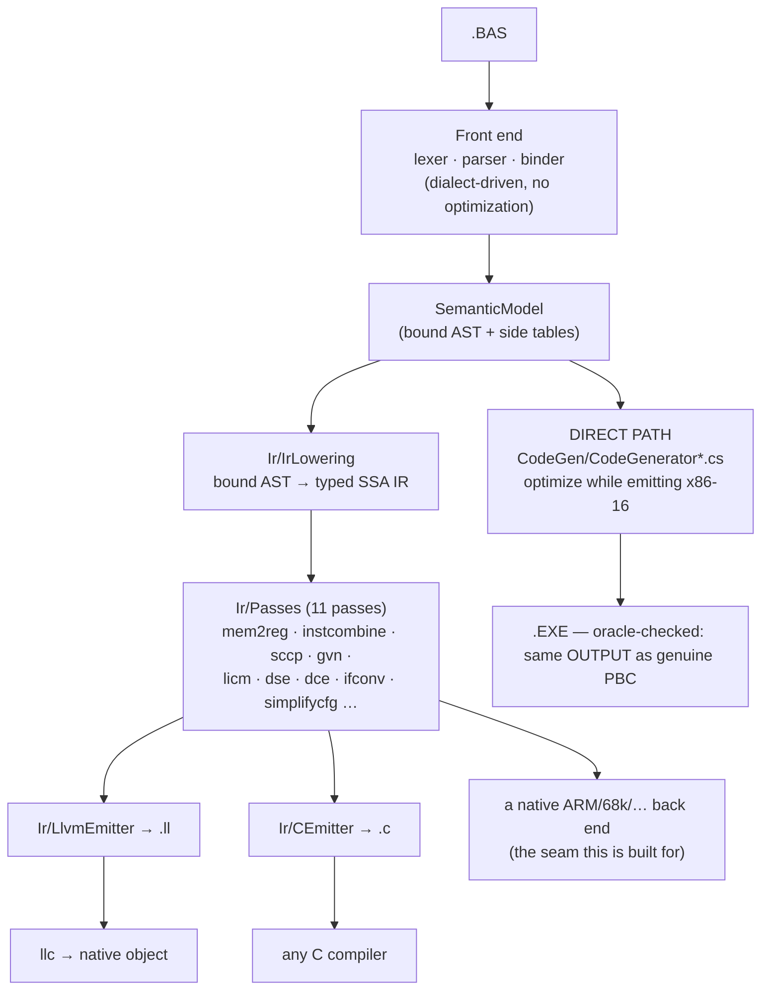

# Back ends — retargeting without giving up the optimizer

`pbc` has two ways to turn a bound program into output, and they exist for different
reasons. Knowing which layer a change belongs to is the whole point of this document.



## The two paths, and why both exist

**The direct path** (`CodeGen/`) is the fidelity path. Its job is to be
### What the fidelity gates actually enforce

Worth stating plainly, because the phrase "byte-identical" appears throughout this repository and
**no test here compares bytes**:

- `GoldenTests` compiles every `tests/NAME.BAS` and compares its **DOSBox stdout** against
  `tests/NAME.expected`.
- `scripts/run-diff-tests.sh` compiles each `tests/diff/*.BAS` twice — once with the genuine
  `PBC.EXE`, once with ours — **runs both**, and diffs `RESULT.TXT`.

Both are observational. The contract this compiler is actually held to is: *the same program behaves
the same way*, and the artefacts it produces (`.EXE`, `.PBU`, `.LIB`) are usable the same way. Byte
identity with PBC 3.50 was an aim and is a useful discipline, but it is not a gate, and it is not
what stands between the IR path and retiring the direct emitter.

### Retiring the direct emitter — the actual checklist

| | now |
|---|---|
| every program compiles through the IR | 135 / 162 lower; **38 / 135** module bodies fully owned; 109 / 224 functions routed |
| observable behaviour identical | **0 disagreements** over 82 compilations |
| units and libraries (`.PBU`, `.LIB`) route | **yes** — a routed `.PBU` links against an ordinarily-built main module and behaves identically (`RoutedUnitTests`) |

### Could the IR path be byte-identical unoptimized?

Measured, not assumed (`UnoptimizedByteCompatibilityTests`). Over the 33 corpus programs the back end
takes part in with `--no-optimize`:

| | |
|---|---|
| byte-identical to the direct emitter | **0** |
| routed image shorter | 21 |
| routed image longer | 12 |

The images differ in **length**, in both directions — which is what rules out "the same instructions
with different registers chosen". Both directions have a cause, and each is deliberate: shorter
because the IR path does real register allocation where the direct emitter is AX-serial by
construction; longer because the IR pipeline runs transformations of its own (loop unrolling trades
size for speed) and the routed prologue zeroes its frame unconditionally.

So byte-identity is not a near-miss to be closed by tidying. It would require the IR back end to
reproduce the direct emitter's instruction selection — the opposite of why it exists. The contract
the IR path is held to is **observable equivalence**, which is measured continuously by
`BackendCorpusDifferentialTests`.

---

observably identical to the genuine vintage compilers with the optimizer off, and to
optimize aggressively with it on while *staying* observably identical. Its
optimizations are interleaved with emission on purpose — many of them are decisions
about 8086 encodings (which register stays resident, whether a `CMP AX,BX` can stand
in for a 32-bit compare). That interleaving is not a design flaw to be refactored
away; it is what lets encoding-level decisions be made at all. This path is not
retargetable and is not meant to be.

Note on wording: throughout this repository "byte-identical" describes the **output** a program
produces — the `RESULT.TXT` an oracle battery diffs — not the executable image. No test compares
executables; see "What the fidelity gates actually enforce" above.

**The IR path** (`Ir/`) is the retargeting path. `IrLowering` turns the bound model
into a target-independent typed SSA IR; the pass pipeline optimizes it; a back end
renders it. Adding a target means writing one emitter — not a compiler.

Nothing in the production DOS pipeline depends on the IR path, so experiments there
cannot regress the golden gate.

## What a new back end costs

Two things, and only two:

1. **An emitter over `IrModule`.** `CEmitter` is ~300 lines and is the smallest
   complete example: types map one-to-one, every instruction with a value becomes a
   single-assignment local, blocks become labels, terminators become jumps, and phis
   become copies staged in the predecessors. `LlvmEmitter` is the same shape for a
   different notation.
2. **An implementation of the `rt_*` ABI** (`runtime/pbc_rt.h`). The middle end
   leaves everything that is not computation — strings, console and file I/O, array
   storage — as calls to that small extern surface. `runtime/pbc_rt.c` is the hosted
   implementation; a bare-metal target would provide its own.

Everything else is inherited: the dialect front ends, the lowering, and all the
optimization passes. That is what "modular without compromising optimizations"
means here — a new target does not re-earn constant propagation, GVN, LICM or
dead-code elimination, because those run before the back end is involved.

## The C back end (`--emit-c`)

```bash
pbc --emit-c PROG.BAS -O prog.c
cc -std=c99 -O2 -I runtime -o prog prog.c runtime/pbc_rt.c -lm
```

C99, no compiler extensions. Two details are load-bearing:

- **Integer arithmetic runs through the unsigned type of the same width and is cast
  back.** PB defines wrap-around; C leaves signed overflow undefined, which would
  licence a C compiler to assume it never happens. The unsigned round-trip is the
  only faithful spelling. Division keeps C's truncate-toward-zero, which is already
  exactly PB's `\` and `MOD`.
- **PB's observable formatting lives in the runtime, not in the generated code.**
  `PRINT` gives a numeric a leading sign slot and a trailing space, drops the leading
  zero of a pure fraction (`.0001`), and prints strings unpadded — so the C program's
  output is comparable to the DOS binary's byte for byte.

**The C reads like hand-written code, not a transcription of the SSA form.** Four
things close the gap (`CEmitterQualityTests` pins them; `CBackendTests` proves the
output still runs):
- **Integer arithmetic is recovered from PB's float promotion.** PB computes integral
  `+`/`-`/`*` in floating point, so `p% = a% * b%` lowers to `fptosi((float)a * (float)b)`.
  `IntegerRecovery` (now run in the `--emit-c`/`--emit-llvm` pipeline, as it already was for
  the x86-16 back end) rewrites a float tree stored back to an integer into the integer
  arithmetic it is equivalent to mod 2ⁿ — the C then reads `a * b`. It sees through the
  `fpext`/`fptrunc` PB inserts to widen a SINGLE subtree to DOUBLE before combining it with a
  wider operand (`a% * a% + b%` squares in SINGLE, extends to DOUBLE for the add), so an inlined
  integer function recovers whole; the leaf-width check keeps it inside the same modular form the
  direct back end uses, leaving a genuinely overflow-prone mixed-width tree on the FPU.
- **Phi copies sequentialize to direct assignments.** A loop-carried value that is not part
  of a swap becomes `counter = counter_next;`, not a parallel copy staged through `int64_t`
  temps; only a genuine cycle pays for the temps.
- **Control flow falls through.** A branch to the block emitted next emits nothing, a
  conditional whose false arm is next becomes `if (c) { … }` with no `else`, and a block no
  live `goto` reaches loses its label — so a loop is `L1: … goto L1;`, not a label-and-jump
  for every edge.
- **A single-use compare folds into its branch** — `if (i <= 10)`, not `t = (i <= 10); if (t)`.

`CBackendTests` compiles every DOS battery program that has a golden output through
this path with the host C compiler and diffs the result against that golden — the
same file the DOSBox battery checks the 16-bit executable against. A program outside
the lowering's subset is reported and skipped, never quietly passed.

## The seam is a test, not an interface

There is deliberately no `IBackend` abstraction. An emitter's input is `IrModule`
and its output is text or bytes; a C# interface over that would add a vocabulary
without adding a constraint. What actually keeps back ends honest is the
cross-checking:

| Check | What it proves |
|---|---|
| `scripts/run-diff-tests.sh` | the direct path still matches the genuine vintage compilers |
| `CBackendTests` | the IR path's C output matches the DOS goldens |
| `EmitLlvmTests` | the IR path's LLVM output is accepted by `llvm-as` and lowered by `llc` |
| `IrVerifier` | every pass leaves structurally valid, well-typed SSA |
| `BackendCoverageTests` | how much of the corpus the in-house x86-16 back end takes, and what blocks the rest |

Any new back end should add one row to that table. The cross-check has already earned
its keep. Running the DOS battery through both paths found five real defects that a
single back end cannot expose, because there was nothing to disagree with:

| Defect | Symptom |
|---|---|
| `+` between strings lowered as arithmetic | every program using the classic concat spelling declined |
| an unsuffixed decimal literal kept double precision | `d# = 3.14159` printed `3.14159` where PB prints `3.1415901184082` (the literal is SINGLE) |
| `INPUT` prompted per variable, not per statement | `INPUT a, s` printed two `? ` prompts |
| a `STATIC` local was a frame alloca | it restarted at zero on every call |
| a module variable was a *separate* alloca per function | a procedure and the main body silently disagreed about `SHARED` state |

The last two were miscompiles: correct-looking IR, wrong program. `tests/SHAREDG.BAS`
now pins both, in the DOS battery and in `CBackendTests`.

## Coverage and what is next

The lowering's supported subset is listed in [IR.md](IR.md); everything outside it
makes `TryLowerModule` return null rather than miscompile. The largest gaps today
are `ON ERROR`, `PRINT USING`, the FIELD form of random I/O and inline assembly
(which is target-specific by definition and will never lower).

Beyond widening that subset, the two items that would most change the picture:

- **A native IR → x86-16 back end** that reproduces the same program output for a
  subset. That is the fidelity proof that would let the IR path augment, and
  eventually replace, the direct emitter. It exists and is live behind
  `--x-backend` for integer functions (docs/X86-BACKEND.md); what it still
  declines is now *measured* rather than guessed — `BackendCoverageTests` ranks
  the blockers over the whole corpus, and the top one at any time is the next
  increment. Both standing gaps are now closed - the data-layout bridge (a load
  of a module-level global) and the runtime-label bridge (a call to an `rt_*`
  helper, mapped per routine onto the DOS runtime's register convention in
  `Backend/RuntimeAbi.cs`) - alongside signed division and spilling, which took
  the corpus from 14 to 32 routed functions of 139. What ranks next is floating
  point (the x87 stack), strings (the runtime's handle representation), and the
  `main` body, which additionally needs the startup/exit sequence.
- **Feeding the direct path's range facts into the IR.** The interval lattice
  (`CodeGen/IntervalRange.cs`) proves things — bounds are in range, a divisor is
  non-zero, a 32-bit operation fits 16 bits — that the IR currently rediscovers only
  partially through SCCP and correlated value propagation. Those proofs are
  target-independent and belong to every back end.
