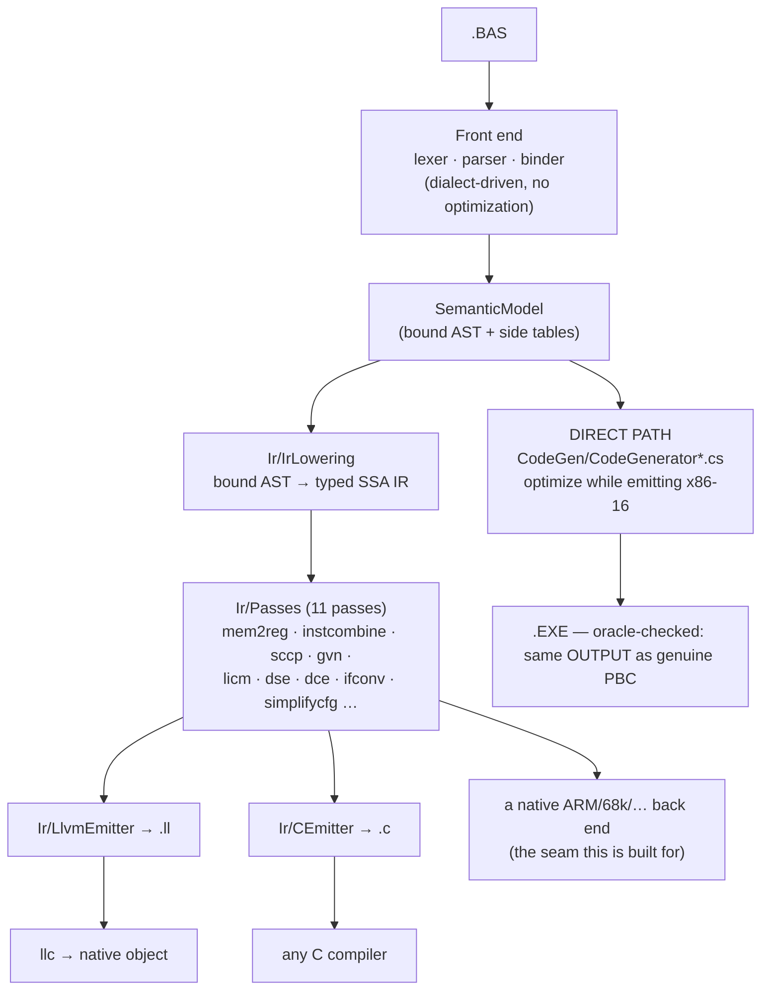

# Back ends — retargeting without giving up the optimizer

`pbc` has two ways to turn a bound program into output, and they exist for different
reasons. Knowing which layer a change belongs to is the whole point of this document.



## The two paths, and why both exist

**The direct path** (`CodeGen/`) is the fidelity path. Its job is to be
### What the fidelity gates actually enforce

Worth stating plainly, because the phrase "byte-identical" appears throughout this repository and
**no test here compares bytes**:

- `GoldenTests` compiles every `tests/NAME.BAS` and compares its **DOSBox stdout** against
  `tests/NAME.expected`.
- `scripts/run-diff-tests.sh` compiles each `tests/diff/*.BAS` twice — once with the genuine
  `PBC.EXE`, once with ours — **runs both**, and diffs `RESULT.TXT`.

Both are observational. The contract this compiler is actually held to is: *the same program behaves
the same way*, and the artefacts it produces (`.EXE`, `.PBU`, `.LIB`) are usable the same way. Byte
identity with PBC 3.50 was an aim and is a useful discipline, but it is not a gate, and it is not
what stands between the IR path and retiring the direct emitter.

### Retiring the direct emitter — the actual checklist

| | now |
|---|---|
| every program compiles through the IR | 135 / 162 lower; **65 / 135** module bodies fully owned; 137 / 224 functions routed, 178 selected |
| observable behaviour identical | **0 disagreements** over 136 compilations |
| units and libraries (`.PBU`, `.LIB`) route | **yes** — a routed `.PBU` links against an ordinarily-built main module and behaves identically (`RoutedUnitTests`) |

### Could the IR path be byte-identical unoptimized?

Measured, not assumed (`UnoptimizedByteCompatibilityTests`). Over the 33 corpus programs the back end
takes part in with `--no-optimize`:

| | |
|---|---|
| byte-identical to the direct emitter | **0** |
| routed image shorter | 21 |
| routed image longer | 12 |

The images differ in **length**, in both directions — which is what rules out "the same instructions
with different registers chosen". Both directions have a cause, and each is deliberate: shorter
because the IR path does real register allocation where the direct emitter is AX-serial by
construction; longer because the IR pipeline runs transformations of its own (loop unrolling trades
size for speed) and the routed prologue zeroes its frame unconditionally.

So byte-identity is not a near-miss to be closed by tidying. It would require the IR back end to
reproduce the direct emitter's instruction selection — the opposite of why it exists. The contract
the IR path is held to is **observable equivalence**, which is measured continuously by
`BackendCorpusDifferentialTests`.

---

observably identical to the genuine vintage compilers with the optimizer off, and to
optimize aggressively with it on while *staying* observably identical. Its
optimizations are interleaved with emission on purpose — many of them are decisions
about 8086 encodings (which register stays resident, whether a `CMP AX,BX` can stand
in for a 32-bit compare). That interleaving is not a design flaw to be refactored
away; it is what lets encoding-level decisions be made at all. This path is not
retargetable and is not meant to be.

Note on wording: throughout this repository "byte-identical" describes the **output** a program
produces — the `RESULT.TXT` an oracle battery diffs — not the executable image. No test compares
executables; see "What the fidelity gates actually enforce" above.

**The IR path** (`Ir/`) is the retargeting path. `IrLowering` turns the bound model
into a target-independent typed SSA IR; the pass pipeline optimizes it; a back end
renders it. Adding a target means writing one emitter — not a compiler.

Nothing in the production DOS pipeline depends on the IR path, so experiments there
cannot regress the golden gate.

## What a new back end costs

Two things, and only two:

1. **An emitter over `IrModule`.** `CEmitter` is ~300 lines and is the smallest
   complete example: types map one-to-one, every instruction with a value becomes a
   single-assignment local, blocks become labels, terminators become jumps, and phis
   become copies staged in the predecessors. `LlvmEmitter` is the same shape for a
   different notation.
2. **An implementation of the `rt_*` ABI** (`runtime/pbc_rt.h`). The middle end
   leaves everything that is not computation — strings, console and file I/O, array
   storage — as calls to that small extern surface. `runtime/pbc_rt.c` is the hosted
   implementation; a bare-metal target would provide its own.

Everything else is inherited: the dialect front ends, the lowering, and all the
optimization passes. That is what "modular without compromising optimizations"
means here — a new target does not re-earn constant propagation, GVN, LICM or
dead-code elimination, because those run before the back end is involved.

## The C back end (`--emit-c`)

```bash
pbc --emit-c PROG.BAS -O prog.c
cc -std=c99 -O2 -I runtime -o prog prog.c runtime/pbc_rt.c -lm
```

C99, no compiler extensions. Two details are load-bearing:

- **Integer arithmetic runs through the unsigned type of the same width and is cast
  back.** PB defines wrap-around; C leaves signed overflow undefined, which would
  licence a C compiler to assume it never happens. The unsigned round-trip is the
  only faithful spelling. Division keeps C's truncate-toward-zero, which is already
  exactly PB's `\` and `MOD`.
- **PB's observable formatting lives in the runtime, not in the generated code.**
  `PRINT` gives a numeric a leading sign slot and a trailing space, drops the leading
  zero of a pure fraction (`.0001`), and prints strings unpadded — so the C program's
  output is comparable to the DOS binary's byte for byte.

**The C reads like hand-written code, not a transcription of the SSA form.** Four
things close the gap (`CEmitterQualityTests` pins them; `CBackendTests` proves the
output still runs):
- **Integer arithmetic is recovered from PB's float promotion.** PB computes integral
  `+`/`-`/`*` in floating point, so `p% = a% * b%` lowers to `fptosi((float)a * (float)b)`.
  `IntegerRecovery` (now run in the `--emit-c`/`--emit-llvm` pipeline, as it already was for
  the x86-16 back end) rewrites a float tree stored back to an integer into the integer
  arithmetic it is equivalent to mod 2ⁿ — the C then reads `a * b`. It sees through the
  `fpext`/`fptrunc` PB inserts to widen a SINGLE subtree to DOUBLE before combining it with a
  wider operand (`a% * a% + b%` squares in SINGLE, extends to DOUBLE for the add), so an inlined
  integer function recovers whole; the leaf-width check keeps it inside the same modular form the
  direct back end uses, leaving a genuinely overflow-prone mixed-width tree on the FPU.
- **Phi copies sequentialize to direct assignments.** A loop-carried value that is not part
  of a swap becomes `counter = counter_next;`, not a parallel copy staged through `int64_t`
  temps; only a genuine cycle pays for the temps.
- **Control flow falls through.** A branch to the block emitted next emits nothing, a
  conditional whose false arm is next becomes `if (c) { … }` with no `else`, and a block no
  live `goto` reaches loses its label — so a loop is `L1: … goto L1;`, not a label-and-jump
  for every edge.
- **A single-use compare folds into its branch** — `if (i <= 10)`, not `t = (i <= 10); if (t)`.

`CBackendTests` compiles every DOS battery program that has a golden output through
this path with the host C compiler and diffs the result against that golden — the
same file the DOSBox battery checks the 16-bit executable against. A program outside
the lowering's subset is reported and skipped, never quietly passed.

## The seam is a test, not an interface

There is deliberately no `IBackend` abstraction. An emitter's input is `IrModule`
and its output is text or bytes; a C# interface over that would add a vocabulary
without adding a constraint. What actually keeps back ends honest is the
cross-checking:

| Check | What it proves |
|---|---|
| `scripts/run-diff-tests.sh` | the direct path still matches the genuine vintage compilers |
| `CBackendTests` | the IR path's C output matches the DOS goldens |
| `EmitLlvmTests` | the IR path's LLVM output is accepted by `llvm-as` and lowered by `llc` |
| `IrVerifier` | every pass leaves structurally valid, well-typed SSA |
| `BackendCoverageTests` | how much of the corpus the in-house x86-16 back end takes, and what blocks the rest |

Any new back end should add one row to that table. The cross-check has already earned
its keep. Running the DOS battery through both paths found five real defects that a
single back end cannot expose, because there was nothing to disagree with:

| Defect | Symptom |
|---|---|
| `+` between strings lowered as arithmetic | every program using the classic concat spelling declined |
| an unsuffixed decimal literal kept double precision | `d# = 3.14159` printed `3.14159` where PB prints `3.1415901184082` (the literal is SINGLE) |
| `INPUT` prompted per variable, not per statement | `INPUT a, s` printed two `? ` prompts |
| a `STATIC` local was a frame alloca | it restarted at zero on every call |
| a module variable was a *separate* alloca per function | a procedure and the main body silently disagreed about `SHARED` state |

The last two were miscompiles: correct-looking IR, wrong program. `tests/SHAREDG.BAS`
now pins both, in the DOS battery and in `CBackendTests`.

## The bar for retiring the direct emitter

Worth stating plainly, because coverage numbers make the distance look shorter than it is. Dropping
`CodeGen/` needs THREE things, and only the first is being measured today.

**1. Coverage - every program on the IR path. Selection and allocation are DONE.** `BackendCoverageTests`
ranks this over the whole corpus. As of this writing: **160 of 165 programs lower**, **261 of 261
functions select and allocate**, and **160 of 160 module bodies** can be owned outright - every
function that reaches the IR is compiled by the back end, with no allocation declines left.

What remains is on the LOWERING side, and it is short: four programs the FRONT end rejects (so they
are nobody's coverage), and one that declines on `DIM ... AT` with a non-default array CLASS. That
last one is deliberate rather than pending - `HUGE` steps the segment by `byteOffset >> 4` so one
array spans many of them, and `VIRTUAL` maps a 16 KiB EMS page pair into a window before each access,
which needs the allocator, the page mapper and the far descriptor the DOS runtime holds. Half-building
it would be worse than the honest decline.

One decline was ADDED on purpose while closing the others, and it is the interesting one. A function
whose inline-asm blocks have other work BETWEEN them now declines: `LOWLEVEL.BAS` counts `CX` down
across `n = n + 1`, and an asm block is modelled as clobbering everything - which stops a value living
ACROSS it but does nothing to stop the allocator putting a temporary IN `CX` in the middle. It printed
1 where 5 was right, and only reached the back end at all once two unrelated declines were widened.
The direct emitter survives by computing through AX, which is luck rather than contract. Until an asm
block can declare the registers it defines and for how long, selecting that shape is worse than not.

**Routing is not gated on the optimizer, and that is safe only because the gate is observational.**
`CodeGenerator.Backend.cs` runs `IrPassManager.Standard(...)` whenever a function routes, so a
`--no-optimize` build of a routed function is still optimized. It looks alarming written down - the
historic dialects rest on "optimizer off means vintage behaviour" - but the thing that promise is
about is BEHAVIOUR, and the evidence is the golden battery itself: `tests/diff` compiles pb35 with the
optimizer OFF, and it passes routed. What would be a real problem is an optimization that changes an
observable, and that is exactly what the battery is watching for. Worth knowing before reading
`--no-optimize` as "nothing ran".

**2. Fidelity - the routed path agreeing with the direct one everywhere. DONE.** The differential
battery run with `PBC_X_BACKEND=1` scores **504 of 504** against the genuine vintage compilers -
the same score the direct path gets. Every program the back end owns produces output the oracle
agrees with.

Getting there took three fixes, and all three were the same mistake in different clothes: guessing
where PB rounds instead of checking.

* `STR$` coerced its argument to the declared type before handing it over. A float reaches the
  formatter at the x87's own width and the NAME picks the digit count - `rt_str_f32` and
  `rt_str_f64` share a body. Rounding first cost eight digits under `$COMPAT tb10`, whose formatter
  prints seventeen.
* Constant float arithmetic folded at 64 bits while the target computes at 80, so every INEXACT
  result differed in the last bit. It now folds only when the result is exact, which is TESTED with
  a fused multiply-add rather than assumed.
* A transcendental's result was kept at 80 bits, where the direct emitter writes `FSTP m64; FLD m64`
  right after the `FYL2X`. This one is the opposite of the first two - here PB *does* round - and
  keeping the extra bits looked more accurate while being less faithful:
  `LOG(2.718281828459045#)` is 1 rounded to a double and .9999999999999999 with all eighty, and the
  oracle says 1.

The lesson worth carrying: none of these was found by reading the IR. The last one was found by
disassembling both images and noticing `DD 1E` where the other wrote `DB 7E`.

**Tiers 1 and 2 are not independent, which is the thing to know before grinding coverage.** Every
function the back end newly owns is a function the differential battery newly measures, and a
widening can therefore COST fidelity. `FPToUI` was the worked example: enabling it took coverage
from 215 to 217 functions and pulled `DIFF05.BAS` and `DIFF61.BAS` into the back end, where two
faults that predated it became visible - a BYTE printing as -56 for 200, and a DWORD comparison
answering `LE` where PB says `GT`. Neither was caused by the conversion; enabling it is simply what
made them reachable. Both are fixed and the case is on.

So the order is: widen, run the battery routed, and keep the widening only if the score holds. A
coverage number that went up while the battery went down is a worse position than before. The two
faults that turned up this way were worth more than the two functions that found them.

**The routed path needs a REAL 80-bit x87 for QUAD where the direct one does not**, and that is
invisible on an accurate emulator. `DIFF15` (QUAD division and modulo) and `DIFF72` (`$CPU 80386`
64-bit bitwise) pass routed under dosbox-staging and fail under vanilla DOSBox 0.74, which computes
the x87 in 64-bit doubles: `73300775184` comes back as `...85`, and DIFF72's ~1e16 values differ in
their last digit. The direct emitter passes both on the same emulator, because it does that
arithmetic in memory-based four-word integer routines while the routed path goes through the x87 -
where a 64-bit integer IS exact, on hardware with the 64-bit mantissa the part promises.

So it is not a fidelity bug and not something to fix by rounding differently. It is a dependency
the direct emitter does not have, and it belongs on the retirement checklist rather than in the
failure column: after `CodeGen/` is gone, QUAD arithmetic is only as exact as the FPU underneath,
which on period hardware includes PB's own emulator library for machines with no 8087 at all.

**String lifetime: the leak is closed, the convention is now stated.** This was not on the decline
list - it is a concern rather than a construct, and only a coverage increment surfaced it.

`IrLowering` emitted **no `rt_str_free` at all**, so every value a string variable ever held was
leaked. `STRHEAP.BAS` is the program that notices: two thousand assignments of a 200-byte
concatenation through the DOS runtime's 64 KiB compacting heap, ending in `OUT OF STRING SPACE`. The
C and LLVM back ends `malloc` and never noticed, and the battery did not either, because the
programs the back end owned did not churn enough - a passing battery does not exclude a
scale-dependent fault.

The rule now written into the lowering, in the order it has to hold:

1. **A runtime entry CONSUMES its handle arguments.** That is what the borrow on every variable read
   is already for, and it is what the DOS runtime does; the C runtime simply never reclaims, which is
   safe and leaky rather than different.
2. **A string slot is NULL-INITIALISED at entry.** An alloca holds whatever the frame did, so the
   previous value is only readable if it was put there. The first attempt skipped this and freed
   garbage - 15 tests, and none of them said "uninitialised".
3. **An assignment frees the handle it replaces**, after the new value is computed, so `t = t + "x"`
   has already taken its copy. Freeing a null handle is a no-op, which is what makes the first
   assignment need no special case.

`IrBasicWriter` renders none of it: releasing a handle has no BASIC spelling, exactly as `rt_str_dup`
has none, and a string variable already starts empty.

**3. The OPTIMIZER - the gate nobody had written down, and the one that is now blocking.** Coverage
and behavioural equivalence say a function CAN be routed; neither says anything about what is lost by
routing it. Making pb36 route by default - the natural next step, and the one this document used to
imply was all that remained - failed **109 tests**, and after `Ir/Passes/TailRecursion.cs` it fails
**96**. The count is the measure of the gate; the composition of it is what says which work is left:

* **most are assertions about emitted code** and read like a list of what pb36 is for: a string appended
  in place rather than reallocated, a SELECT dispatched through a table or a perfect hash instead of a
  chain, a multiplier decomposed into shifts, a bounds check elided where the index is provably in
  range, a small counted loop unrolled, UDT copies moved a dword at a time.
* **the STRING family is now CLOSED** - 14 of them, and the whole of `Ir/Passes/String*.cs`. Read as a
  set they say what a string optimizer on a handle-based runtime has to know: a chain of three or more
  concatenations builds with ONE allocation (`rt_str_concat_n`) instead of one per node; a
  concatenation onto a dead temporary appends in place (`rt_str_append_var` / `rt_str_append_lit`)
  rather than allocating a result and copying both sides; a comparison only ever tested against zero
  goes to the equality entry that decides unequal lengths without reading a byte; emptiness is a null
  handle rather than a call; a literal concatenation, a literal comparison and a zero-length substring
  are answered at compile time; and `ASC(MID$(s$, i, 1))` reads the byte.

  The one thing that made these passes rather than rewrites of the lowering is the ownership rule
  `IrLowering` already states - a runtime entry CONSUMES its handle arguments. Every transform here is
  an accounting change on that rule: `s$ = s$ + x$` makes a copy of `s$`, frees the original and
  consumes the copy, which is the ORIGINAL being consumed with two extra steps, and removing them is
  what turns the pairwise chain into an in-place append. Get it wrong and nothing says so until a
  program churns enough to exhaust the 64 KiB heap, which is the same failure mode the lowering's own
  free discipline was bought with.

  One defect worth keeping, because it is about the back end rather than about strings. The staging
  stores that fill `rt_catlist` carried no clobbers, so the SCHEDULER was free to move them above the
  `MOV v, AX` that captures the PREVIOUS call's result; the spiller then put a reload inside that
  window, and the last operand staged was the previous operand's handle - `a$ + (b$ + c$)` printed
  `aabbbb`. Every runtime call's staging moves claim the call's whole destination set for exactly this
  reason (`InstructionSelector.StagingDestinations`), and a hand-written sequence has to do the same.

* **four SELECT tests can no longer observe what they assert**, and it is worth saying which way round
  that is. `Emit_GivenDenseSelect`, `Emit_GivenDenseLongSelect`, `Emit_GivenSparseManyCaseSelect` and
  `Emit_GivenSparseValueListArm` set the subject to a literal one line above the `SELECT`; SCCP
  resolves the dispatch outright, so the whole statement is one `PRINT` and there is no dispatch left
  to be a jump table. `Emit_GivenAscOfSingleCharMid` is the same shape - it tells a constant length
  from a runtime one by `n% = 1`, which SCCP proves. These are not missing optimizations; the
  discriminator is.
* **the SELECT dispatch family proper is NOT done** - `Emit_GivenConstantCaseRange`,
  `Emit_GivenWideSpanFewArmSelect`, `Emit_GivenWideWindowArm`, `Emit_GivenSparseSelectWithPerfectHash`,
  `Emit_GivenOrChainEqualityIf`, `Emit_GivenAndChainOfInequalities`. Those take their subject from
  `INPUT`, so the dispatch is real. What they need is machine-level and not a pass: a data table
  emitted INSIDE the code stream, an indexed indirect `JMP word [BX+table]`, the byte-index table under
  `$OPTIMIZE SIZE`, and a compile-time membership mask shifted by the subject (32-bit under
  `$CPU 80386`). The machine IR has no operand for a table of block addresses and the selector is not
  told the optimization objective, so both are prerequisites rather than details.
* **`Emit_GivenLoopInvariantLen` needs a purity notion for runtime calls.** `LEN(s$)` lowers to
  `rt_str_len(rt_str_dup(s))` - allocate a copy, read its length, free it - which is observably a pure
  read of `s`, but LICM and GVN will not move or number a call and are right not to in general. It
  wants a small, checked list of entries that are pure given their arguments, which is exactly the kind
  of claim that miscompiles silently if it is one row too long.
* **the optimization battery** (`tests/optimize`), which is the file where those expectations are
  declared rather than inferred.
* **two that were not about quality at all - now CLOSED.** `Execute_GivenDeepTailRecursion_WhenPb36_ThenConstantStack`
  and its mutual-recursion twin: tail-call elimination is a BEHAVIOURAL promise, since without it a
  deep recursion overflows. `TailRecursion` turns a self tail call into a loop, and the mutual form
  needs no case of its own because the inliner makes it a self-call first and the sweep after
  inlining is where the loop forms. 60000 levels deep and 120000 bounces both print DONE routed.
* **one that was a BUG rather than a missing optimization** - now CLOSED, and only default-routing
  found it: `Execute_GivenOmittedAndFromEndBounds_WhenRun_ThenDefaultsApply`. Two array SLICES into
  two dynamic arrays ended up sharing memory, so writing the second changed the first:

  ```basic
  DIM a(1 TO 8) AS INTEGER : FOR i = 1 TO 8 : a(i) = i * 10 : NEXT
  DIM b() AS INTEGER, c() AS INTEGER
  b() = a(TO 3)   ' 10 20 30
  c() = a(6 TO)   ' 60 70 80   ...and b(0) was 80, which is c(2)
  ```

  The addresses said where to look. `VARPTR(b(0))` / `VARPTR(c(0))` are 0 and 6 under the direct
  emitter - two 6-byte blocks, adjacent - and were **10 and 6** routed, so c's 6..11 overlapped b's
  10..15. The heap was never confused: it handed out 0 then 6 in both builds. It was b's RECORDED
  pointer that was wrong, and it was not about slices either - the desugaring written out by hand
  reproduces it in plain BASIC from a runtime `REDIM` bound and a computed index, twice over.

  **The cause was register allocation, one level below anything the IR could show.** A `REDIM` is
  `CALL rt_arr_alloc` followed by the `MOV v, AX` that takes the block address out of the result
  register. The scheduler is free to put an unrelated instruction between the two - it writes a
  VIRTUAL register, so it conflicts with nothing - and `LinearScanAllocator` modelled a physical
  register being WRITTEN (`PinnedByIndex`) but never one being READ. Nothing said AX was occupied
  between the call and its consumer, so the intervening `MOV v2, [BP-2]` was given AX, and b's data
  pointer became the frame word that instruction had loaded: the constant `10`. Which then pointed
  into the block the NEXT allocation returned.

  The fix is the missing half of the pinned-register model: `InFlightByIndex` marks each physical
  register over `[producer + 1, reader - 1]`, so a value live anywhere in that window cannot be
  allocated it. Both ends stay outside the window deliberately, which keeps the extraction move
  itself free to coalesce into the register it reads. `BackendDynamicArrayAliasTests` holds the two
  BASIC forms and the allocator's own statement of the rule.

  It is worth recording why this took the census's whole battery to surface. Every ingredient alone
  is correct routed - a constant-bound `REDIM` pair, a runtime-bound pair with constant indices, the
  same runtime-bound loop over a SINGLE dynamic array, and REDIMing the second-declared array first.
  The window has to exist, and something independent has to be schedulable into it. No corpus program
  combines the two, which is why the differential never saw it.

The reason is structural rather than a list of missing passes. `CodeGen/`'s optimizations are
interleaved with emission, which is the same property that makes byte-identity achievable; a function
the back end owns never passes through them, and the IR pipeline's eleven passes are a different set
aimed at a different problem. So the direct emitter is not only the fidelity path - it is the
OPTIMIZING path, and retiring it means the IR path must first earn those expectations rather than
inherit them.

That is the honest state: the switch is safe to flip the moment `tests/optimize` and the `Emit_Given*`
fixtures pass routed, and not before. The flip itself is one line
(`CodeGenerator.UseExperimentalBackend`), it has been tried twice, and it is reverted with the
measurement kept. With the aliasing bug closed, what remains is the 95, in whatever order the battery
ranks them - each is a transform the direct emitter performs during emission and the IR pipeline has
no equivalent of.

**4. The golden gate - byte-identical output with the optimizer off.** This is the hard one, and it
is the direct emitter's whole reason for existing: its optimizations are interleaved with emission
*on purpose*, because that is what makes byte-identity with genuine PBC achievable. An SSA
middle-end that schedules and allocates registers does not naturally emit the same bytes as an
AX-serial emitter, and nothing about widening coverage moves this. Retiring `CodeGen/` therefore
means either reproducing that byte-for-byte through the IR path, or deciding the gate becomes
behavioural rather than byte-exact - a decision about what the project promises, not a task.

The honest summary: (1) is DONE on selection and allocation and has only deliberate declines left,
(2) holds - the routed battery scores what the direct one does - (3) is the live blocker, now purely
a question of optimization quality, and (4) is a design decision that has been made: the contract is
observational, so EXE byte-identity is an aim rather than a gate.

## Coverage and what is next

The lowering's supported subset is listed in [IR.md](IR.md); everything outside it
makes `TryLowerModule` return null rather than miscompile. The largest gaps today
are `ARRAY SORT`, the FIELD form of random I/O and inline assembly (which is
target-specific by definition and will never lower).

`PRINT USING` lowers, but the **C** emitter declines it, for the reason `ON ERROR`
does below: `runtime/pbc_rt.c` has no `rt_using_field`, and the DOS runtime's
formatter is a fixed-point renderer with grouping and field overflow rather than
anything a shim could stand in for. `LPRINT` declines there too, and more simply -
"the printer" has no meaning on a hosted platform.

`ON ERROR` lowers, but the **C** emitter declines it, and that is a second and
separate gap. It arms its handler with the address of a basic block, which standard
C has no value for - GCC's `&&label` is an extension, and even with it the jump
`ON ERROR` performs is non-local, from an arbitrary fault point inside a runtime
routine, so it needs `setjmp`/`longjmp` rather than a computed goto. The portable
shape would be an integer id per address-taken block plus a `setjmp` dispatch at
function entry; what makes it a project rather than an afternoon is that the fault
has to come from somewhere, and the C runtime has no file I/O at all - so the one
battery program that faults for real (`ONERR.BAS` opens a missing file) needs
`rt_open` before it needs a handler.

Both emitters DECLINE rather than emit something that compiles and misbehaves, and
`CBackendTests` treats a decline as a skip naming the construct - the same answer it
already gives when the lowering declines. A FAILURE there means emitted C that
disagrees with the DOS golden, which is the only thing that fixture exists to catch.

Beyond widening that subset, the two items that would most change the picture:

- **A native IR → x86-16 back end** that reproduces the same program output for a
  subset. That is the fidelity proof that would let the IR path augment, and
  eventually replace, the direct emitter. It exists and is live behind
  `--x-backend` for integer functions (docs/X86-BACKEND.md); what it still
  declines is now *measured* rather than guessed — `BackendCoverageTests` ranks
  the blockers over the whole corpus, and the top one at any time is the next
  increment. Both standing gaps are now closed - the data-layout bridge (a load
  of a module-level global) and the runtime-label bridge (a call to an `rt_*`
  helper, mapped per routine onto the DOS runtime's register convention in
  `Backend/RuntimeAbi.cs`) - alongside signed division and spilling, which took
  the corpus from 14 to 32 routed functions of 139. What ranks next is floating
  point (the x87 stack), strings (the runtime's handle representation), and the
  `main` body, which additionally needs the startup/exit sequence.
- **Feeding the direct path's range facts into the IR.** The interval lattice
  (`CodeGen/IntervalRange.cs`) proves things — bounds are in range, a divisor is
  non-zero, a 32-bit operation fits 16 bits — that the IR currently rediscovers only
  partially through SCCP and correlated value propagation. Those proofs are
  target-independent and belong to every back end.
