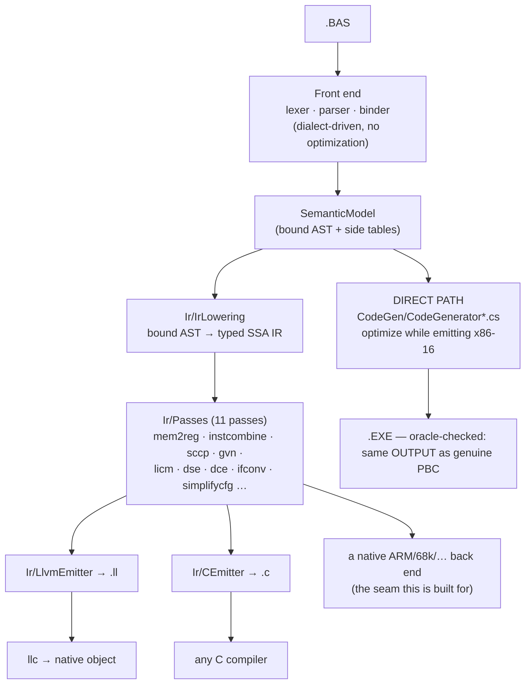

# Back ends — retargeting without giving up the optimizer

`pbc` has two ways to turn a bound program into output, and they exist for different
reasons. Knowing which layer a change belongs to is the whole point of this document.



## The two paths, and why both exist

**The direct path** (`CodeGen/`) is the fidelity path. Its job is to be
### What the fidelity gates actually enforce

Worth stating plainly, because the phrase "byte-identical" appears throughout this repository and
**no test here compares bytes**:

- `GoldenTests` compiles every `tests/NAME.BAS` and compares its **DOSBox stdout** against
  `tests/NAME.expected`.
- `scripts/run-diff-tests.sh` compiles each `tests/diff/*.BAS` twice — once with the genuine
  `PBC.EXE`, once with ours — **runs both**, and diffs `RESULT.TXT`.

Both are observational. The contract this compiler is actually held to is: *the same program behaves
the same way*, and the artefacts it produces (`.EXE`, `.PBU`, `.LIB`) are usable the same way. Byte
identity with PBC 3.50 was an aim and is a useful discipline, but it is not a gate, and it is not
what stands between the IR path and retiring the direct emitter.

### Retiring the direct emitter — the actual checklist

| | now |
|---|---|
| every program compiles through the IR | 135 / 162 lower; **65 / 135** module bodies fully owned; 137 / 224 functions routed, 178 selected |
| observable behaviour identical | **0 disagreements** over 136 compilations |
| units and libraries (`.PBU`, `.LIB`) route | **yes** — a routed `.PBU` links against an ordinarily-built main module and behaves identically (`RoutedUnitTests`) |

### Could the IR path be byte-identical unoptimized?

Measured, not assumed (`UnoptimizedByteCompatibilityTests`). Over the 33 corpus programs the back end
takes part in with `--no-optimize`:

| | |
|---|---|
| byte-identical to the direct emitter | **0** |
| routed image shorter | 21 |
| routed image longer | 12 |

The images differ in **length**, in both directions — which is what rules out "the same instructions
with different registers chosen". Both directions have a cause, and each is deliberate: shorter
because the IR path does real register allocation where the direct emitter is AX-serial by
construction; longer because the IR pipeline runs transformations of its own (loop unrolling trades
size for speed) and the routed prologue zeroes its frame unconditionally.

So byte-identity is not a near-miss to be closed by tidying. It would require the IR back end to
reproduce the direct emitter's instruction selection — the opposite of why it exists. The contract
the IR path is held to is **observable equivalence**, which is measured continuously by
`BackendCorpusDifferentialTests`.

---

observably identical to the genuine vintage compilers with the optimizer off, and to
optimize aggressively with it on while *staying* observably identical. Its
optimizations are interleaved with emission on purpose — many of them are decisions
about 8086 encodings (which register stays resident, whether a `CMP AX,BX` can stand
in for a 32-bit compare). That interleaving is not a design flaw to be refactored
away; it is what lets encoding-level decisions be made at all. This path is not
retargetable and is not meant to be.

Note on wording: throughout this repository "byte-identical" describes the **output** a program
produces — the `RESULT.TXT` an oracle battery diffs — not the executable image. No test compares
executables; see "What the fidelity gates actually enforce" above.

**The IR path** (`Ir/`) is the retargeting path. `IrLowering` turns the bound model
into a target-independent typed SSA IR; the pass pipeline optimizes it; a back end
renders it. Adding a target means writing one emitter — not a compiler.

Nothing in the production DOS pipeline depends on the IR path, so experiments there
cannot regress the golden gate.

## What a new back end costs

Two things, and only two:

1. **An emitter over `IrModule`.** `CEmitter` is ~300 lines and is the smallest
   complete example: types map one-to-one, every instruction with a value becomes a
   single-assignment local, blocks become labels, terminators become jumps, and phis
   become copies staged in the predecessors. `LlvmEmitter` is the same shape for a
   different notation.
2. **An implementation of the `rt_*` ABI** (`runtime/pbc_rt.h`). The middle end
   leaves everything that is not computation — strings, console and file I/O, array
   storage — as calls to that small extern surface. `runtime/pbc_rt.c` is the hosted
   implementation; a bare-metal target would provide its own.

Everything else is inherited: the dialect front ends, the lowering, and all the
optimization passes. That is what "modular without compromising optimizations"
means here — a new target does not re-earn constant propagation, GVN, LICM or
dead-code elimination, because those run before the back end is involved.

## The C back end (`--emit-c`)

```bash
pbc --emit-c PROG.BAS -O prog.c
cc -std=c99 -O2 -I runtime -o prog prog.c runtime/pbc_rt.c -lm
```

C99, no compiler extensions. Two details are load-bearing:

- **Integer arithmetic runs through the unsigned type of the same width and is cast
  back.** PB defines wrap-around; C leaves signed overflow undefined, which would
  licence a C compiler to assume it never happens. The unsigned round-trip is the
  only faithful spelling. Division keeps C's truncate-toward-zero, which is already
  exactly PB's `\` and `MOD`.
- **PB's observable formatting lives in the runtime, not in the generated code.**
  `PRINT` gives a numeric a leading sign slot and a trailing space, drops the leading
  zero of a pure fraction (`.0001`), and prints strings unpadded — so the C program's
  output is comparable to the DOS binary's byte for byte.

**The C reads like hand-written code, not a transcription of the SSA form.** Four
things close the gap (`CEmitterQualityTests` pins them; `CBackendTests` proves the
output still runs):
- **Integer arithmetic is recovered from PB's float promotion.** PB computes integral
  `+`/`-`/`*` in floating point, so `p% = a% * b%` lowers to `fptosi((float)a * (float)b)`.
  `IntegerRecovery` (now run in the `--emit-c`/`--emit-llvm` pipeline, as it already was for
  the x86-16 back end) rewrites a float tree stored back to an integer into the integer
  arithmetic it is equivalent to mod 2ⁿ — the C then reads `a * b`. It sees through the
  `fpext`/`fptrunc` PB inserts to widen a SINGLE subtree to DOUBLE before combining it with a
  wider operand (`a% * a% + b%` squares in SINGLE, extends to DOUBLE for the add), so an inlined
  integer function recovers whole; the leaf-width check keeps it inside the same modular form the
  direct back end uses, leaving a genuinely overflow-prone mixed-width tree on the FPU.
- **Phi copies sequentialize to direct assignments.** A loop-carried value that is not part
  of a swap becomes `counter = counter_next;`, not a parallel copy staged through `int64_t`
  temps; only a genuine cycle pays for the temps.
- **Control flow falls through.** A branch to the block emitted next emits nothing, a
  conditional whose false arm is next becomes `if (c) { … }` with no `else`, and a block no
  live `goto` reaches loses its label — so a loop is `L1: … goto L1;`, not a label-and-jump
  for every edge.
- **A single-use compare folds into its branch** — `if (i <= 10)`, not `t = (i <= 10); if (t)`.

`CBackendTests` compiles every DOS battery program that has a golden output through
this path with the host C compiler and diffs the result against that golden — the
same file the DOSBox battery checks the 16-bit executable against. A program outside
the lowering's subset is reported and skipped, never quietly passed.

## The seam is a test, not an interface

There is deliberately no `IBackend` abstraction. An emitter's input is `IrModule`
and its output is text or bytes; a C# interface over that would add a vocabulary
without adding a constraint. What actually keeps back ends honest is the
cross-checking:

| Check | What it proves |
|---|---|
| `scripts/run-diff-tests.sh` | the direct path still matches the genuine vintage compilers |
| `CBackendTests` | the IR path's C output matches the DOS goldens |
| `EmitLlvmTests` | the IR path's LLVM output is accepted by `llvm-as` and lowered by `llc` |
| `IrVerifier` | every pass leaves structurally valid, well-typed SSA |
| `BackendCoverageTests` | how much of the corpus the in-house x86-16 back end takes, and what blocks the rest |

Any new back end should add one row to that table. The cross-check has already earned
its keep. Running the DOS battery through both paths found five real defects that a
single back end cannot expose, because there was nothing to disagree with:

| Defect | Symptom |
|---|---|
| `+` between strings lowered as arithmetic | every program using the classic concat spelling declined |
| an unsuffixed decimal literal kept double precision | `d# = 3.14159` printed `3.14159` where PB prints `3.1415901184082` (the literal is SINGLE) |
| `INPUT` prompted per variable, not per statement | `INPUT a, s` printed two `? ` prompts |
| a `STATIC` local was a frame alloca | it restarted at zero on every call |
| a module variable was a *separate* alloca per function | a procedure and the main body silently disagreed about `SHARED` state |

The last two were miscompiles: correct-looking IR, wrong program. `tests/SHAREDG.BAS`
now pins both, in the DOS battery and in `CBackendTests`.

## The bar for retiring the direct emitter

Worth stating plainly, because coverage numbers make the distance look shorter than it is. Dropping
`CodeGen/` needs THREE things, and only the first is being measured today.

**1. Coverage - every program on the IR path. Lowering, selection and allocation are DONE.**
`BackendCoverageTests` ranks this over the whole corpus. As of this writing: **161 of 165 programs
lower**, **262 of 262 functions select and allocate**, and **161 of 161 module bodies** can be owned
outright. The remaining four programs are rejected by the FRONT end, so they are nobody's coverage,
and every decline histogram - lowering, selection and allocation alike - is now EMPTY: there is no
corpus program or function the IR path refuses.

The last one to go was `DIM ... AT` with a non-default array CLASS, which this document called a
deliberate decline on the grounds that `HUGE` steps the segment by `byteOffset >> 4` and `VIRTUAL`
maps a 16 KiB EMS page pair into a window before each access. That reasoning was wrong in its premise
and it is worth recording why, because the same premise could retire other work by mistake. Both are
addressing arithmetic ending in a segment and a displacement, which is precisely what `IrFarPtr`
carries - and it never required the segment to be a CONSTANT; `InstructionSelector.FarMemory`
materializes whatever value it is given into a register in front of the access. The allocator, the
page mapper and the zero fill are `rt_hugealloc` / `rt_emsalloc` / `rt_emsmap2` / `rt_emszero`, which
the DOS runtime already exports and the direct emitter already calls, so the lowering calls the same
entries through the same `RuntimeAbi` table every other runtime routine goes through. The "far
descriptor the DOS runtime holds" was the only real claim in the paragraph, and it is a 20-byte DGROUP
cell whose contents the routed path keeps in two frame slots instead - which is why an array a
PROCEDURE also reaches still declines (below). `IrLowering.PagedArrays.cs` is the whole widening.

DIFF17 now routes end to end, and the differential battery scores the same with it as without.

What still declines inside those classes, each measured rather than assumed:

| refused | why |
|---|---|
| rank above one, non-scalar or dynamic-string element | the DIRECT emitter refuses them too (`TryEmitLongBoundsAndByteCount`), so there is no behaviour to agree with |
| `REDIM PRESERVE` | same - the copy would have to walk two segment-stepped or page-mapped blocks at once |
| `ERASE` of an `EMS`/`XMS` array | the direct emitter has arms for `HUGE` and `VIRTUAL` and none for these two, so one falls through to the conventional reclaim and gives a 20-byte HV descriptor to the heap allocator. Reproducing that would copy a defect into a second place |
| an array a PROCEDURE also reaches | the routed descriptor is two frame slots and the direct one is a DGROUP cell; two descriptors for one array agree about nothing. This is the only decline the shared-storage boundary causes, and it is the same one dynamic arrays have |
| the ADDRESS of an element (BYREF, VARPTR, a record copy) | `IrFarPtr`'s own rule, unchanged: a far pointer used as a near one loses its segment silently |
| `FRE` other than `FRE(-11)` | `FRE(-11)` is the free EMS byte count and is real information; every other spelling answers an advisory 32767 after CONSUMING a string argument, which is an ownership rule the IR does not model |

Two implementation notes that cost time and would cost it again. The 32-bit offset is split into its
16-bit halves and recombined the way the direct emitter's `SHR AX,n / SHL DX,16-n / OR AX,DX` does,
not shifted at 32 bits: `SelectWideShift` walks a register pair one bit per step and caps the count at
eight, so `lshr i32 x, 14` declines where the same value computed in halves selects. And the EMS
window cache is `rt_ems_curhnd` / `rt_ems_curpage` - the runtime's own cells, read and written by both
paths, because the page frame is one window for the whole image and a routed access that remapped it
privately would leave a directly emitted one addressing the wrong page.

One decline was ADDED on purpose while closing the others, and it is the interesting one - and it has
since been closed by doing what it said. A function whose inline-asm blocks had other work BETWEEN
them used to decline: `LOWLEVEL.BAS` counts `CX` down across `n = n + 1`, and an asm block is modelled
as clobbering everything - which stops a value living ACROSS it but does nothing to stop the allocator
putting a temporary IN `CX` in the middle. It printed 1 where 5 was right. The direct emitter survives
by computing through AX, which is luck rather than contract, so the answer was to make the contract
real: an asm statement now declares the registers it defines and reads, read out of its text by the
assembler that emits it, and the allocator reserves each one over the stretch between the statement
that sets it and the one that reads it (docs/X86-BACKEND.md, "An inline-asm block can say which
registers it defines"). What still declines is a register something in between DESTROYS - a call owns
the whole caller-saved file, and no allocation can answer that.

**Routing is not gated on the optimizer, and that is safe only because the gate is observational.**
`CodeGenerator.Backend.cs` runs `IrPassManager.Standard(...)` whenever a function routes, so a
`--no-optimize` build of a routed function is still optimized. It looks alarming written down - the
historic dialects rest on "optimizer off means vintage behaviour" - but the thing that promise is
about is BEHAVIOUR, and the evidence is the golden battery itself: `tests/diff` compiles pb35 with the
optimizer OFF, and it passes routed. What would be a real problem is an optimization that changes an
observable, and that is exactly what the battery is watching for. Worth knowing before reading
`--no-optimize` as "nothing ran".

**Selection used to be gated on the optimizer's AGGRESSIVENESS, which is a different and worse
thing, and that is now fixed.** The observation above is about behaviour; this one was about
coverage. `CHR$(64 + i%)` reaches `rt_str_chr` as `add i32 64, (sext i16 %i)`, and the argument slot
is one word register - so the selector declined it, and the only reason the corpus did not notice is
that `LoopUnroll` unrolled every instance until the character code was a literal. A back end whose
coverage is a function of how hard the optimizer tried cannot be reasoned about: the same function
routes or does not depending on a trip count.

`InstructionSelector.WordSizedRange` is the fix, and the proof obligation is the whole of it. A
32-bit value narrows to one word only when narrowing cannot change what the consumer reads, which
takes two things at once. The operation must be one whose low sixteen bits are a function of its
operands' low sixteen bits - `add`, `sub`, `and`, `or`, `xor`, the ones that commute with truncation;
a shift, a divide and a LOAD do not. And the value must FIT: every leaf contributes an interval (a
constant its own value, a `sext`/`zext` the span of the type it was widened from), the operations
propagate them, and the result has to land in `[short.MinValue, ushort.MaxValue]` - the same window
the constant arm already accepted, one word wide with the caller choosing the sign. `64 + i%` proves
out at `[-32704, 32831]` and narrows; `i% - j%` reaches `-65535` and keeps its register pair. The
`and` arm is the one that does not need both sides: `x AND 255` is in `[0, 255]` however unknown `x`
is, because the mask has already discarded exactly what the narrowing would.

Where the interval overhangs the SIGNED word, the narrowed word is what the direct emitter produces
anyway - PB computes `64 + i%` in sixteen bits and wraps, and the low half of the 32-bit sum is that
wrapped result bit for bit. That is why the window is the union of the two words rather than either
one alone.

The measurement is `BackendWordNarrowingTests`: the seven `BackendArrayElementTests` programs put
through a deliberately weak pipeline (promote, combine, propagate, collect, tidy the CFG, no
unrolling). Four of the seven declined before, all four on that one message; all seven select and
allocate now. Corpus coverage under the FULL pipeline is unchanged at 261 of 262 - the optimizer was
already rescuing every corpus instance, which is precisely why this had gone unnoticed - so the whole
gain is that selection no longer depends on it. This is a narrow, local version of what
`CodeGen/IntervalRange.cs` does for the direct emitter; the note at the end of this document about
feeding those range facts into the IR is still the general answer.

**2. Fidelity - the routed path agreeing with the direct one everywhere. DONE.** The differential
battery run with `PBC_X_BACKEND=1` scores **504 of 504** against the genuine vintage compilers -
the same score the direct path gets. Every program the back end owns produces output the oracle
agrees with.

Getting there took three fixes, and all three were the same mistake in different clothes: guessing
where PB rounds instead of checking.

* `STR$` coerced its argument to the declared type before handing it over. A float reaches the
  formatter at the x87's own width and the NAME picks the digit count - `rt_str_f32` and
  `rt_str_f64` share a body. Rounding first cost eight digits under `$COMPAT tb10`, whose formatter
  prints seventeen.
* Constant float arithmetic folded at 64 bits while the target computes at 80, so every INEXACT
  result differed in the last bit. It now folds only when the result is exact, which is TESTED with
  a fused multiply-add rather than assumed.
* A transcendental's result was kept at 80 bits, where the direct emitter writes `FSTP m64; FLD m64`
  right after the `FYL2X`. This one is the opposite of the first two - here PB *does* round - and
  keeping the extra bits looked more accurate while being less faithful:
  `LOG(2.718281828459045#)` is 1 rounded to a double and .9999999999999999 with all eighty, and the
  oracle says 1.

The lesson worth carrying: none of these was found by reading the IR. The last one was found by
disassembling both images and noticing `DD 1E` where the other wrote `DB 7E`.

**Tiers 1 and 2 are not independent, which is the thing to know before grinding coverage.** Every
function the back end newly owns is a function the differential battery newly measures, and a
widening can therefore COST fidelity. `FPToUI` was the worked example: enabling it took coverage
from 215 to 217 functions and pulled `DIFF05.BAS` and `DIFF61.BAS` into the back end, where two
faults that predated it became visible - a BYTE printing as -56 for 200, and a DWORD comparison
answering `LE` where PB says `GT`. Neither was caused by the conversion; enabling it is simply what
made them reachable. Both are fixed and the case is on.

So the order is: widen, run the battery routed, and keep the widening only if the score holds. A
coverage number that went up while the battery went down is a worse position than before. The two
faults that turned up this way were worth more than the two functions that found them.

**The routed path needs a REAL 80-bit x87 for QUAD where the direct one does not**, and that is
invisible on an accurate emulator. `DIFF15` (QUAD division and modulo) and `DIFF72` (`$CPU 80386`
64-bit bitwise) pass routed under dosbox-staging and fail under vanilla DOSBox 0.74, which computes
the x87 in 64-bit doubles: `73300775184` comes back as `...85`, and DIFF72's ~1e16 values differ in
their last digit. The direct emitter passes both on the same emulator, because it does that
arithmetic in memory-based four-word integer routines while the routed path goes through the x87 -
where a 64-bit integer IS exact, on hardware with the 64-bit mantissa the part promises.

So it is not a fidelity bug and not something to fix by rounding differently. It is a dependency
the direct emitter does not have, and it belongs on the retirement checklist rather than in the
failure column: after `CodeGen/` is gone, QUAD arithmetic is only as exact as the FPU underneath,
which on period hardware includes PB's own emulator library for machines with no 8087 at all.

**String lifetime: the leak is closed, the convention is now stated.** This was not on the decline
list - it is a concern rather than a construct, and only a coverage increment surfaced it.

`IrLowering` emitted **no `rt_str_free` at all**, so every value a string variable ever held was
leaked. `STRHEAP.BAS` is the program that notices: two thousand assignments of a 200-byte
concatenation through the DOS runtime's 64 KiB compacting heap, ending in `OUT OF STRING SPACE`. The
C and LLVM back ends `malloc` and never noticed, and the battery did not either, because the
programs the back end owned did not churn enough - a passing battery does not exclude a
scale-dependent fault.

The rule now written into the lowering, in the order it has to hold:

1. **A runtime entry CONSUMES its handle arguments.** That is what the borrow on every variable read
   is already for, and it is what the DOS runtime does; the C runtime simply never reclaims, which is
   safe and leaky rather than different.
2. **A string slot is NULL-INITIALISED at entry.** An alloca holds whatever the frame did, so the
   previous value is only readable if it was put there. The first attempt skipped this and freed
   garbage - 15 tests, and none of them said "uninitialised".
3. **An assignment frees the handle it replaces**, after the new value is computed, so `t = t + "x"`
   has already taken its copy. Freeing a null handle is a no-op, which is what makes the first
   assignment need no special case.

`IrBasicWriter` renders none of it: releasing a handle has no BASIC spelling, exactly as `rt_str_dup`
has none, and a string variable already starts empty.

**3. The OPTIMIZER - the gate nobody had written down, and the one that is now blocking.** Coverage
and behavioural equivalence say a function CAN be routed; neither says anything about what is lost by
routing it. Making pb36 route by default - the natural next step, and the one this document used to
imply was all that remained - failed **109 tests**. Each family closed since then moved it:
`Ir/Passes/TailRecursion.cs` took it to 96, the string passes to 92, the SELECT dispatch family to
**85**, the fixture barrier below to **73** (measured on a merged tree: 80 before the barrier fix,
73 after), and the peephole idioms to **67 of 76** on the tree that measured them. Those figures were
otherwise each measured on the tree their author had, and the branches landed separately - so treat
the chain as the shape of the progress and re-measure the number on the merged tree before quoting it.
The count is the measure of the gate; the composition is what says which work is left:

* **most are assertions about emitted code** and read like a list of what pb36 is for: a string appended
  in place rather than reallocated, a SELECT dispatched through a table or a perfect hash instead of a
  chain, a multiplier decomposed into shifts, a bounds check elided where the index is provably in
  range, a small counted loop unrolled, UDT copies moved a dword at a time.
* **the STRING family is now CLOSED** - 14 of them, and the whole of `Ir/Passes/String*.cs`. Read as a
  set they say what a string optimizer on a handle-based runtime has to know: a chain of three or more
  concatenations builds with ONE allocation (`rt_str_concat_n`) instead of one per node; a
  concatenation onto a dead temporary appends in place (`rt_str_append_var` / `rt_str_append_lit`)
  rather than allocating a result and copying both sides; a comparison only ever tested against zero
  goes to the equality entry that decides unequal lengths without reading a byte; emptiness is a null
  handle rather than a call; a literal concatenation, a literal comparison and a zero-length substring
  are answered at compile time; and `ASC(MID$(s$, i, 1))` reads the byte.

  The one thing that made these passes rather than rewrites of the lowering is the ownership rule
  `IrLowering` already states - a runtime entry CONSUMES its handle arguments. Every transform here is
  an accounting change on that rule: `s$ = s$ + x$` makes a copy of `s$`, frees the original and
  consumes the copy, which is the ORIGINAL being consumed with two extra steps, and removing them is
  what turns the pairwise chain into an in-place append. Get it wrong and nothing says so until a
  program churns enough to exhaust the 64 KiB heap, which is the same failure mode the lowering's own
  free discipline was bought with.

  One defect worth keeping, because it is about the back end rather than about strings. The staging
  stores that fill `rt_catlist` carried no clobbers, so the SCHEDULER was free to move them above the
  `MOV v, AX` that captures the PREVIOUS call's result; the spiller then put a reload inside that
  window, and the last operand staged was the previous operand's handle - `a$ + (b$ + c$)` printed
  `aabbbb`. Every runtime call's staging moves claim the call's whole destination set for exactly this
  reason (`InstructionSelector.StagingDestinations`), and a hand-written sequence has to do the same.

* **five tests that could not observe what they assert - now FIXED, and the fix moved the count the
  other way.** `Emit_GivenDenseSelect`, `Emit_GivenDenseLongSelect`, `Emit_GivenSparseManyCaseSelect`
  and `Emit_GivenSparseValueListArm` set the subject to a literal one line above the `SELECT`; SCCP
  resolved the dispatch outright, so the whole statement was one `PRINT` and there was nothing left to
  be a jump table. `Emit_GivenAscOfSingleCharMid` was the same shape - it told a constant length from a
  runtime one by `n% = 1`, which SCCP proves, and routed the two programs compiled to the SAME image,
  so its inequality assertion failed for a reason that had nothing to do with the byte read.

  All five now take their subject (and, for the last, its length) from `INPUT`, and their expectations
  are re-derived against the DIRECT emitter, which is the reference. The negative twins went the same
  way - `Emit_GivenSparseSelect`, `Emit_GivenTwoValueArm`, `Emit_GivenFewCaseSparseSelect` - because a
  boundary test whose subject folds away proves nothing about the threshold either. Two consequences
  worth recording. `Emit_GivenAscOfSingleCharMid` now PASSES routed: `StringByteRead` really does
  implement the byte read, and only the discriminator was hiding it. And
  `Emit_GivenFewCaseSparseSelect` now FAILS routed, which is the honest reading of a real difference:
  it asserts the ABSENCE of `CMP AX, 012Ch`, the direct emitter's decision-tree signature, and the
  routed path emits those bytes as an ordinary compare against a case constant. That discriminator is
  specific to the direct emitter's two dispatch shapes and does not separate anything in a back end
  that has neither.
* **the SELECT dispatch family is now DONE** - `Emit_GivenConstantCaseRange`,
  `Emit_GivenWideSpanFewArmSelect`, `Emit_GivenWideWindowArm`, `Emit_GivenSparseSelectWithPerfectHash`,
  `Emit_GivenOrChainEqualityIf` and `Emit_GivenAndChainOfInequalities` all pass routed, and
  `Emit_GivenOutOfRangeCheck` came with them. It took three pieces, and the first was the surprise:
  there was no `IrSwitch` to select. The lowering renders `SELECT CASE` as the source reads - one block
  per arm with its own compare tree - so `Ir/Passes/SwitchFormation.cs` reads a branch condition as the
  SET of subject values that satisfy it, over closed intervals, and folds the chain back into one
  switch; that single reading covers a value list, a range, and the `OR`/`AND` De Morgan pair.
  `MOperand.BlockAddressTable` and `MOpcode.JmpIndexed` then put a table of block addresses in the code
  stream (plain, byte-indexed under `$OPTIMIZE SIZE`, key-verified for the perfect hash), and
  `Backend/SelectionTarget.cs` carries `$CPU` and `$OPTIMIZE` into the selector, which had never been
  told the objective.

  Left inside it: the balanced decision tree (every sparse SELECT in the corpus reaches the perfect
  hash, which is constant time where a tree is logarithmic), 32-bit subjects (which still dispatch
  through the compare chain), and one pair that cannot both pass -
  `Emit_GivenBoundedRangeCheck` and `Emit_GivenOutOfRangeCheck` want opposite branch polarities from
  what `SwitchFormation` makes structurally identical objects, and the polarity is a property of the
  source's IF/ELSE order that `IrSwitch` deliberately does not carry. Before, both failed; now one
  passes.

* **the purity notion for runtime calls now exists - and `Emit_GivenLoopInvariantLen` is not what it
  buys.** `FunctionSummaries.IsPureExternal` / `IsSpeculatableExternal` is the checked list; `Gvn`
  numbers a call whose callee is on it and `Licm` hoists one, and everything else stays a wall. The
  list is eight rows, all of them float math intrinsics - `llvm.sqrt`, `sin`, `cos`, `tan`, `atan`,
  `log`, `exp`, `pow`, one per PB intrinsic that reaches the IR that way. They take floats by value, so
  no pointer reaches them and there is no memory to read, allocate or free; the x86-16 back end lowers
  them to bare x87 or to `rt_sin`/`rt_cos`/`rt_tan`/`rt_pow`, which read only read-only constants and
  raise no runtime error, and the C back end lowers them to `<math.h>`.

  What the exercise settled is why `LEN(s$)` is NOT one of them. It lowers to
  `rt_str_len(rt_str_dup(s))`, which reads as allocate-read-free and looks pure - but `rt_str_len` is
  the DOS `rt_len`, and that entry FREES the handle before returning. That is the whole reason the
  lowering puts an `rt_str_dup` on every read of a string variable. Numbering two of them would free
  one block twice; hoisting one out of a loop would leave the body reading freed memory. `rt_str_dup`
  fails the allocation test for the mirror reason - the copy is observed by whoever releases it. So
  `Emit_GivenLoopInvariantLen` still fails routed, and it wants either an idiom pass that moves the
  dup/len PAIR or a memory-dependence analysis, not a row on this list. A list that is one row too
  long miscompiles silently; this was very nearly that row.
* **the optimization battery** (`tests/optimize`), which is the file where those expectations are
  declared rather than inferred.
* **two that were not about quality at all - now CLOSED.** `Execute_GivenDeepTailRecursion_WhenPb36_ThenConstantStack`
  and its mutual-recursion twin: tail-call elimination is a BEHAVIOURAL promise, since without it a
  deep recursion overflows. `TailRecursion` turns a self tail call into a loop, and the mutual form
  needs no case of its own because the inliner makes it a self-call first and the sweep after
  inlining is where the loop forms. 60000 levels deep and 120000 bounces both print DONE routed.
* **one that was a BUG rather than a missing optimization** - now CLOSED, and only default-routing
  found it: `Execute_GivenOmittedAndFromEndBounds_WhenRun_ThenDefaultsApply`. Two array SLICES into
  two dynamic arrays ended up sharing memory, so writing the second changed the first:

  ```basic
  DIM a(1 TO 8) AS INTEGER : FOR i = 1 TO 8 : a(i) = i * 10 : NEXT
  DIM b() AS INTEGER, c() AS INTEGER
  b() = a(TO 3)   ' 10 20 30
  c() = a(6 TO)   ' 60 70 80   ...and b(0) was 80, which is c(2)
  ```

  The addresses said where to look. `VARPTR(b(0))` / `VARPTR(c(0))` are 0 and 6 under the direct
  emitter - two 6-byte blocks, adjacent - and were **10 and 6** routed, so c's 6..11 overlapped b's
  10..15. The heap was never confused: it handed out 0 then 6 in both builds. It was b's RECORDED
  pointer that was wrong, and it was not about slices either - the desugaring written out by hand
  reproduces it in plain BASIC from a runtime `REDIM` bound and a computed index, twice over.

  **The cause was register allocation, one level below anything the IR could show.** A `REDIM` is
  `CALL rt_arr_alloc` followed by the `MOV v, AX` that takes the block address out of the result
  register. The scheduler is free to put an unrelated instruction between the two - it writes a
  VIRTUAL register, so it conflicts with nothing - and `LinearScanAllocator` modelled a physical
  register being WRITTEN (`PinnedByIndex`) but never one being READ. Nothing said AX was occupied
  between the call and its consumer, so the intervening `MOV v2, [BP-2]` was given AX, and b's data
  pointer became the frame word that instruction had loaded: the constant `10`. Which then pointed
  into the block the NEXT allocation returned.

  The fix is the missing half of the pinned-register model: `InFlightByIndex` marks each physical
  register over `[producer + 1, reader - 1]`, so a value live anywhere in that window cannot be
  allocated it. Both ends stay outside the window deliberately, which keeps the extraction move
  itself free to coalesce into the register it reads. `BackendDynamicArrayAliasTests` holds the two
  BASIC forms and the allocator's own statement of the rule.

  It is worth recording why this took the census's whole battery to surface. Every ingredient alone
  is correct routed - a constant-bound `REDIM` pair, a runtime-bound pair with constant indices, the
  same runtime-bound loop over a SINGLE dynamic array, and REDIMing the second-declared array first.
  The window has to exist, and something independent has to be schedulable into it. No corpus program
  combines the two, which is why the differential never saw it.

  A second, shorter reproduction of the same fault turned up independently in
  `tests/optimize/CODEGEN.BAS`, which prints `twodim 0` where 6 is right and contains no slices at
  all: a rank-2 subscript is a runtime product, so it goes through `rt_lmul` and the result comes back
  in `DX:AX` - the same unprotected window, the row term vanishing from every address. Two very
  different-looking programs, one cause, which is what a missing half of a register model looks like.


The rest is structural rather than a list of missing passes. `CodeGen/`'s optimizations are
interleaved with emission, which is the same property that makes byte-identity achievable; a function
the back end owns never passes through them, and the IR pipeline's eleven passes are a different set
aimed at a different problem. So the direct emitter is not only the fidelity path - it is the
OPTIMIZING path, and retiring it means the IR path must first earn those expectations rather than
inherit them.

**Two things the count hides, both found by taking the flip seriously rather than by reading code.**

* **An empty `SUB` was not an optimization barrier for the IR pipeline - now it is, because `NOINLINE`
  is.** Some `Emit_Given*` expectations keep their operands opaque by passing them to `SUB T(a%)` with
  an empty body. The direct emitter cannot see through that (`AnalyzeInlinableLeaf` declines a body of
  zero statements); the IR pipeline could, and once `T` was absorbed the stores were dead and the
  program folded to nothing. `x% = 11 : T x% : y% = x% * 3 : T y%` routed to an EMPTY main, so the
  assertion about its multiply asked a question about no code at all.

  Removing the call is SOUND - an empty body writes nothing - so the repair is the barrier, not the
  transform. `NOINLINE` already existed for exactly this and `tests/optimize/*.BAS` already used it;
  what it lacked was any effect on the IR path. `IrFunction.NoInline` carries `ProcedureSymbol.NoInline`
  through the lowering and `Inliner` declines such a callee. `FunctionSummaries.RemoveDeadPureCalls`
  exempts it too - dropping a dead pure call to a barrier removes the barrier just as thoroughly as
  inlining it - which changes nothing today, since that consumer is still off in the pipeline, but it
  is half of what the comment there is waiting for: DIFF113's `SUB Opaque(v&)` is that same empty-body
  barrier, and it can now say so. The fixtures then say `NOINLINE` where they meant "a real call": the
  `_TOUCH` pair in `OptimizerTests`, the `SUB s(BYVAL n%)` helpers whose body IS the subject under test,
  and `LoopAlignmentTests._LOOP`.

  Two things worth keeping. Every barrier added this way leaves the DIRECT emitter byte-identical -
  checked shape by shape - because the direct emitter already declined to inline all of them, so
  nothing was re-baselined. And the honest size of the effect: **7 of the 80** routed failures were
  this, not the "large share" the earlier note guessed. The `27 -> 27 bytes` battery rows are a
  different cause entirely (the objective flags below), and reading them as empty-main artefacts is
  what made the estimate too big.

  It is the same finding recorded against `FunctionSummaries.RemoveDeadPureCalls` and DIFF113,
  arriving from the other direction.

* **`smaller-than-unoptimized` cannot hold for a routed function today, and not because of a missing
  pass.** Routing runs `IrPassManager.Standard` whatever `Optimize` says, so the battery's two builds
  of a routed scenario are the same build. Gating the pipeline on the flag is the obvious repair and
  it does not work: the back end needs the optimizer to SELECT at all. `CHR$(64 + r%)` reaches
  `rt_str_chr` as `add i32 64, (sext i16 %r)`, which `TryWordOperand` refuses because it can only
  narrow a constant or an extension - the full pipeline gets past it by UNROLLING the loop until the
  argument is a literal. Measured with the pipeline cut back to mem2reg + instcombine + sccp + dce +
  simplifycfg, that program stops routing entirely. So the prerequisite is a selector that can narrow
  an i32 it can prove fits a word, not a pipeline switch.

That is the honest state: the switch is safe to flip the moment `tests/optimize` and the `Emit_Given*`
fixtures pass routed, and not before. The flip itself is one line
(`CodeGenerator.UseExperimentalBackend`), it has been tried four times, and it is reverted with the
measurement kept.

**The 73 that remain now measure something, and they sort into nine causes rather than a list.** With
the barrier fixed, no `Emit_Given*` fixture is asking about an absent program - every failure below is
a real difference between the two paths. Ordered by how many tests each accounts for:

| cause | tests | what it is |
|---|---|---|
| peephole idioms the selector does not recognise | ~~19~~ **10** | mostly CLOSED - see "What the peephole row actually was" below. `Backend/Peephole.cs` and `InstructionSelector.Idioms.cs` took nine of the nineteen; the ten that remain are a different thing wearing the same label |
| the direct emitter's loop-register model has no counterpart | 13 | SI/DI residency for counters and accumulators, the constant-limit immediate compare that rides on it, loop rotation and the count-down form |
| `$ERROR OVERFLOW/BOUNDS` traps are not modelled | 8 → see below | the traps were always modelled; what was absent were the range facts that elide one. `Ir/Analysis/` now supplies them, and the two alarming-looking observations that led this row turned out to be fixtures that cannot see what they assert - both measured rather than argued |
| the objective flags do not reach the routed build | 6 + 2 batteries | `IrPassManager.Standard` runs whatever `Optimize`/`$OPTIMIZE` says, so the two builds a comparison makes are one build - which is where the batteries' twelve `smaller-than-unoptimized` rows come from. Also why `--no-optimize` no longer means faithful: `Emit_GivenDeadGlobalWithoutOptimize` and `Emit_GivenLatticeProvedComparison` assert the UNOPTIMIZED build keeps what the optimizer removes, and routed it does not |
| `$CPU` tier does not reach instruction selection | 6 | 32-bit shift, `SHLD`, inline dword `OR`, `REP MOVSD`, the ESI/EDI LONG residency - and the same census file says `'$CPU 80286'` and `'$CPU 8086'` produce the same image |
| no auto-vectorizer, no loop-top alignment | 6 | MMX/SSE2/AVX2/AVX-512 `PADDW`/`PMULLW`, the 586 NOP pad |
| the interval lattice has no IR equivalent | 4 | the LATTICE now exists (`Ir/Analysis/`); what these four still want is four SELECTOR features it would feed - range-known LONG compare/divide and DWORD multiply narrowing to 16 bits, and the unsigned window compare |
| dispatch shape | 3 | a 32-bit `SELECT` subject and `ON n GOTO` still take the compare chain; `Emit_GivenFewCaseSparseSelect` is the disagreement already recorded above |
| dead procedures survive routing | 2 | a body the IR inliner absorbed is still emitted (`Emit_GivenNoInlineFunction`'s negative half, `Emit_GivenCodeptrCascadeUnderOptimize`) |

**The interval lattice now has an IR equivalent, and the two things that looked like lost traps are
not.** Both were checked against a running program before anything was written, because the
difference between "this optimization is missing" and "this program no longer raises Error 6" is the
difference between a quality gap and a silent miscompile.

* **`Emit_GivenCheckedMultiplyByTwo` is not a correctness bug *as written*, and the reason it is not is
  the reason it could not see one.** `x% = 30000 : y% = x% * 2` under `$ERROR OVERFLOW ON` routes to
  `call rt_error(6)` **unconditionally** - SCCP proves the product is 60000, the range check that guards
  it is therefore always true, and what is left is the raise with no multiply in front of it. Both
  images print `RUNTIME ERROR` under DOSBox. The fixture asserts the presence of `IMUL BX`, which is the
  direct emitter's signature for "the trap is still reachable" and says nothing about a back end that
  answered the question at compile time. Take the constant away and there IS a correctness bug behind
  it - see "Two `$ERROR` traps the routed path loses" below.
* **`'$ERROR OVERFLOW ON' and '$ERROR OVERFLOW OFF' produce the SAME image` is the same shape.** The
  claim's body in `DialectMetaClaims` is `a = 100000 : b = 7 : c = a * b + a \ b`, which is constant
  throughout: the routed module is one `rt_print_i32(714285)` either way, because no trap CAN fire and
  eliding one that cannot is correct. The claim needs a body with a runtime operand before it measures
  the directive rather than the constant folder.

What was actually missing is now `Ir/Analysis/ValueRange.cs` (the lattice), `Ir/Analysis/IrRangeAnalysis.cs`
(the analysis) and `Ir/Passes/RangeCheckElim.cs` (the consumer), run as `rangefold` after `sccp` and
`correlate`. It is the direct emitter's O16 restated for SSA, in two halves that answer different
questions: an optimistic fixpoint over the def-use graph with widening and a **narrowing** phase, and a
per-block refinement from dominating conditional edges. The second half is where nearly everything
comes from - `CorrelatedValueProp` generalized from "equals a constant" to every ordering predicate -
because the fact that bounds a loop counter lives on the loop's own back edge, not in its definition.

Three things about it are worth carrying, each of which cost a wrong version first.

* **Widening alone is useless and the descending phase is not optional.** `FOR i% = 1 TO 10` closes its
  latch with `i + 1`, which evaluated globally is `[2, 32768]`; that does not fit an `INTEGER`, so it
  widens to the whole type, the counter's LOWER bound goes with it, and the subscript can no longer be
  shown non-negative. A converged ascent is a post-fixpoint, so re-applying the transfer descends
  towards the least fixpoint and never below it, which recovers `[1, 11]` - and with it every bounds
  check in a counted loop.
* **The signed overflow trap needs no special case, and the special case written for it was wrong.**
  The lowering asks it as the sign rule `(~(l^r) & (sum^l)) < 0`, a fact about three CORRELATED values
  that interval arithmetic genuinely loses. The first attempt matched that expression syntactically and
  never fired once: `instcombine` had already folded the two `XOR`s into one. What decides it instead is
  the **asymmetric** AND rule - `x & y` with `y` in `[0, 127]` is in `[0, 127]` however unknown `x` is -
  which carries the bounded half through the conjunction and makes the comparison against zero fall
  out. The same one-sided rule is why `a(x AND 7)` needs no bounds check.
* **The proofs belong in the IR and not in the selector, and `InstructionSelector.WordSizedRange` is
  the case for it rather than against it.** That routine is the right LAYER for the decision - "does
  this fit one word" is a question about a 16-bit register and means nothing to the C emitter - but the
  wrong layer for the PROOF. It can only walk pure dataflow eight steps through five opcodes, and it
  cannot see a loop guard or an `IF` refinement at all, because those are properties of the CFG and the
  selector is handed values. Growing it would mean rebuilding dominators and a fixpoint inside the
  selector, per back end. The arrangement that follows is the one now in place: the analysis answers
  intervals over `IrValue`, and a consumer adds whatever target rule it owns - `RangeCheckElim` adds
  none, `WordSizedRange` would keep its "the low half must be self-sufficient" opcode test and take the
  interval from the analysis instead of computing its own. That last wiring is NOT done.

**Two pre-existing miscompiles turned up while measuring this, both in loop transforms, and one is
still open.** They matter more than the assertions do: the analysis makes traps disappear on purpose,
so anything else that makes one disappear has to be told apart from it first.

* **`LoopUnroll` dropped a conditional preheader branch - FIXED.** It rewires the preheader to fall into
  the first unrolled copy by REPLACING its terminator, which is only right when that terminator is an
  unconditional branch. `LoopUnswitch` produces headers whose preheader ends in
  `condbr c, this-clone, that-clone`; unrolling one ran the clone specialized for the arm that was not
  taken, and `$ERROR BOUNDS ON` over a counted loop then called `rt_error(9)` on every iteration. It is
  invisible until something puts a foldable condition in front of a countable loop, which eliding the
  bounds check does. `LoopUnroll.Match` now declines a non-`IrBr` preheader; the next sweep folds the
  condition and unrolls the survivor, so nothing is lost but the round trip.
* **A `$ERROR OVERFLOW` trap is lost when `LoopUnswitch` clones a loop on the trap condition - OPEN,
  and it is a routed miscompile rather than a quality gap.**

  ```basic
  $ERROR OVERFLOW ON
  INPUT k%
  FOR i% = 1 TO 100 : x% = k% + 1 : NEXT i%
  ```

  With `k% = 32767` the direct build prints `RUNTIME ERROR` and the routed build prints nothing. The
  trap is present and reachable in the optimized IR - LICM hoists the invariant check out of the loop,
  `LoopUnswitch` clones on it, and the true clone calls `rt_error(6)` - so the loss is below the IR.
  Three things narrow it and are worth not re-establishing: it is not a polarity inversion (a
  non-overflowing input correctly does not trap), it is not the range work (the same program built
  from the tree before it behaves identically), and both straight-line overflow
  (`INPUT k% : x% = k% + 1`) and a loop-VARIANT one (`x% = k% + i%`) trap correctly routed - which is
  what leaves the hoist-and-unswitch shape.

  `CountRaise6`/`CountRaise9` could not be used to chase it, and now they can. They counted `B8 06 00`,
  which also matches an entry in the MZ **relocation table** of every image, so a routed program with no
  raise at all still scored 1. The pattern now includes the `E8` that follows the load, which is what
  makes the pair a raise rather than two coincident bytes, and a routed raise counts like a direct one -
  a `MOV AX, 6 / CALL rt_error` is what both paths emit. That is what let the two traps below be
  measured at all.

Three do not fit the table, and the first is not about quality at all.
`Compile_GivenRegisterConventionWithLongParam_ThenDiagnostic` is the one to fix first: routing skips the
direct emitter's calling-convention validation, so a program that must be REJECTED compiles clean. A
lost diagnostic is a correctness bug, and it is the only failure here that lets a wrong program
through. One is induction-variable strength reduction WITHHELD -
`Emit_GivenArrayReadLoop_WhenMultiStatementBody` wants it withheld where the routed path makes it
anyway, which is the direct emitter's O6b applicability rule rather than a property of the program.
The third is `Emit_GivenLoopInvariantLen`, already explained above: it wants an idiom pass over
the `dup`/`len` pair, not a purity row.

### Two `$ERROR` traps the routed path loses

Both fall out of an argument to a `NOINLINE` SUB, which is what makes them invisible to the corpus: the
differential battery's programs do not put a trapping value behind a parameter. Both are **lost traps**,
not quality gaps - the direct build stops and the routed build prints - and both are open.

```basic
$ERROR OVERFLOW ON                    $OPTIMIZE SPEED : $ERROR BOUNDS ON
DECLARE SUB s(BYVAL x%)               DECLARE SUB s(BYVAL m%)
s 30000                               s 5
s 7                                   s 3
END                                   END
SUB s(BYVAL x%) NOINLINE              SUB s(BYVAL m%) NOINLINE
PRINT x% * 2                            DIM a%(1 TO 5), p%(1 TO 5), x%
END SUB                                 FOR i% = 1 TO m% : x% = a%(p%(i%)) : NEXT i%
                                        PRINT x%
                                      END SUB
```

Direct prints `RUNTIME ERROR` for both. Routed prints `-5536` / `14` for the first and ` 0` twice for the
second. Neither image contains an `rt_error` call at all - it is the CHECK that is gone, not the branch
polarity, and the value is still read from the frame in both, so nothing was constant-folded around it.

Three things narrow them and are worth not re-establishing. The same programs with the operand from
`INPUT` instead of a parameter trap correctly on both paths, so what is wrong is what interprocedural
propagation contributes: the operand's interval, `[7, 30000]` and `[0, 0]` respectively. Neither interval
makes the check false. The first is *possible* overflow (`[14, 60000]` does not fit an `INTEGER`) and the
second is *certain* out-of-range (`0` is below `a%`'s lower bound of 1) - so one elision is optimistic
and the other has the wrong polarity, which is the shape of a signed/unsigned mix-up in the predicate
the range consumer folds: a bounds check normalized to `idx - lbound` is `-1` here and is compared
UNSIGNED, where an interval read as signed says `-1 <= 4` and answers "in range".

`Emit_GivenCheckedMultiplyByTwo` is the fixture next to the first one, and it cannot see it: with the
constant it asserted, SCCP answers the multiply and the fixture is about a program with no multiply in
it. It now takes the multiplicand from `INPUT` - which traps correctly - so closing these two needs a
test of their own rather than a repair to that one.

### What the peephole row actually was

Nine of the nineteen were what the row said, and they are closed. The other ten were three quite
different things, and the distinction is worth keeping because the same mistake is available in every
other row of the table: **a fixture that fails routed is not evidence of a missing optimization until
somebody has looked at what routed emits.**

The nine that were real, and where each landed:

* **`Backend/Peephole.cs`** - a pass over the selected machine IR, run before scheduling and gated on
  the optimizer. It folds an ALU operand read out of memory rather than staged through a register, a
  cell read-modified-written in place (`INC [a]`, `ADD [a],imm`), and a bit test that never
  materializes the masked value (`TEST x,mask`). Each is guarded by a census of the WHOLE function -
  the value being removed is defined and read only by the instructions being rewritten - plus a
  barrier scan for anything in between that writes memory, clobbers the file, or writes a register the
  folded address is formed from. The addressing rule is the one with teeth: a register-formed address
  folds only into the instruction immediately following the load, because a value used as a memory
  base may live only in `BX`/`SI`/`DI` and cannot spill, so lengthening its range is precisely what
  makes a function fail to allocate.
* **`InstructionSelector.Idioms.cs`** - the patterns that span several IR instructions. Branchless
  `ABS` (`CWD / XOR AX,DX / SUB AX,DX`) and `SGN` (`CWD / NEG AX / ADC DX,DX`), neither of which can be
  written over virtual registers because `CWD` IS the sign mask and names `DX`; the min/max
  canonicalization, which brings BASIC's four spellings of a maximum to one shape by reading reversed
  arms as the negated predicate and relaxing a strict ordering to its or-equal twin (they differ only
  where the operands are equal, and there both arms answer the same value); and the x87 memory
  operands, where a literal multiplies out of the constant pool (`FMUL qword`) and a widened integer is
  read as an integer (`FIADD word`) rather than converted into an 80-bit temporary first.

The ten that were not, in three groups:

1. **Six fixtures could not observe what they assert.** `Emit_GivenIntegerSgn`, the three
   `Emit_GivenBitTest*` and two of the `Emit_GivenFloat*` call their subject `SUB` from exactly ONE
   site, so interprocedural constant propagation proves the argument and the whole construct folds to
   the arm it selects - the routed `SGN` image contains `B8 01 00`, the answer, and no sequence at all.
   `NOINLINE` stops the body being absorbed; it does not stop the argument being known. This is the
   same shape as the five fixtures repaired earlier in this document, and the repair is the same: a
   second call site with a different argument, the assertion untouched. Four of the six then pass.
   The other two are group 2.
2. **Three assert a shape the routed path structurally does not produce, and producing it would be a
   pessimization.** `Emit_GivenSelfModifyStore` and `Emit_GivenIncrWithAmount` want `INC [a%]` /
   `ADD [a%],5` for a SUB-local the routed path promotes to a register - there is no cell to
   read-modify-write, and the peephole that would do it is implemented and fires on globals and array
   elements instead. `Emit_GivenScalarSwap` wanted an inline `XCHG`; `SWAP x, y` between two
   SSA-promoted locals is a rename and emits nothing - which is BETTER, and the fixture now says what
   its name always did (the byte loop `rt_swap` is not linked in) against a UDT `SWAP`, which needs it,
   so both paths pass. `Emit_GivenBinaryWithMemoryRightOperand` and
   `Emit_GivenCompareWithMemoryRightOperand` are the same story from the other end: they count
   `MOV BX,AX` stagings, and the routed path emits none in EITHER program, so the inequality cannot
   hold. `Emit_GivenFloatBinaryWithDirectCellOperand` and `Emit_GivenFloatCompareWithDirectCellOperand`
   want `FADD m32` / `FCOMP m32` between two intermediates this back end deliberately parks at the
   x87's own 80-bit width (see `FloatCell`, where the reason is fidelity) - and `FADD` has no tbyte
   form, so the memory operand is unreachable by construction rather than unimplemented.
3. **One is a real gap with a real reason, and one is a third-party dependency.**
   `Emit_GivenAdjacentDivAndMod` wants `q = n \ d : m = n MOD d` to share one `IDIV`. The two divides
   are in DIFFERENT blocks - the division-by-zero guard the lowering emits splits them, and the trap
   arm calls `rt_error`, which destroys the `DX` holding the remainder - so sharing needs the redundant
   second guard removed first, which is a question about whether `rt_error` returns. Worth noting
   separately: the routed divisor spills to a frame cell, so the image carries `F7 7E` (`IDIV word
   [BP+d]`) where the fixture's byte pattern looks for `F7 F8..FF`; even a shared divide would not be
   counted. And `Emit_GivenAbsIntrinsic` now passes its first two assertions and fails its third: the
   explicit `IF a < 0 THEN a = -a` spelling never becomes a `select`, because `IfConversion` requires
   BOTH arms of a diamond to be empty and this one negates. Speculating a single pure instruction out
   of an arm would close it, but that is a change to a shared IR pass rather than to the back end, and
   it would need a second selection pattern (`select(x < 0, 0 - x, x)`) to pay off.

### `OptimizerTests` routed: 46 of 188, and what the seven that closed had in common

Seven of the forty-six were the fixture rather than the back end, and none of the seven needed a weaker
assertion - each got a stronger one. They sort into three shapes, and the shapes are worth more than the
list, because the same three are still available in the thirty-nine that remain.

**The subject folded away.** `Emit_GivenOnGoto` dispatched on a parameter with ONE call site, so
interprocedural propagation answered the `ON n% GOTO` and the SUB routed to a bare `RET`; the assertion
about its jump table was about no code at all. Same for `Emit_GivenCheckedMultiplyByTwo` (`x% = 30000`),
`Emit_GivenScalarSwap` (`x = 1 : y = 2`), `Emit_GivenPowerOfTwoDivides` (`a% = -29`), and both array
loops, whose constant trip count is unrolled to constant subscripts. A second call site or an `INPUT`
is the whole repair.

**The discriminator named the direct emitter's spelling.** `TEST BX,BX` is how the direct emitter tests
a divisor; a guard that reads the divisor out of its frame slot is the same guard and carries no `TEST`,
so `Emit_GivenDivideByForCounter` was counting instruction selection. The Error-11 raise is the thing the
optimization removes, and it counts the same on both paths - which additionally let the provable form be
asserted to reach ZERO. `SHL AX,1` for a subscript scale names a register the allocator chose;
`cmp dx,cx / cmp ax,bx` names one lowering of a 32-bit compare, where folding the constant operand into
it (`cmp bx,0 / cmp cx,5`) is better and the shape that survives both is the high-word three-way test, a
`JG` and a `JL` back to back. And a lone `0x87` byte "proving" an inline `XCHG` proves nothing at all: it
occurs sixteen times in any image that links the number parser, and the claim in the fixture's own name
is the ABSENCE OF `rt_swap`, which `DescribeImage().RuntimeLabels` answers for either back end.

**The control was an objective flag.** "The same program without `$OPTIMIZE SPEED`" and "the same program
under pb35" are proxies for *unoptimized* that hold only where the optimizations are gated on that flag;
the routed middle end runs whatever the dialect says. The repair is the one `df0700b` established for the
bounds-check family: the control becomes a program the optimization **cannot apply to** - a non-affine
subscript for IVSR, a non-power-of-two divisor for the shift decomposition, a DOUBLE for the integer
min/max fold - which is a stronger claim than "the flag was off", because it says the optimization
recognises its own precondition.

Of the thirty-nine left, six are `$CPU`-tier, eleven are the loop-register model, six are the objective
flag reaching the routed build at all, and the remaining sixteen are the gaps this document already
lists. Four of those sixteen legitimately pin the direct emitter's instruction selection and are expected
to stay red until the flip retires them: `Emit_GivenSelfModifyStore`, `Emit_GivenIncrWithAmount` and the
two `Emit_GivenFloat*DirectCellOperand` want memory operands for values the routed path keeps in
registers, which is not something to reproduce.

Two more are worth separating from the gap list because they now measure the property and fail on it.
`Emit_GivenPowerOfTwoDivides` says, with an `INPUT` dividend and a non-power-of-two control, that the
routed path emits four `IDIV`s where the direct one decomposes all four into shifts and masks - a real
strength reduction the selector does not have. And `Emit_GivenArrayReadLoop_WhenBoundsChecking` demands
a PESSIMIZATION: `a%(i%)` over `FOR i% = 1 TO 5` into `a%(1 TO 5)` is provably in range, and eliding its
check is correct, so the fixture's claim that `$ERROR BOUNDS ON` must suppress the address optimization
is the direct emitter's policy rather than a property of the program.

**4. The golden gate - byte-identical output with the optimizer off.** This is the hard one, and it
is the direct emitter's whole reason for existing: its optimizations are interleaved with emission
*on purpose*, because that is what makes byte-identity with genuine PBC achievable. An SSA
middle-end that schedules and allocates registers does not naturally emit the same bytes as an
AX-serial emitter, and nothing about widening coverage moves this. Retiring `CodeGen/` therefore
means either reproducing that byte-for-byte through the IR path, or deciding the gate becomes
behavioural rather than byte-exact - a decision about what the project promises, not a task.

The honest summary: (1) is DONE on selection and allocation and has only deliberate declines left,
(2) holds - the routed battery scores what the direct one does - (3) is the live blocker, now purely
a question of optimization quality, and (4) is a design decision that has been made: the contract is
observational, so EXE byte-identity is an aim rather than a gate.

## Coverage and what is next

The lowering's supported subset is listed in [IR.md](IR.md); everything outside it
makes `TryLowerModule` return null rather than miscompile. The largest gaps today
are `ARRAY SORT`, the FIELD form of random I/O and inline assembly (which is
target-specific by definition and will never lower).

`PRINT USING` lowers, but the **C** emitter declines it, for the reason `ON ERROR`
does below: `runtime/pbc_rt.c` has no `rt_using_field`, and the DOS runtime's
formatter is a fixed-point renderer with grouping and field overflow rather than
anything a shim could stand in for. `LPRINT` declines there too, and more simply -
"the printer" has no meaning on a hosted platform.

`ON ERROR` lowers, but the **C** emitter declines it, and that is a second and
separate gap. It arms its handler with the address of a basic block, which standard
C has no value for - GCC's `&&label` is an extension, and even with it the jump
`ON ERROR` performs is non-local, from an arbitrary fault point inside a runtime
routine, so it needs `setjmp`/`longjmp` rather than a computed goto. The portable
shape would be an integer id per address-taken block plus a `setjmp` dispatch at
function entry; what makes it a project rather than an afternoon is that the fault
has to come from somewhere, and the C runtime has no file I/O at all - so the one
battery program that faults for real (`ONERR.BAS` opens a missing file) needs
`rt_open` before it needs a handler.

Both emitters DECLINE rather than emit something that compiles and misbehaves, and
`CBackendTests` treats a decline as a skip naming the construct - the same answer it
already gives when the lowering declines. A FAILURE there means emitted C that
disagrees with the DOS golden, which is the only thing that fixture exists to catch.

Beyond widening that subset, the two items that would most change the picture:

- **A native IR → x86-16 back end** that reproduces the same program output for a
  subset. That is the fidelity proof that would let the IR path augment, and
  eventually replace, the direct emitter. It exists and is live behind
  `--x-backend` for integer functions (docs/X86-BACKEND.md); what it still
  declines is now *measured* rather than guessed — `BackendCoverageTests` ranks
  the blockers over the whole corpus, and the top one at any time is the next
  increment. Both standing gaps are now closed - the data-layout bridge (a load
  of a module-level global) and the runtime-label bridge (a call to an `rt_*`
  helper, mapped per routine onto the DOS runtime's register convention in
  `Backend/RuntimeAbi.cs`) - alongside signed division and spilling, which took
  the corpus from 14 to 32 routed functions of 139. What ranks next is floating
  point (the x87 stack), strings (the runtime's handle representation), and the
  `main` body, which additionally needs the startup/exit sequence.
- **Feeding the direct path's range facts into the IR — the analysis is DONE, one
  consumer is not.** `Ir/Analysis/IrRangeAnalysis.cs` is the interval lattice restated
  for SSA, and `Ir/Passes/RangeCheckElim.cs` spends it on the proofs that are pure
  optimization for every back end at once: a subscript that cannot leave its
  dimension, a sum that cannot overflow its type, a divisor that cannot be zero. What
  it does not yet feed is the one proof that is target-specific in its *use* — "a
  32-bit operation fits 16 bits" — which lives in `InstructionSelector.WordSizedRange`
  and still computes its own, much weaker, interval. Rewiring that is the next
  increment and the prerequisite for the four narrowing assertions in gate 3.
