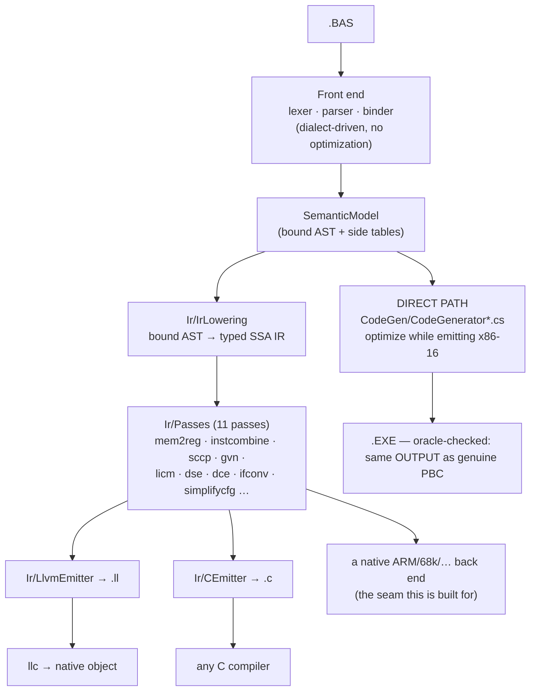

Warning: truncated output (original token count: 35300)
Total output lines: 1897

# Back ends — retargeting without giving up the optimizer

`pbc` has two ways to turn a bound program into output, and they exist for different
reasons. Knowing which layer a change belongs to is the whole point of this document.



## The two paths, and why both exist

**The direct path** (`CodeGen/`) is the fidelity path. Its job is to be
### What the fidelity gates actually enforce

Worth stating plainly, because the phrase "byte-identical" appears throughout this repository and
**no test here compares bytes**:

- `GoldenTests` compiles every `tests/NAME.BAS` and compares its **DOSBox stdout** against
  `tests/NAME.expected`.
- `scripts/run-diff-tests.sh` compiles each `tests/diff/*.BAS` twice — once with the genuine
  `PBC.EXE`, once with ours — **runs both**, and diffs `RESULT.TXT`.

Both are observational. The contract this compiler is actually held to is: *the same program behaves
the same way*, and the artefacts it produces (`.EXE`, `.PBU`, `.LIB`) are usable the same way. Byte
identity with PBC 3.50 was an aim and is a useful discipline, but it is not a gate, and it is not
what stands between the IR path and retiring the direct emitter.

### Retiring the direct emitter — the actual checklist

| | now |
|---|---|
| every program compiles through the IR | 135 / 162 lower; **65 / 135** module bodies fully owned; 137 / 224 functions routed, 178 selected |
| observable behaviour identical | **0 disagreements** over 136 compilations |
| units and libraries (`.PBU`, `.LIB`) route | **yes** — a routed `.PBU` links against an ordinarily-built main module and behaves identically (`RoutedUnitTests`) |

### Could the IR path be byte-identical unoptimized?

Measured, not assumed (`UnoptimizedByteCompatibilityTests`). Over the 33 corpus programs the back end
takes part in with `--no-optimize`:

| | |
|---|---|
| byte-identical to the direct emitter | **0** |
| routed image shorter | 21 |
| routed image longer | 12 |

The images differ in **length**, in both directions — which is what rules out "the same instructions
with different registers chosen". Both directions have a cause, and each is deliberate: shorter
because the IR path does real register allocation where the direct emitter is AX-serial by
construction; longer because the IR pipeline runs transformations of its own (loop unrolling trades
size for speed) and the routed prologue zeroes its frame unconditionally.

So byte-identity is not a near-miss to be closed by tidying. It would require the IR back end to
reproduce the direct emitter's instruction selection — the opposite of why it exists. The contract
the IR path is held to is **observable equivalence**, which is measured continuously by
`BackendCorpusDifferentialTests`.

---

observably identical to the genuine vintage compilers with the optimizer off, and to
optimize aggressively with it on while *staying* observably identical. Its
optimizations are interleaved with emission on purpose — many of them are decisions
about 8086 encodings (which register stays resident, whether a `CMP AX,BX` can stand
in for a 32-bit compare). That interleaving is not a design flaw to be refactored
away; it is what lets encoding-level decisions be made at all. This path is not
retargetable and is not meant to be.

Note on wording: throughout this repository "byte-identical" describes the **output** a program
produces — the `RESULT.TXT` an oracle battery diffs — not the executable image. No test compares
executables; see "What the fidelity gates actually enforce" above.

**The IR path** (`Ir/`) is the retargeting path. `IrLowering` turns the bound model
into a target-independent typed SSA IR; the pass pipeline optimizes it; a back end
renders it. Adding a target means writing one emitter — not a compiler.

Nothing in the production DOS pipeline depends on the IR path, so experiments there
cannot regress the golden gate.

## What a new back end costs

Two things, and only two:

1. **An emitter over `IrModule`.** `CEmitter` is ~300 lines and is the smallest
   complete example: types map one-to-one, every instruction with a value becomes a
   single-assignment local, blocks become labels, terminators become jumps, and phis
   become copies staged in the predecessors. `LlvmEmitter` is the same shape for a
   different notation.
2. **An implementation of the `rt_*` ABI** (`runtime/pbc_rt.h`). The middle end
   leaves everything that is not computation — strings, console and file I/O, array
   storage — as calls to that small extern surface. `runtime/pbc_rt.c` is the hosted
   implementation; a bare-metal target would provide its own.

Everything else is inherited: the dialect front ends, the lowering, and all the
optimization passes. That is what "modular without compromising optimizations"
means here — a new target does not re-earn constant propagation, GVN, LICM or
dead-code elimination, because those run before the back end is involved.

## The C back end (`--emit-c`)

```bash
pbc --emit-c PROG.BAS -O prog.c
cc -std=c99 -O2 -I runtime -o prog prog.c runtime/pbc_rt.c -lm
```

C99, no compiler extensions. Two details are load-bearing:

- **Integer arithmetic runs through the unsigned type of the same width and is cast
  back.** PB defines wrap-around; C leaves signed overflow undefined, which would
  licence a C compiler to assume it never happens. The unsigned round-trip is the
  only faithful spelling. Division keeps C's truncate-toward-zero, which is already
  exactly PB's `\` and `MOD`.
- **PB's observable formatting lives in the runtime, not in the generated code.**
  `PRINT` gives a numeric a leading sign slot and a trailing space, drops the leading
  zero of a pure fraction (`.0001`), and prints strings unpadded — so the C program's
  output is comparable to the DOS binary's byte for byte.

**The C reads like hand-written code, not a transcription of the SSA form.** Four
things close the gap (`CEmitterQualityTests` pins them; `CBackendTests` proves the
output still runs):
- **Integer arithmetic is recovered from PB's float promotion.** PB computes integral
  `+`/`-`/`*` in floating point, so `p% = a% * b%` lowers to `fptosi((float)a * (float)b)`.
  `IntegerRecovery` (now run in the `--emit-c`/`--emit-llvm` pipeline, as it already was for
  the x86-16 back end) rewrites a float tree stored back to an integer into the integer
  arithmetic it is equivalent to mod 2ⁿ — the C then reads `a * b`. It sees through the
  `fpext`/`fptrunc` PB inserts to widen a SINGLE subtree to DOUBLE before combining it with a
  wider operand (`a% * a% + b%` squares in SINGLE, extends to DOUBLE for the add), so an inlined
  integer function recovers whole; the leaf-width check keeps it inside the same modular form the
  direct back end uses, leaving a genuinely overflow-prone mixed-width tree on the FPU.
- **Phi copies sequentialize to direct assignments.** A loop-carried value that is not part
  of a swap becomes `counter = counter_next;`, not a parallel copy staged through `int64_t`
  temps; only a genuine cycle pays for the temps.
- **Control flow falls through.** A branch to the block emitted next emits nothing, a
  conditional whose false arm is next becomes `if (c) { … }` with no `else`, and a block no
  live `goto` reaches loses its label — so a loop is `L1: … goto L1;`, not a label-and-jump
  for every edge.
- **A single-use compare folds into its branch** — `if (i <= 10)`, not `t = (i <= 10); if (t)`.

`CBackendTests` compiles every DOS battery program that has a golden output through
this path with the host C compiler and diffs the result against that golden — the
same file the DOSBox battery checks the 16-bit executable against. A program outside
the lowering's subset is reported and skipped, never quietly passed.

## The seam is a test, not an interface

There is deliberately no `IBackend` abstraction. An emitter's input is `IrModule`
and its output is text or bytes; a C# interface over that would add a vocabulary
without adding a constraint. What actually keeps back ends honest is the
cross-checking:

| Check | What it proves |
|---|---|
| `scripts/run-diff-tests.sh` | the direct path still matches the genuine vintage compilers |
| `CBackendTests` | the IR path's C output matches the DOS goldens |
| `EmitLlvmTests` | the IR path's LLVM output is accepted by `llvm-as` and lowered by `llc` |
| `IrVerifier` | every pass leaves structurally valid, well-typed SSA |
| `BackendCoverageTests` | how much of the corpus the in-house x86-16 back end takes, and what blocks the rest |
| `BackendRoutingGateTests` | one program per construct, so a construct that silently STOPS routing is a red test rather than a quiet fallback |

Any new back end should add one row to that table. The cross-check has already earned
its keep. Running the DOS battery through both paths found five real defects that a
single back end cannot expose, because there was nothing to disagree with:

| Defect | Symptom |
|---|---|
| `+` between strings lowered as arithmetic | every program using the classic concat spelling declined |
| an unsuffixed decimal literal kept double precision | `d# = 3.14159` printed `3.14159` where PB prints `3.1415901184082` (the literal is SINGLE) |
| `INPUT` prompted per variable, not per statement | `INPUT a, s` printed two `? ` prompts |
| a `STATIC` local was a frame alloca | it restarted at zero on every call |
| a module variable was a *separate* alloca per function | a procedure and the main body silently disagreed about `SHARED` state |

The last two were miscompiles: correct-looking IR, wrong program. `tests/SHAREDG.BAS`
now pins both, in the DOS battery and in `CBackendTests`.

## The bar for retiring the direct emitter

Worth stating plainly, because coverage numbers make the distance look shorter than it is. Dropping
`CodeGen/` needs THREE things, and only the first is being measured today.

**1. Coverage - every program on the IR path. NOT done, and the number that said it was measured the
wrong thing.** `BackendCoverageTests` ranks this over the whole corpus, and it used to report **262 of
262 functions select and allocate** and **161 of 161 module bodies** with every decline histogram
empty. Both figures were real and neither was coverage. They measured the SELECTOR over every function
the lowering produced, while `CodeGenerator.BackendProcs` refuses a procedure on its SHAPE - a QUAD,
BYTE, FIX, EXT or record value, an unsupported BYREF pointee, a non-default calling convention,
or error handling in the body - BEFORE the selector is asked at all. A procedure the filter skips
appeared in neither the numerator nor the denominator, so the ratio said "of the functions we
attempted, how many succeeded", which is nearly a tautology. Today that is free, because a skipped
procedure falls back to the direct emitter; the moment `CodeGen/` is deleted each one is a compile
failure.

The honest figures, taken from the production code generator itself rather than from a second
implementation of its rule (`CodeGenerator.BackendDeclines`):

| | |
|---|---|
| programs reaching the IR at all | **169 / 171** - the other two the FRONT end rejects |
| functions ROUTED, `--optimize` | **320 / 320** |
| functions ROUTED, `--no-optimize` | **320 / 320** |
| module bodies owned | **169 / 169** |
| ...of which the SELECTOR would take, if offered | 320 / 320, 169 / 169 |

The denominator is the SOURCE - every procedure with a body plus one module body per program - not
the IR function count. The two used to differ when a procedure body failed lowering and disappeared
from the IR entirely, and `IrModule.ProcedureLoweringDeclines` plus the pinned census set keep that
observable. It is empty: the last refused body was `WEIRD.BAS::Test_OnGosub` (`ON … GOSUB`), and the
lowering now has an arm for it.

**The two figures are the same figure, and that is the point of the second one.** `--no-optimize` was
the mode with the weaker coverage for as long as the four gaps below stood, and all four turned out to
be selection arms rather than anything the passes were doing - so what the optimizer was buying was not
coverage but the accident of folding the shapes away before the selector met them. Only four
`EXTERNAL` declarations are outside the ratio, and they have no body here to route.

**These figures were 263/263 and 161/161 as recently as this document's previous revision, and the
difference is not a widening - it is the census learning to read two of the programs it was counting.**
It bound each corpus file with `Lexer.Tokenize`, which does not reach `Preprocessor.Expand`, so
`MINI.BAS` and `WEIRD.BAS` never resolved their `$INCLUDE "TESTLIB.BI"`, bound with unbound equates,
and were discarded as front-end rejections - out of BOTH halves of every ratio, along with the
forty-nine procedures they contain and the only `ON … GOSUB` in the corpus. Five more corpus-wide
fixtures had the same gap. This is the third time this ratio has turned out to be taken over the wrong
denominator, and the pattern each time is the same: the number was true about what it measured.

Both production gaps are now empty, and the unoptimized one closed last. What was in it, and what each
one cost to close, because three of the four are worth knowing about individually:

| class | funcs | programs | how it closed |
|---|---|---|---|
| phi edge-copy cycle needs a temporary | 2 | 2 | `DIFF39`, `DIFF49` - and the decline was over-broad |
| `FPToSI f80 -> i64` | 1 | 1 | `DIFF16` - a FIX cell is a scaled int64 the program KEEPS |
| `SIToFP i64 -> f80` | 1 | 1 | the row above EXPOSED it: the FIX load half |
| `select` with an `f32` result | 1 | 1 | `CODEGEN.BAS` - the diamond, through a frame cell |

**The edge-copy decline was not testing for a cycle.** The copies a CFG edge carries are a PARALLEL
copy - every phi reads the values the predecessor ENDS with - and the old test asked whether a copy's
source was ANY other copy's destination. That is true of `a <- b` beside `b <- c`, which needs nothing
but the other order, so acyclic edges declined alongside cyclic ones.
`InstructionSelector.SequenceEdgeCopies` sequentializes instead: a copy may be written once no copy
still waiting reads the register it overwrites, which orders every acyclic edge and leaves exactly the
cycles. A cycle is broken by copying one destination's incoming value into a fresh virtual register
first and rewriting every remaining reader of it, which is the classic swap-through-a-temporary. Not an
`XCHG`: the values are virtual here, so an exchange would have to be undone in the allocator's terms,
and a value the spiller puts in the frame has no exchange instruction at all. The register is minted at
SELECTION, so it is an ordinary value the allocator sees from the start - not a spiller-minted one, and
so deliberately not a member of `MFunction.MovedValues`, whose whole meaning is "already moved once
during spilling". `BackendPhiSwapTests` pins both halves: a swap costs three moves and really performs
the exchange, and an edge that only needed ordering mints nothing.

**The two qword conversions are one shape read in both directions, and the second is the worked
example this document already warns about.** A FIX cell holds the value scaled by `pbvFixDigits` as an
int64, so the store path is `FPToSI f80 -> i64` ending in storage rather than in a matching `SIToFP` -
a qword frame cell, the only place this target holds a 64-bit integer. It goes through `rt_trunc` for
the reason the existing `SIToFP(FPToSI(x))` pair does: `FISTP` rounds by the control word, and
`FPToSI` means toward zero everywhere else in this compiler. That costs a call the direct emitter's FIX
store does not make - `rt_fixup` has already applied `FRNDINT` by then - and it is emitted anyway,
because the arm is `FPToSI` in general and not the FIX idiom in particular. Enabling it moved
`DIFF16::main`'s decline one instruction later, to the `SIToFP i64 -> f80` of the LOAD path, which had
been unreachable behind it: a widening making the next blocker visible, exactly as `FPToUI` did.

**`ON n GOSUB` is `ON n GOTO`'s switch over the `GOSUB` machinery**, with one thing that decides
whether it is correct: the return id is pushed INSIDE each arm rather than once in front of the
dispatch (`IrLowering.GosubArm`). The default arm is PB's fall-through and never returns, so a push in
front would leave an id on the shadow stack whenever the selector is out of range - and the next
`RETURN` anywhere in the procedure would come back to the `ON` statement instead of to its own caller.
All the arms share ONE id, because they share one continuation, which is what a GOSUB's return address
is. `tests/diff/DIFF119.BAS` is the oracle: the selector comes out of `DATA` so nothing folds the
dispatch, every arm is taken plus 0 and past-the-end, and a plain `GOSUB` written behind the dispatch
is what catches an unbalanced return stack.

**And DIFF119 was arranged around a defect rather than exposing it, which is the more interesting
half.** It puts the dispatch and a plain `GOSUB` together in the MODULE body, and gives the procedure
only the dispatch. Write both in a procedure with ONE call site - so the inliner absorbs it - and the
copy in `main` names the CALLEE's phi: `--emit-llvm` raised `LlvmEmitter.Ref … (IrPhi is none)`,
`--emit-c` wrote an undeclared identifier into C that does not compile, and the routed path declined
`main` with `operand: IrPhi has no register`.

`IrCloner` was cloning block by block in `source` order and passing an unmapped operand through
unchanged - which is right for a genuinely external value and silently wrong for one inside the
region. Block order is CREATION order and not dominance order: `EnsureGosubDispatch` builds its block
lazily, so the phi that carries a GOSUB's answer is appended BEHIND every continuation that reads it.
The cloner now re-reads every cloned instruction's operands from its source once the value map is
complete (`IrCloner.ResolveOperands`), which cannot depend on the order at all.

**`IrVerifier` should have caught this and did not, and that is a second finding.** It skipped an
operand whose defining instruction has no parent block, in the same clause as the constants and
arguments that really do impose no constraint. While the callee still existed the dominance rule did
flag it - and then `GlobalDce` removed the callee, the phi's parent went null, and the driver's final
`IrVerifier.Verify(module)` passed a module carrying a cross-function reference straight to two back
ends. A detached operand and one defined in another function are both errors now
(`IrVerifier.VerifyOperandIsOwned`).

Near BYREF INTEGER/WORD/LONG/DWORD/SINGLE/DOUBLE parameters are no longer in that table: all 12 corpus
procedures now route through one-word near pointers, taking production from 245/263 to 257/263
optimized and from 242/263 to 254/263 unoptimized. `BackendByRefRoutingTests` pins write-through,
same-cell aliasing, recursive forwarding, every admitted numeric type, both optimizer modes, and the
SPEED fixpoint that requires both caller and callee to route.

Dynamic strings now close the next three corpus rows. A BYVAL argument hands its owned one-word handle
to the callee; BYREF hands the near address of the caller's handle cell; and a function returns an
owned handle in AX. The IR releases BYVAL parameters and local dynamic strings on every return,
releases copy-in temporaries after their call, and releases a string result discarded in statement
position. At that stage production reached 262/263 optimized and 258/263 unoptimized. The routing gate
also compiles unoptimized so an optimizer-erased backend limitation remains visible.

Linked BASIC/PASCAL declarations close the final optimized row. The census now builds the corpus-local
PBU named by `$LINK`, so `LINKDEMO` is measured with the same `MATHUNIT.PBU` input the driver supplies.
Its numeric, BYREF, nested-call and dynamic-string calls use the routed stack ABI in both optimizer
modes, through either a PBU or a PBL. Routed calls to near CDECL and STDCALL declarations now preserve
their IR convention identity, push argument groups right-to-left, and apply caller/callee cleanup as
declared. Near FASTCALL/WATCALL calls stage their leading one-word values in the ABI registers, push
the overflow in the declared direction and leave its cleanup to the callee; source-declared
FASTCALL/WATCALL *definitions* route with them, because the routed prologue now pushes those same
registers into the negative frame cells `LayoutFrame` had always assigned them. Merely having a link
input no longer rejects the entire module.

Two limits remain. A register-convention value wider than a word - LONG, float, far pointer, multiword
aggregate - is refused on the routed and the direct path alike, because the per-compiler rules for
splitting one across a register pair differ between FASTCALL and WATCALL and neither is modelled; the
call side and the definition side share one predicate for it, which is what stops a definition and its
call sites disagreeing about which shapes exist. And a GENERATED definition - a clone, or a procedure
whose signature an interprocedural pass rewrote - has no `ProcedureSymbol` carrying that spill plan, so
`X86CallAbi.TryDefinitionStackLayout` derives the frame from the IR signature alone and declines a
register convention outright.

The six near conventions and the rules each one selects:

<!-- x86-call-abi: re-derived from X86CallAbi by BackendCallAbiDocumentationTests -->

| convention | argument registers | stack argument order | stack cleanup |
|---|---|---|---|
| `BASIC` | - | left-to-right | callee |
| `PASCAL` | - | left-to-right | callee |
| `CDECL` | - | right-to-left | caller |
| `STDCALL` | - | right-to-left | callee |
| `FASTCALL` | AX, DX, BX | left-to-right | callee |
| `WATCALL` | AX, DX, BX, CX | right-to-left | callee |

Dynamic-string `SWAP` removes the former invisible lowering row. The IR loads the raw handle from
each owner cell and crosses the stores; it neither borrows a duplicate nor frees a handle because the
operation transfers ownership. Local cells and far dynamic string-array elements agree with the
direct emitter in both optimizer modes. `SwapIsInline` therefore adds one routed procedure in both
modes; its SPEED caller adds the second optimized gain, moving 257/254 to 259/255 and module ownership
from 159/161 to 160/161. Selection and allocation move from 262/262 to 263/263.

**Whole classes are absent from the corpus and are no less real.** `BackendRoutingGateTests` holds one
program each: QUAD and BYTE parameters and results, FIX and EXT parameters, a record parameter, the
four non-default conventions `CDECL`/`STDCALL`/`FASTCALL`/`WATCALL`, error handling inside a procedure
body, and an array parameter - none of which the corpus would have noticed stopping or starting.

Every one of them routes today. The fixture used to carry a decline list beside its routing list, and
closing an item meant moving its row from one to the other; the last row to move was `ERASE` of an
ABSOLUTE array, and the list went with the test that consumed it rather than being kept empty, because
a routing that refuses nothing cannot be shown to be refusing and an empty case source proves nothing
while looking like coverage. What each row now pins is the opposite claim - that the construct is still
taken - which is why the fixture asserts the routing table by name as well as execution equivalence: a
byte-identical image no longer means whole-program fallback once a declined procedure and a routed
caller can share one stack ABI.

**Six constructs the routed path declined OUTRIGHT now route, and none of them was in the corpus
either.** A sweep of the declarative surface - rather than of the programs to hand - found them; each
was harmless while `CodeGen/` exists and a compile failure the day it does not.

| construct | what it was | what it is |
|---|---|---|
| `RND`, `TIMER` without parentheses | `unbound name RND` | the binder leaves a bare intrinsic a `NameExpr`, so it never reached the intrinsic-call path at all - while `RND(0)` a line above lowered perfectly well. Both are now nullary intrinsic names, beside `FREEFILE` and `CSRLIN` |
| `RANDOMIZE` | `unsupported statement` | a seed the program names is a plain store into the runtime's own `rt_rndseed`; the argumentless form seeds from the BIOS tick counter, which is now `rt_randomize` - a routine, and one BOTH paths call, because a program must not seed two ways |
| `SWAP` of a record | `unsupported lvalue` | three block copies through a frame temporary, which is also what keeps `SWAP p, p` correct where a two-copy version would not be |
| `READ` into a `STRING * n` | `unsupported lvalue` | the item is padded or truncated into the buffer, the same store `INPUT` already made into one; it had been falling through to the numeric path |
| `READ` / `RESTORE` inside a procedure | `global '.data_cursor' has no cell` | see below - this one is the interesting one |
| `$DYNAMIC`, `$STATIC`, `$OPTION`, `$DIM`, `$STACK` | `metastatement $…` | not one of them is an instruction: they are consumed by the binder, by a model flag, or by a codegen pre-pass over `model.MetaStatements`, all of which a routed module body already gets |

**The DATA one had been declining over a conflict its own declining created.** The two paths keep
separate pools - the IR's cursor is an INDEX into its own blob and `rt_dataptr` is an absolute pointer
into `rt_datapool` - so what must never happen is a program reading through both. The guard asked
whether any PROCEDURE reads DATA and, if one did, made `.data_cursor` unaddressable. That declined the
procedure, which was the only thing that could have made the pools disagree, and it declined the
module body with it: a `SUB` containing one `READ` cost the whole program its routing.

The rule is about how many FUNCTIONS read DATA rather than about which ones, and it cannot be settled
before selection and allocation have had their say - so it is granted optimistically and CHECKED once
the last routing decision is in. A split set of readers discards the routing and decides it again with
the pool left to the direct emitter, which is the state the old rule assumed in advance. The check has
to run before `OptRegParm`, which mutates the model's calling conventions on the strength of the
routing: recomputing after it would lower a model the first pass never saw.

Two things turned up alongside. `ContainsDataRead` named the compound statements it descended into -
IF, FOR, DO, SELECT - and therefore not `TRY`, so a `READ` inside a `TRY` block read as a body with no
DATA in it, which is the one answer that turns this guard into a miscompile; it now walks with
`OptReachability.DescendantNodes`. And `Cpu8086`'s INT 1Ah answered a fixed zero, so a clock that never
moves cannot be told from a routine that answers a constant - a back end that dropped `TIMER` entirely
would have passed. It now advances one tick per read, which also gives `rt_delay` and `rt_sound` a
counter that reaches their budget instead of spinning.

**What `RND` is NOT held to, stated plainly.** The routed and direct builds draw the same sequence from
the same seed, and that is the whole contract these tests assert. Matching GENUINE PBC 3.50 is a
separate claim and it is false: from seed 7 the oracle draws `.7670898` where this compiler draws
`.5970459` (measured with `scripts/diff-one.sh`). Reproducing Zale's generator is a fidelity item for
the DIRECT emitter, which is the path held to the oracle. `tests/diff/DIFF120.BAS` therefore carries
only the half the oracle does agree with - a seeded sequence replays, every draw is in range,
`RND(a, z)` is bounded - and it passes both ways. `RANDOMIZE` with no argument is deliberately absent
from it: genuine PBC PROMPTS for the seed and waits, so a battery program containing one never
finishes and measures nothing.

Still declining, and measured rather than assumed: `INPUT #n` of a QUAD, BYTE, WORD or DWORD
(`rt_finput_i64` / `rt_finput_u8` / `rt_finput_u16` / `rt_finput_u32` are declared by the IR - the same
declarations feed the C back end - and the DOS runtime composes an entry only for `i16`, `i32` and the
floats). Closing it wants either those entries written to mirror the direct emitter's width-specific
`Coerce`, or `INPUT` re-shaped to read every number as `VAL` of a token and convert - which is what the
direct emitter does at its call site, and would change the C back end's output as well. And `DIM` of a
`$DYNAMIC` array with no `REDIM` after it declines at `gep: non-register base`, which is a dynamic-array
gap the metastatement work exposed rather than caused.

The optimized SELECTION and ALLOCATION decline histograms are empty, and that remains worth having.
The separately reported unoptimized histogram names the four optimizer-dependent selector gaps above.

The last one to go was `DIM ... AT` with a non-default array CLASS, which this document called a
deliberate decline on the grounds that `HUGE` steps the segment by `byteOffset >> 4` and `VIRTUAL`
maps a 16 KiB EMS page pair into a window before each access. That reasoning was wrong in its premise
and it is worth recording why, because the same premise could retire other work by mistake. Both are
addressing arithmetic ending in a segment and a displacement, which is precisely what `IrFarPtr`
carries - and it never required the segment to be a CONSTANT; `InstructionSelector.FarMemory`
materializes whatever value it is given into a register in front of the access. The allocator, the
page mapper and the zero fill are `rt_hugealloc` / `rt_emsalloc` / `rt_emsmap2` / `rt_emszero`, which
the DOS runtime already exports and the direct emitter already calls, so the lowering calls the same
entries through the same `RuntimeAbi` table every other runtime routine goes through. The "far
descriptor the DOS runtime holds" was the only real claim in the paragraph, and it is a 20-byte DGROUP
cell whose contents the routed path keeps in two frame slots instead - which is why an array a
PROCEDURE also reaches still declines (below). `IrLowering.PagedArrays.cs` is the whole widening.

DIFF17 now routes end to end, and the differential battery scores the same with it as without.

What still declines inside those classes, each measured rather than assumed:

| refused | why |
|---|---|
| rank above one, non-scalar or dynamic-string element | the DIRECT emitter refuses them too (`TryEmitLongBoundsAndByteCount`), so there is no behaviour to agree with |
| `REDIM PRESERVE` | same - the copy would have to walk two segment-stepped or page-mapped blocks at once |
| `ERASE` of an `EMS`/`XMS` array | the direct emitter has arms for `HUGE` and `VIRTUAL` and none for these two, so one falls through to the conventional reclaim and gives a 20-byte HV descriptor to the heap allocator. Reproducing that would copy a defect into a second place |
| an array a PROCEDURE also reaches | the routed descriptor is two frame slots and the direct one is a DGROUP cell; two descriptors for one array agree about nothing. This is the only decline the shared-storage boundary causes, and it is the same one dynamic arrays have — though *that* half was a claim rather than a fact until `DynDescriptor` was made to ask. It mints its slots directly and never went through `SlotFor`/`GlobalFor`, where the guard lives, so a module-level dynamic array a `SUB` re-DIMed got one private descriptor per procedure: `REDIM PRESERVE a(1 TO 6)` inside the SUB allocated a new block and wrote the new bounds where nothing else read them, and the module body went on answering `UBOUND` 3 and addressing the freed block. The escape analysis could not have said otherwise either — a `REDIM` names its array through a `VariableDecl` and the walk only looked at expressions, so a SUB whose only mention of the array is the REDIM read as one that never touched it |
| the ADDRESS of an element (BYREF, VARPTR, a record copy) | `IrFarPtr`'s own rule, unchanged: a far pointer used as a near one loses its segment silently |
| `FRE` other than `FRE(-11)` | `FRE(-11)` is the free EMS byte count and is real information; every other spelling answers an advisory 32767 after CONSUMING a string argument, which is an ownership rule the IR does not model |

**A `DIM` whose bound is not a constant was allocating nothing at all, and the routed decline was
hiding it.** `INPUT n% : DIM a%(1 TO n%)` makes a DYNAMIC array whose only allocation point is the
declaration - there need be no `REDIM` anywhere - and `IrLowering.LowerDim` ended in the comment "a
DIM is just a declaration here; storage is allocated lazily on first use". That is true of a STATIC
array, whose storage is laid out at compile time, and of a dynamic one it was not lazy allocation but
no allocation: the descriptor's data cell stayed null and `a%(1) = 7` compiled to
`getelementptr i8, ptr null, i32 2` and a store through it. The selector declined that shape
(`gep: non-register base` - the null base folds to an immediate), which is why no DOS program ever ran
it, and `--emit-c` and `--emit-llvm` emitted the null store. `AllocateDynamicArray` is now shared by
`REDIM` and by the `DIM` of a dynamic array, which is what the direct emitter already does: `EmitDim`
and `REDIM` without `PRESERVE` both reach `EmitClassedAllocation`.

**File `INPUT` of a `QUAD`, `BYTE`, `WORD` or `DWORD` now routes, and closing it found a miscompile in
the entry that was already there.** The IR declares `rt_finput_i64` and its three neighbours because
the same declarations feed the C back end; the DOS runtime composed an entry only for `i16`, `i32` and
the floats, so those four declined with "not in the runtime ABI table". What each one had to be is
decided by where the direct emitter's `Coerce` narrows the VAL'd number for that target type, and the
four are not one shape: a BYTE and a WORD are both `ValueKind.Int16` there and share the 16-bit entry,
differing only in how much of `AX` the caller keeps; a DWORD takes the 32-bit one; and a QUAD stays on
the x87, because 64 bits of integer have no register pair on this target - only a qword frame cell -
and anything that touched a DOUBLE on the way in would drop eleven mantissa bits. Two new answer kinds
carry those last two (`ResultKind.LowByte`, `ResultKind.St0ToQword`); the qword cell is the same one
`SelectQwordLoad` mints, so the result is an ordinary 64-bit value every later store already reads.

The defect underneath: **`rt_inp_i16` narrowed with a 16-bit `FISTP` and `rt_inp_i32` with a 32-bit
one, and `FISTP` does not wrap.** Given a value its destination cannot hold it writes the INDEFINITE -
`8000h` in a word, `8000_0000h` in a dword - so `INPUT #1, a%` on 40000 answered -32768 routed where
PB wraps to -25536, and `INPUT #1, l&` on 3000000000 answered -2147483648 where PB wraps to
-1294967296. The direct emitter stores through one size more and keeps the low half for exactly this
reason and says so in a comment; both entries now do the same. That also makes the signed and unsigned
32-bit arms one routine, which is why there is no `rt_inp_u32`. It was invisible because both entries
are called only from the routed path and every INPUT any test had written was in range - the
in-range answer is identical either way.

**A FIX literal was built as the CELL it is stored into rather than at the width it is computed at,
and the routed decline was the only back end that noticed.** `MapType` gives `1.5@` the type `i64` -
correctly, a FIX cell is a scaled int64 - and `LowerExpr` then built the constant with that type while
holding a float: an `IrConstantFloat` carrying an `i64`. The x86-16 selector declined it ("64-bit
operand: IrConstantFloat has no cell"); `--emit-c` and `--emit-llvm` rendered the double's BIT PATTERN
as an integer, so `v@ = 1.5@ : PRINT v@` printed `4.6E+16`. The literal now lowers at the x87's own
width and reaches the cell through the same `rt_fix_up` every other value stored to one goes through,
and `IrVerifier` rejects a float constant carrying a non-float type.

It is deliberately NOT the direct emitter's compile-time decimal fold against a hard-coded 100
(`CodeGenerator.Places`, "FIX literal stores round DECIMALLY at compile time"). That fold is a defect
`BackendFixBcdTests` already declines to reproduce - with `pbvFixDigits` at 4 it writes the two-digit
scaling and reads it back at four - and the two agree wherever the scale is the default the fold
assumes.

**An empty decline histogram is not the same as "every shape is handled", and one shape RAISED rather
than declining.** A narrow (`BYTE`/`WORD`/`INTEGER`) shift whose count the immediate encoding cannot
carry - one the program computed, or a literal outside 1..31 - reached the assembler in a form it has
no encoding for, so `SHIFT RIGHT a%, n%` and `SHIFT LEFT a%, 32` ended the COMPILATION with an
exception instead of an answer or a decline. Both now take the `CL` form the direct emitter uses for
every narrow shift (`InstructionSelector.SelectVariableShift`). It survived a green corpus and a green
differential battery because every corpus shift by a runtime count is 32- or 64-bit, where
`SelectWideShift` declines, and every narrow one is a literal in range - the shape simply is not in the
corpus. A coverage census that only counts declines cannot see this class: the function neither routed
nor declined, it threw.

Two implementation notes that cost time and would cost it again. The 32-bit offset is split into its
16-bit halves and recombined the way the direct emitter's `SHR AX,n / SHL DX,16-n / OR AX,DX` does,
not shifted at 32 bits: `SelectWideShift` walks a register pair one bit per step and caps the count at
eight, so `lshr i32 x, 14` declines where the same value computed in halves selects. And the EMS
window cache is `rt_ems_curhnd` / `rt_ems_curpage` - the runtime's own cells, read and written by both
paths, because the page frame is one window for the whole image and a routed access that remapped it
privately would leave a directly emitted one addressing the wrong page.

One decline was ADDED on purpose while closing the others, and it is the interesting one - and it has
since been closed by doing what it said. A function whose inline-asm blocks had other work BETWEEN
them used to decline: `LOWLEVEL.BAS` counts `CX` down across `n = n + 1`, and an asm block is modelled
as clobbering everything - which stops a value living ACROSS it but does nothing to stop the allocator
putting a temporary IN `CX` in the middle. It printed 1 where 5 was right. The direct emitter survives
by computing through AX, which is luck rather than contract, so the answer was to make the contract
real: an asm statement now declares the registers it defines and reads, read out of its text by the
assembler that emits it, and the allocator reserves each one over the stretch between the statement
that sets it and the one that reads it (docs/X86-BACKEND.md, "An inline-asm block can say which
registers it defines"). What still declines is a register something in between DESTROYS - a call owns
the whole caller-saved file, and no alloc…15300 tokens truncated…mizer both on and off and under `$CPU 8086` and `80386`. Every answer below is genuine
PBC 3.50's, taken with `scripts/diff-one.sh`, and **three of the six turned out to be the direct
emitter's**:

| | PBC 3.50 | direct was | routed was |
|---|---|---|---|
| `STR$(ex)` (EXT = 5/3) | `1.66666666666667` | correct | `1.666667` |
| `IF sg = 1 / 3` (sg = the SINGLE 1/3) | `ne` | correct | `eq` |
| `FOR x! = 0 TO 1 STEP .1`, summed | `4.50000026077032` | correct | `4.50000006705523` |
| `PRINT %B` (`%B = 1 / 3`) | `0` | correct | `.333333333333333` |
| `CDBL(CSNG(2 / 3))` | `.666666686534882` | `.666666666666666` | correct |
| `db = F!(...)` (a SINGLE FUNCTION) | `1.66666662693024` | `1.66666666666667` **optimized** | correct |

* **`STR$` named the DOUBLE by its byte size** and let everything else fall to the SINGLE formatter,
  which puts the two WIDER formats on the wrong side of the test - an EXT and a BCD are ten bytes
  each. The direct emitter's dispatch names ByteSize 4 and falls everything else to the 64-bit
  renderer, which is the same rule stated so that adding a width cannot break it.

* **A float comparison was run at the narrower operand's declared width.** `CommonCompareType` took
  the max of the two, so a SINGLE against a SINGLE-typed constant expression narrowed the CONSTANT
  too, whereupon the two were bit-identical. PB rounds a float when it STORES it and not before, so
  a comparison happens at the x87's own width; the common type is EXT, and widening costs nothing
  where the operands already agree. Note the second row is decided by WIDTH and not by folding:
  `IF sg = .3333333` is `ne` as well, and a literal is not a quotient.

* **`fptrunc` was only half the narrowing rule.** A float instruction the IR types f32 or f64 is not
  an intermediate PB left wide - the lowering types every ordinary PB float expression `x86_fp80`
  and says where a rounding happens by writing a NARROW type - so `fadd float` has to round too. A
  SINGLE `FOR` counter is exactly that shape once `mem2reg` has taken its four-byte cell away. The
  round trip is now one helper, `PopRounded`, shared by the resize, both float-binary forms, the
  integer-to-float conversion and the math intrinsics - the last of which had been writing it out by
  hand, which is how the others got missed. C and LLVM round an `fadd float` by definition, so this
  one is the x86-16 selector's alone.

* **A `%` equate holds an INTEGER.** PBC 3.50 rejects a fractional one outright
  (`%A = 3.75` is `Error 427: Integer constant expected`) and prints `0` for the `%B = 1 / 3` it does
  accept. The lowering carried the folder's floating value where the direct emitter has always read
  `AsInteger`. Being a superset of the real compiler is fine; being two different supersets in one
  compiler is not.

* **`CSNG`/`CDBL`/`CEXT` rounded nothing** in the direct emitter: `Coerce` answers "both sides are
  floats" and returns. It hid behind the formatter - `PRINT CSNG(x)` is seven digits whatever the
  cell holds - so the value has to be widened again before anything says so.

* **O0102's return-value forwarding admitted float results** on the grounds that the epilogue's
  `FLD` would have put the value in ST(0) anyway. That reload comes from the result variable's own
  four- or eight-byte cell, so it is not a move: it is the rounding that makes a SINGLE FUNCTION
  answer a SINGLE. This is the direct emitter's and moves optimized bytes only - the unoptimized
  epilogue was right throughout.

**And the sixth was `Cpu8086`, which is the reason it is worth writing down.** `db = GD#(1E-300#) :
PRINT 1 / db` printed `1E+300` directly and `0` routed. Neither back end was wrong:
`WriteExtended` scaled by multiplying with `Math.Pow(2, 63 - exponent)`, and 1E-300 has a binary
exponent of -997, so the POWER overflowed to infinity long before the product would have and the
stored mantissa was zero (`ReadExtended` had the mirror fault). Every extended value below about
1E-289 was therefore ZERO to the oracle - **and only on the path that parks intermediates in ten-byte
cells**, which is what made an interpreter defect present as a routed miscompile of exactly the
tiny-magnitude cases. Both now scale with `Math.ScaleB`. When a divergence is confined to one
magnitude range, suspect the instrument.

### Float facts the sweep settled that NEITHER path gets right

Recorded rather than fixed: each is a fidelity gap against PBC 3.50 that the direct and routed paths
share, so none of them is a retirement blocker - but none of them is closed either.

* **`MOD` on reals answers 0.** Genuine PBC 3.50 gives the real remainder at every width -
  `7.5## MOD 2##` is `1.5`, `-7.5 MOD 2` is `-1.5` - where both of our paths convert the operands to
  integers first and answer `0`. This is a binder/lowering question, not a back-end one.
* **A SINGLE-typed expression sometimes prints through the DOUBLE formatter.** `PRINT sg * 3` with
  `sg = 5/3` is ` 5 ` on the oracle and `4.99999988079071` on both of ours; `PRINT sg + sg` is right
  on all three. The VALUE agrees (`d2 = sg * 3` matches) - it is the result TYPE of SINGLE ⊗ INTEGER
  that decides the formatter, and `Binder.ArithmeticResultType` says DOUBLE where PB says SINGLE.
  `MAX`/`MIN` over two SINGLE-typed arguments has the mirror fault in the other direction (ours
  prints seven digits, the oracle fifteen).
* **The fifteenth digit of a DOUBLE below 1.** `PRINT 2 / 3` through runtime operands is
  `.666666666666667` on the oracle and `.666666666666666` on both of ours, while `5 / 3` agrees at
  `1.66666666666667`. Same emulated FPU on both sides, so it is the renderer rather than the value.

The declines the sweep found are coverage rather than correctness, and all are float-shaped: a
BYREF SINGLE or DOUBLE parameter, an EXT parameter or FUNCTION result, unary minus / `ABS` / `SGN`
over a float, and `MIN`/`MAX`/`ROUND` of one.

### Three things the routed path gets RIGHT and the direct emitter does not

All three were found by a differential sweep and all three are recorded here rather than fixed: the
repair belongs to `CodeGen/`, and in one case it moves emitted bytes on the fidelity path.

* **A recursive call whose result is combined with a value computed BEFORE it miscompiles from about
  eight levels down, with the optimizer off.** PB promotes integral `+` to floating point, and with
  `--no-optimize` `IntegerRecovery` does not run - so `Down& = n% + Down&(n% - 1)` leaves the LEFT
  operand on the **x87 register stack across the CALL**:

  ```
  mov ax,[bp+4] ; mov ds:scratch,ax ; fild word [scratch]   <-- n% lives in ST(0) ...
  ...                                                        ... across ...
  call Down                                                  <-- ... this, which does it again
  fild dword [scratch] ; faddp st(1),st
  ```

  The x87 stack is eight deep, so the recursion exhausts it. Genuine PBC 3.50 answers `28` and `45`
  for `sum(1..7)` and `sum(1..9)`; our direct build answers `22` and `23`, and the routed build
  answers `28` and `45`. `$STACK 16384` does not change it, which is what rules out the 8086 stack.
  The same program with the optimizer **on** is correct on both paths, and writing the call through a
  `LOCAL` temp first (`t& = Down&(n% - 1) : Down& = n% + t&`) is correct either way - so the shape is
  exactly "an x87 intermediate live across a call".

* **`RETURN <label>` is refused by the direct emitter and implemented by the routed one.**
  `CodeGenerator` handles only `ReturnStmt { Target: null }`; anything else reports
  `not yet generated: ReturnStmt`. Genuine PBC 3.50 compiles it and runs it, and the routed path
  agrees with the oracle statement for statement. So under `PBC_X_BACKEND=1` a program compiles that
  is otherwise rejected - the mirror image of the calling-convention diagnostic `708205f` closed, and
  benign in the same way a missing feature is benign, but it is a difference in what the compiler
  ACCEPTS and belongs on the retirement checklist rather than in a decline table.

* **An element of a DYNAMIC array passed BYREF loses the write.** The element is in the far array
  heap and a BYREF argument here is a near offset, so the callee writes DGROUP at that offset and the
  array is untouched:

  ```basic
  REDIM a%(0 TO 7)
  a%(2) = 10
  CALL Bump(a%(2)) : CALL Bump(a%(2))   ' SUB Bump (v AS INTEGER) : v = v + 1 : END SUB
  PRINT a%(2)                           ' real 12, direct 10
  ```

  Genuine PBC 3.50 prints the incremented value, so it either passes a far pointer or copies the
  element in and out; the direct emitter prints the original. Numeric BYREF procedures can now route,
  but this call still cannot: `IrLowering.AddressOfArgument` rejects the dynamic element's
  `IrType.FarPtr` instead of narrowing it to the callee's near `Ptr` and silently losing `rt_arrseg`.
  The whole module therefore falls back to the direct path and inherits its known wrong result.

  Fixing the fidelity bug means copy-in/copy-out or a far-parameter ABI in both emitters. Until that
  lands, `BackendByRefRoutingTests` pins the honest decline in both optimizer modes; routing a near
  offset into DGROUP would raise coverage by producing the wrong program.

### Re-sweeping the four domains that were swept with a BLIND oracle

Three of the defects the correctness sweep found were in the **oracle**, and each was found after
several domains had already been declared clean:

1. the interpreter's disk answered an append where a position was asked for, so a `PUT` to the wrong
   record produced identical file bytes;
2. the corpus differential compared the output STREAM and never the SCREEN, so `LOCATE`, `CLS` and a
   line wrap moved characters without changing a byte it could see;
3. every extended value below about 1E-289 read as zero on one path.

A clean result from a sweep run before those is not evidence about the compiler; it is a measurement
of the instrument. **Strings**, **arrays/UDTs**, **error handling and control flow** and **integer
arithmetic** were therefore run again through the oracle as it now stands - stdout, the text page,
the attribute plane, the cursor, the printer, the whole disk, and the exit code, with the router's
own decline reasons printed beside every result so a program that agreed because it never routed is
visible instead of counted.

The probes take every value from a `NOINLINE` FUNCTION called from two or more sites with different
arguments, or off a seeded disk file, because the corpus writes constants and constants fold before
selection. Both optimizer settings, and the cross-dialect probes under pb20/pb30/pb35/pb36/qb45/pds71
(where NOINLINE does not exist, so the disk is the only source folding cannot see through).

| domain | compilations | routed | declined | agreed | disagreed |
|---|---|---|---|---|---|
| strings | 58 | 52 | 6 | **52** | 0 |
| arrays and UDTs | 48 | 40 | 6 | 35 | 5 |
| error handling and control flow | 24 | 22 | 2 | **22** | 0 |
| integer arithmetic | 36 | 34 | 2 | **34** | 0 |
| cross-dialect (six dialects each) | 48 | 32 | 16 | **32** | 0 |
| recursion, narrowing the above | 20 | 20 | 0 | 14 | 6 |
| **total** | **234** | **200** | **32** | **189** | **11** |

Nothing was left unmeasured: every routed compilation ran to completion on both paths.

**All eleven disagreements are one already-recorded defect**, the direct emitter's x87 operand held
across a CALL (`docs/ROADMAP.md`), rediscovered independently: `Walk& = n% + Walk&(n% - 1)` is right
to depth 6 and wrong from 7, which is the register file. The routed path is correct on every one of
them. **No routed defect was found in any of the four domains.** That is the finding, and it is what
the retirement case rests on for these domains - it is not a substitute for the coverage the decline
column records.

Two DIRECT-emitter fidelity defects fell out of the sweep and are fixed here, both confirmed against
genuine PBC 3.50 with `scripts/diff-one.sh … pb35` and both with the routed path already right:

* **A signed LONG ordering whose difference does not fit a LONG answered backwards.**
  `EmitInt32Op` decided the order by the SIGN of `left - right`; `-2147483648& - 3&` is `+2147483645`,
  whose sign says "greater", so `-2147483648& < 3&` answered 0 where PBC 3.50 answers -1 - in every
  dialect and both optimizer settings. It now branches on the subtraction's own `JL`/`JGE`, which is
  `SF != OF`. `tests/diff/DIFF115.BAS`; `BackendWideCompareTests` already listed the
  `2147483647 / -2147483648` pair and measured nothing, because it writes its operands down and the
  optimizer folds the comparison before either back end is asked.

* **A decimal literal wider than QUAD threw out of the lexer.** `long.Parse` on the digits raised an
  unhandled `OverflowException` from inside the tokenizer, ending the compilation with a stack trace.
  To PB such a literal is simply a float: PBC 3.50 prints `9223372036854775808` as
  `9.22337203685478E+18`. `tests/diff/DIFF116.BAS`.

The sweep driver is `Wave3SweepHarness` (`Probe` category, self-skipping without `PBC_PROBE_DIR`).

### Sweeping the declarative surface: `DATA`, `DEF FN`, the metastatements and the print/convert tail

Eleven domains in, the constructs nobody had pointed a differential at were the ones that are not
expressions: the `DATA` pool, `DEF FN` and the `DEF`*type* letters, conditional compilation and the
`%` equates, `SELECT CASE` over a subject that is neither a string nor an INTEGER, `SWAP`/`LSET`/
`RSET`/`TAB`/`SPC`/`PRINT USING`, `VAL`/`STR$`/`HEX$`/`OCT$`/`BIN$` and the `&H`/`&O`/`&B` literals,
and `RANDOMIZE`/`RND`. Every subject came out of a seeded file or a two-site `NOINLINE` FUNCTION, over
both optimizer settings.

| | domain probes | narrowing the disagreements |
|---|---|---|
| compilations | 94 | 26 |
| routed | 50 | 26 |
| declined (fell back to the direct emitter) | 36 | 0 |
| agreed, after the fixes below | 48 | 26 |
| unmeasured | 2 | 0 |
| disagreed, before them | 4 | 12 |

Eight further programs went to the genuine PBC 3.50 oracle through `scripts/diff-one.sh … pb35`,
because two paths agreeing says nothing about whether either is right — and on this surface that
mattered twice: it is what settled `READ` past the end (PB raises Error 4 and leaves the target
alone) and what settled a nested `DATA` statement (PB collects it). The two `unmeasured` rows are one
probe whose DIRECT image needs more than 8M interpreted instructions; its shorter twin measures the
same `VAL` inputs.

**One routed defect, and it was a wrong answer before it was a missing diagnostic.** `IrLowering`'s
`READ` had no end-of-pool check at all, where the direct emitter's `rt_readdata` compares `rt_dataptr`
against `rt_dataend`. Past the last item the cursor stands on whatever global follows the blob and its
first two bytes are read as an item LENGTH, so the target is filled from an unrelated object and the
cursor advances by however much that said. Genuine PBC raises Error 4 and leaves the target alone. It
is middle-end, so `--emit-c` and `--emit-llvm` walked off the blob too.

**Two direct-emitter defects, both with the routed path already right.**

* **The DATA pool was built from the top level of the module body only.** `DATA` is not executable, so
  a statement inside an `IF`, `FOR`, `DO` or `SELECT` block still contributes to the pool in source
  order — which `IrLowering.GatherData` did and `CodeGenerator.EnsureDataPool` did not. One program
  therefore had two different pools depending on the back end: `DATA 1,2 / IF x=0 THEN / DATA 7,8 /
  END IF` reads `1 2 7 8` under PBC 3.50 and under the routed build, and ran out of data entirely
  under the direct one. `RESTORE` to a label written inside a block was refused outright. The walk is
  now one reading, `Runtime.DataPool.Walk`, beside `UsingFormat` and for the same stated reason.
  `tests/diff/DIFF118.BAS`.
* **The inliner bound a BYREF parameter by aliasing the argument's cell without checking its type.**
  A real call compares the two and copies a mismatch into a hidden temp of the parameter's width;
  `TryEmitInlinedFunction` asked only whether the argument was a near lvalue, so `Twice#(i%)` pointed a
  DOUBLE parameter at two bytes and doubled six bytes of the frame — `1.42986060318503E-315` for 32,
  and `238551072` at LONG width. Optimized builds only, which is every pb36 build. Genuine PBC rejects
  the mismatch (`Error 481: Parameter mismatch - may need ByCopy`), so this is a region only we accept
  and the non-inlined build is the whole of the available reference; the corpus's one `DEF FN` takes an
  INTEGER and is given an INTEGER, which is the shape that was already right. The predicate now lives
  in `OptInlining.InlinableByRefArgument` because the reachability purge has to agree with it exactly.

**The fourth disagreement was the instrument, and it had been wrong for every probe ever run through
it.** `Preprocessor.Expand` is its own entry point; `Lexer.Tokenize` does not reach it. Both
differential harnesses — and, it turned out, the coverage census and five more corpus-wide fixtures —
read each file through the lexer, so a `$IF` chain compiled with *every* arm live and an `$INCLUDE`
resolved to nothing. A probe written to compare the two paths on conditional compilation reported
agreement over a program with all three arms emitted in sequence.

Fixing it moved two numbers that had been quoted as evidence:

| measured on one tree, with and without the fix | before | after |
|---|---|---|
| corpus differential comparisons | 325 | **329** |
| functions ROUTED (`--optimize`) | 267 / 267 | **316 / 317** |
| functions ROUTED (`--no-optimize`) | 263 / 267 | **312 / 317** |
| module bodies owned | 165 / 165 | **167 / 167** |
| procedure bodies the lowering refuses | none | `WEIRD.BAS::Test_OnGosub` (`ON … GOSUB`) |

(`tests/diff/DIFF118.BAS` and `DIFF119.BAS` then add a program and a module body each, and the five
declines that remained have since closed, which together is the difference between this row and the
320 / 320 and 169 / 169 quoted at the top of this document.)

`MINI.BAS` and `WEIRD.BAS` `$INCLUDE "TESTLIB.BI"`, so their equates were unbound, they bound with
errors, and every one of those fixtures dropped them through its "the front end rejects it" arm —
out of *both* halves of every ratio. Forty-nine procedures went with them, and so did the corpus's
only `ON … GOSUB`, which is the one construct that could have said "a procedure body still does not
reach the IR". Nothing about the back end moved: both programs routed all along.

**What this surface has no routed coverage for at all**, each a clean decline that falls back to the
direct emitter today and a compile failure the day `CodeGen/` goes:

| construct | the lowering's own reason |
|---|---|
| `RND`, `TIMER` | `unbound name` — the intrinsics are not lowered |
| `RANDOMIZE` | `unsupported statement` |
| `SWAP` of two UDTs | `unsupported lvalue` |
| `$DYNAMIC`, `$STATIC`, `$OPTION` | `metastatement $X` — the default-decline arm, though neither of the first two has runtime semantics |
| `READ`/`RESTORE` inside a PROCEDURE | `global '.data_cursor' has no cell the emitter can address` |
| `READ` into a fixed-length string, a UDT with a fixed-string field | `non-scalar UDT field` |
| file `INPUT` of a QUAD or a BYTE | `rt_finput_i64` / `rt_finput_u8` are not in the runtime ABI table |

**And what neither path implements**, found the same way and reported rather than fixed: `DATE$`,
`TIME$` and `FORMAT$` do not exist (`DATE$` binds as an undeclared string variable and prints empty);
`$SEGMENT` does not parse; `SELECT CASE` over a QUAD subject ends the compilation with
`not yet generated: SelectStmt`; and `RESTORE <label>` from inside a `SUB` is `undefined label`. The
`PRINT USING` gaps a probe turns up — `$$`, `**`, `+`/trailing `-` and `^^^^` printing as the literal
characters — are the ones `Runtime.UsingFormat` already documents as deliberately not modelled, and
the two paths agree on all of them.

Everything else agreed, and agreed with the vintage oracle where a program could be put to it:
`VAL` on malformed, spaced and radix input, `STR$` round trips, `HEX$`/`OCT$`/`BIN$`, the `&H`/`&O`/
`&B` literals, `LSET`/`RSET` including truncation, typed `READ`s with `RESTORE <label>`, `SELECT CASE`
over SINGLE/DOUBLE/LONG, `SWAP` at every scalar width and on array elements, `TAB`/`SPC` at their
boundaries, and the `PRINT USING` numeric fields that are implemented.

### One divergence with no answer: a `$ERROR` metastatement INSIDE a procedure body

```basic
$ERROR OVERFLOW ON
SUB Unchecked(BYVAL x%) : $ERROR OVERFLOW OFF : PRINT x% * 2 : END SUB
SUB Checked(BYVAL x%)   :                       PRINT x% * 2 : END SUB
```

The direct emitter's three flags are one positional field, so the `OFF` inside `Unchecked` leaks into
`Checked` and neither traps. `IrLowering.ArmedForProcedures` folds only the **module-level**
directives, so `Checked` is armed and the routed build stops there. Genuine PBC 3.50 settles nothing:
it **rejects** the program (`Error 506: Declaration must precede statements`), so the construct is an
extension of ours and neither reading is the faithful one. Recorded rather than changed - the routed
reading (a directive inside a body is scoped to that body) is the more defensible of the two, and
making the direct emitter agree would move bytes on the fidelity path for a construct the oracle does
not accept. The ordinary shape - every `$ERROR` at module level, in any position relative to the
procedure definitions - agrees on both paths.

### What the peephole row actually was

That row is down from nineteen failures to six. The distinction behind the reduction is worth keeping:
**a fixture that fails routed is not evidence of a missing optimization until somebody has looked at
what routed emits.** Several fixtures called a `NOINLINE` subject from one constant call site, so
interprocedural propagation removed the construct they meant to inspect; adding a second distinct call
made the original assertions meaningful.

The real transforms, and where each landed:

* **`Backend/Peephole.cs`** - a pass over the selected machine IR, run before scheduling and gated on
  the optimizer. It folds an ALU operand read out of memory rather than staged through a register, a
  cell read-modified-written in place (`INC [a]`, `ADD [a],imm`), a bit test that never materializes
  the masked value (`TEST x,mask`), and crossed scalar loads/stores folded to `XCHG reg,[cell]`. Each is
  guarded by a census of the WHOLE function -
  the value being removed is defined and read only by the instructions being rewritten - plus a
  barrier scan for anything in between that writes memory, clobbers the file, or writes a register the
  folded address is formed from. The addressing rule is the one with teeth: a register-formed address
  folds only into the instruction immediately following the load, because a value used as a memory
  base may live only in `BX`/`SI`/`DI` and cannot spill, so lengthening its range is precisely what
  makes a function fail to allocate.
* **`InstructionSelector.Idioms.cs`** - the patterns that span several IR instructions. Branchless
  `ABS` (`CWD / XOR AX,DX / SUB AX,DX`) and `SGN` (`CWD / NEG AX / ADC DX,DX`), neither of which can be
  written over virtual registers because `CWD` IS the sign mask and names `DX`; the min/max
  canonicalization, which brings BASIC's four spellings of a maximum to one shape by reading reversed
  arms as the negated predicate and relaxing a strict ordering to its or-equal twin (they differ only
  where the operands are equal, and there both arms answer the same value); and the x87 memory
  operands, where a literal multiplies out of the constant pool (`FMUL qword`) and a widened integer is
  read as an integer (`FIADD word`) rather than converted into an 80-bit temporary first. It also pairs
  a dominated signed quotient and remainder over the same SSA operands: the first `IDIV` captures both
  `AX` and `DX`, while error-handler and inline-asm functions retain both faulting operations.
* **`Ir/Passes/IfConversion.cs`** - the exact one-instruction diamond from
  `IF a < 0 THEN a = -a` canonicalizes to the same shift/XOR/subtract form as `ABS(a)`, after which the
  selector emits its accumulator idiom. Checked overflow adds control flow and deliberately does not
  match.

The six remaining failures assert memory shapes the routed program structurally does not produce.
`Emit_GivenSelfModifyStore` and `Emit_GivenIncrWithAmount` want `INC [a%]` / `ADD [a%],5` for a local
promoted to a register. `Emit_GivenBinaryWithMemoryRightOperand` and
`Emit_GivenCompareWithMemoryRightOperand` count staging moves that the routed path omits entirely.
The two float-memory cases want `FADD m32` / `FCOMP m32` over intermediates the back end deliberately
keeps at the x87's 80-bit width; those instructions have no tbyte operand form.

### `OptimizerTests` routed: 46 of 188, and what the seven that closed had in common

Seven of the forty-six were the fixture rather than the back end, and none of the seven needed a weaker
assertion - each got a stronger one. They sort into three shapes, and the shapes are worth more than the
list, because the same three are still available in the thirty-nine that remain.

**The subject folded away.** `Emit_GivenOnGoto` dispatched on a parameter with ONE call site, so
interprocedural propagation answered the `ON n% GOTO` and the SUB routed to a bare `RET`; the assertion
about its jump table was about no code at all. Same for `Emit_GivenCheckedMultiplyByTwo` (`x% = 30000`),
`Emit_GivenScalarSwap` (`x = 1 : y = 2`), `Emit_GivenPowerOfTwoDivides` (`a% = -29`), and both array
loops, whose constant trip count is unrolled to constant subscripts. A second call site or an `INPUT`
is the whole repair.

**The discriminator named the direct emitter's spelling.** `TEST BX,BX` is how the direct emitter tests
a divisor; a guard that reads the divisor out of its frame slot is the same guard and carries no `TEST`,
so `Emit_GivenDivideByForCounter` was counting instruction selection. The Error-11 raise is the thing the
optimization removes, and it counts the same on both paths - which additionally let the provable form be
asserted to reach ZERO. `SHL AX,1` for a subscript scale names a register the allocator chose;
`cmp dx,cx / cmp ax,bx` names one lowering of a 32-bit compare, where folding the constant operand into
it (`cmp bx,0 / cmp cx,5`) is better and the shape that survives both is the high-word three-way test, a
`JG` and a `JL` back to back. And a lone `0x87` byte "proving" an inline `XCHG` proves nothing at all: it
occurs sixteen times in any image that links the number parser, and the claim in the fixture's own name
is the ABSENCE OF `rt_swap`, which `DescribeImage().RuntimeLabels` answers for either back end.

**The control was an objective flag.** "The same program without `$OPTIMIZE SPEED`" and "the same program
under pb35" are proxies for *unoptimized* that hold only where the optimizations are gated on that flag;
the routed middle end runs whatever the dialect says. The repair is the one `df0700b` established for the
bounds-check family: the control becomes a program the optimization **cannot apply to** - a non-affine
subscript for IVSR, a non-power-of-two divisor for the shift decomposition, a DOUBLE for the integer
min/max fold - which is a stronger claim than "the flag was off", because it says the optimization
recognises its own precondition.

Of the thirty-nine left, six are `$CPU`-tier, eleven are the loop-register model, six are the objective
flag reaching the routed build at all, and the remaining sixteen are the gaps this document already
lists. Four of those sixteen legitimately pin the direct emitter's instruction selection and are expected
to stay red until the flip retires them: `Emit_GivenSelfModifyStore`, `Emit_GivenIncrWithAmount` and the
two `Emit_GivenFloat*DirectCellOperand` want memory operands for values the routed path keeps in
registers, which is not something to reproduce.

Two more are worth separating from the gap list because they now measure the property and fail on it.
`Emit_GivenPowerOfTwoDivides` says, with an `INPUT` dividend and a non-power-of-two control, that the
routed path emits four `IDIV`s where the direct one decomposes all four into shifts and masks - a real
strength reduction the selector does not have. And `Emit_GivenArrayReadLoop_WhenBoundsChecking` demands
a PESSIMIZATION: `a%(i%)` over `FOR i% = 1 TO 5` into `a%(1 TO 5)` is provably in range, and eliding its
check is correct, so the fixture's claim that `$ERROR BOUNDS ON` must suppress the address optimization
is the direct emitter's policy rather than a property of the program.

### What the `$CPU` row actually is

Two of the six were the same mistake the peephole row was full of, and the other four are one missing
thing rather than four. Every claim here is a byte count over two images.

**Two could not observe what they assert, and are repaired.** `Emit_GivenQuadShiftUnderCpu386` set
`x&& = 3` and `Emit_GivenQuadBitwiseUnderCpu386` gave both QUAD operands literals, so the statement is
answered at compile time and the routed image holds the ANSWER - `SHIFT LEFT x&, 4` after `x& = 3`
compiles to `B8 30 00`, which is `MOV AX, 48`, and there is no shift for a `66 C1` to be. Both now take
their subject from `INPUT`, assertion untouched, and both pass. The interesting part is WHY: with a
runtime operand the routed and direct images are **byte-identical**, because an `i64` is wider than a
register pair and the function declines to route at all, so the `$CPU` tier reaches it the way it
always did. These two never said anything about selection.

**Four are real, and all four want `Backend/MachineIr.cs` widened.** A 32-bit value on this target is a
PAIR of word registers (`TryOperandPair`, and the declines that read "has no register pair");
`MRegSize.Dword` exists as an operand size and `LinearScanAllocator` allocates from the 16-bit file.
`Emit_GivenLongShiftUnderCpu386` wants `66 C1` (`SHL r32, imm8`) and
`Emit_GivenLongForLoop`/`Emit_GivenLongAccumulatorLoop` want a LONG local resident in `ESI`/`EDI`; each
names a dword register as an operand, and no arrangement of two word registers is one. Measured with an
`INPUT`-sourced value so nothing folds: routed emits no `66 C1` where direct emits one.
`Emit_GivenUdtCopiesUnderCpu386` is the fourth and wants a different widening - the routed UDT copy is
`llvm.memcpy` mapped onto `rt_memcpy` (`RuntimeAbi`), a CALL to a byte-wise `REP MOVSB`, and inlining a
`REP MOVSD` in its place needs string-move opcodes and segment-register moves `MOpcode` does not have.
Widening the runtime routine instead would satisfy the byte pattern while leaving the call in place,
which is the wrong repair for a row about selection.

**4. The golden gate - byte-identical output with the optimizer off.** This is the hard one, and it
is the direct emitter's whole reason for existing: its optimizations are interleaved with emission
*on purpose*, because that is what makes byte-identity with genuine PBC achievable. An SSA
middle-end that schedules and allocates registers does not naturally emit the same bytes as an
AX-serial emitter, and nothing about widening coverage moves this. Retiring `CodeGen/` therefore
means either reproducing that byte-for-byte through the IR path, or deciding the gate becomes
behavioural rather than byte-exact - a decision about what the project promises, not a task.

The honest summary: (1) is DONE on selection and allocation and has only deliberate declines left,
(2) holds - the routed battery scores what the direct one does - (3) is the live blocker, now purely
a question of optimization quality, and (4) is a design decision that has been made: the contract is
observational, so EXE byte-identity is an aim rather than a gate.

## Coverage and what is next

The lowering's supported subset is listed in [IR.md](IR.md); everything outside it
makes `TryLowerModule` return null rather than miscompile. The largest gaps today
are `ARRAY SORT`, the FIELD form of random I/O and inline assembly (which is
target-specific by definition and will never lower).

`PRINT USING` lowers, but the **C** emitter declines it, for the reason `ON ERROR`
does below: `runtime/pbc_rt.c` has no `rt_using_field`, and the DOS runtime's
formatter is a fixed-point renderer with grouping and field overflow rather than
anything a shim could stand in for. `LPRINT` declines there too, and more simply -
"the printer" has no meaning on a hosted platform.

`ON ERROR` lowers, but the **C** emitter declines it, and that is a second and
separate gap. It arms its handler with the address of a basic block, which standard
C has no value for - GCC's `&&label` is an extension, and even with it the jump
`ON ERROR` performs is non-local, from an arbitrary fault point inside a runtime
routine, so it needs `setjmp`/`longjmp` rather than a computed goto. The portable
shape would be an integer id per address-taken block plus a `setjmp` dispatch at
function entry; what makes it a project rather than an afternoon is that the fault
has to come from somewhere, and the C runtime has no file I/O at all - so the one
battery program that faults for real (`ONERR.BAS` opens a missing file) needs
`rt_open` before it needs a handler.

Both emitters DECLINE rather than emit something that compiles and misbehaves, and
`CBackendTests` treats a decline as a skip naming the construct - the same answer it
already gives when the lowering declines. A FAILURE there means emitted C that
disagrees with the DOS golden, which is the only thing that fixture exists to catch.

### These two back ends decline; they never throw

The rule the x86-16 path states for itself ([X86-BACKEND.md](X86-BACKEND.md)) binds
here **more** tightly, not less. There a decline is caught by `CodeGenerator` and the
direct emitter compiles the function instead, so a throw was a crash where a
survivable fallback would have done. `CEmitter` and `LlvmEmitter` have *no fallback at
all*: a C translation unit and a `.ll` module have exactly one producer each, so the
named refusal is the entire value either can offer for a program it cannot render, and
a throw produces no output, no actionable exit code and no name for what stopped it.

So the shape is the one `IrLowering` already has for the stage before: `TryEmit`
returns null and reports which construct, `pbc` prints it and answers 1, and
`EmitDeclinedException` is an implementation detail of that channel rather than
something a caller sees. `Emit` remains for callers that can state in advance that a
module renders (most of the lowering fixtures), exactly as `IrTypeMapper.Map` sits
beside `TryMap`.

What declines, measured rather than assumed - the corpus figures are what
`EmitterNeverThrowsTests` reports:

| construct | C | LLVM | why |
|---|---|---|---|
| Microsoft Binary Format (`mbf32`/`mbf64`) | declines | declines | a DOS storage encoding with no C or LLVM type; `MbfToFP` has to run first. Unreachable through `pbc` today - the lowering refuses an MBF lvalue first - so it is reached only through the emitters' own API |
| the address of a basic block | declines | renders | `ON ERROR` arms a handler with one and `CODEPTR32` of a label is one; standard C has no such value (see above) |
| `IrFarPtr` | declines | declines | a segment:offset pointer (`DIM … AT`, a segmented access); flattening it to a near pointer silently substitutes the default segment |
| `IrInlineAsm` | declines | declines | x86-16 machine code by definition |
| `IrIndirectBr` | (unreachable) | renders | `GOTO DWORD`/`GOSUB DWORD`. LLVM has `indirectbr`; the C arm exists but nothing reaches it, because the address such a branch jumps to is a block address, which the row above declines first. Plain `GOSUB` is a `switch` and renders in both |
| `rt_using_field`, `rt_lprint_*`, `rt_capture_*`, `rt_reg_*`, `rt_interrupt*` | declines | renders | `runtime/pbc_rt.c` has no entry, and a stub would lie about what the program did |

Two failures that are NOT declines, and are spelled apart from them so a stack trace
can be read: `BackendInvariantException` now carries the back end's name and covers
the C emitter's block-label table and name sanitizer, and the LLVM emitter's operand
naming - which used to render an unnamed operand as `%undef`, producing a module that
assembles and computes something else. That is the one outcome worse than a raise.

`EmitterNeverThrowsTests` is the gate, in the two populations
`BackendNeverThrowsTests` argues for: 334 corpus emissions and 1032 generated ones
(43 construct bodies x 4 runtime-operand shapes x 3 dialects x both emitters), each one
a `pbc --emit-c`/`--emit-llvm` run that must answer 0 with a translation unit or 1 with
a name. The operand is always derived from `INPUT` rather than a `NOINLINE` helper,
because `INPUT` is the one opaque source that exists in every dialect and a literal
folds under SCCP long before an emitter sees it.

Each half carries its own can-this-measure-anything companion, because a matrix that
all stops at the lowering would stay green through any change to either emitter: every
generated body must bind (a body the front end rejects varies nothing while looking
like coverage), more than half the generated emissions must reach an emitter (71 of 86
do), and each emitter must render more than 50 corpus programs (142 C, 153 LLVM). One
shape had to be replaced after it was written, which is what that companion is for:
`DEF SEG = &HB800 : PEEK(n%)` lowers to a NEAR access and renders, so it would have sat
in the fixture looking like far-pointer coverage and been none.

Beyond widening that subset, the two items that would most change the picture:

- **A native IR → x86-16 back end** that reproduces the same program output for a
  subset. That is the fidelity proof that would let the IR path augment, and
  eventually replace, the direct emitter. It exists and is live behind
  `--x-backend` for integer functions (docs/X86-BACKEND.md); what it still
  declines is now *measured* rather than guessed — `BackendCoverageTests` ranks
  the blockers over the whole corpus, and the top one at any time is the next
  increment. Both standing gaps are now closed - the data-layout bridge (a load
  of a module-level global) and the runtime-label bridge (a call to an `rt_*`
  helper, mapped per routine onto the DOS runtime's register convention in
  `Backend/RuntimeAbi.cs`) - alongside signed division and spilling, which took
  the corpus from 14 to 32 routed functions of 139. What ranks next is floating
  point (the x87 stack), strings (the runtime's handle representation), and the
  `main` body, which additionally needs the startup/exit sequence.
- **Feeding the direct path's range facts into the IR — the analysis is DONE, one
  consumer is not.** `Ir/Analysis/IrRangeAnalysis.cs` is the interval lattice restated
  for SSA, and `Ir/Passes/RangeCheckElim.cs` spends it on the proofs that are pure
  optimization for every back end at once: a subscript that cannot leave its
  dimension, a sum that cannot overflow its type, a divisor that cannot be zero. What
  it does not yet feed is the one proof that is target-specific in its *use* — "a
  32-bit operation fits 16 bits" — which lives in `InstructionSelector.WordSizedRange`
  and still computes its own, much weaker, interval. It is one leaf less weak than it
  was — a widened CONSTANT contributes its value rather than its type's span, which is
  what keeps the proof from depending on `instcombine` having run — but it still cannot
  see a loop guard or an `IF` refinement, because those are properties of the CFG.
  Rewiring it onto the analysis is the next increment and the prerequisite for the four
  narrowing assertions in gate 3.
