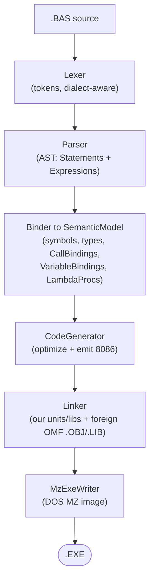
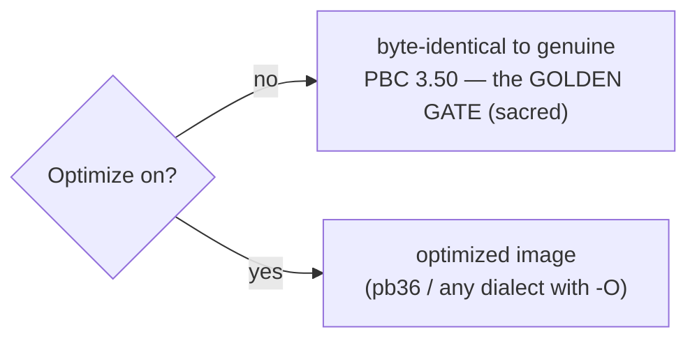
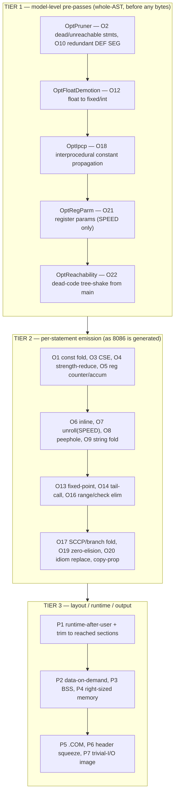
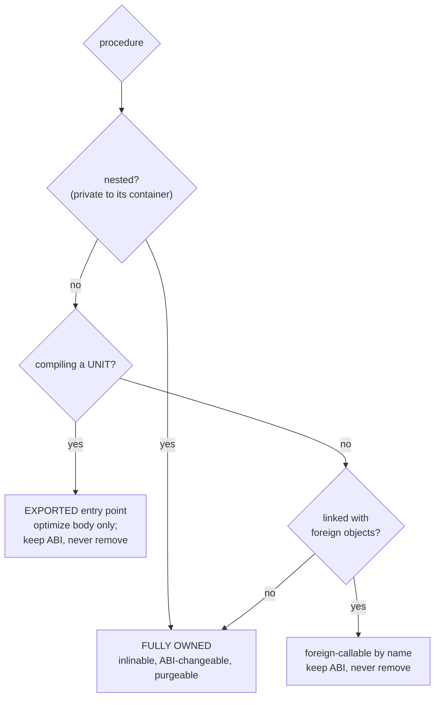
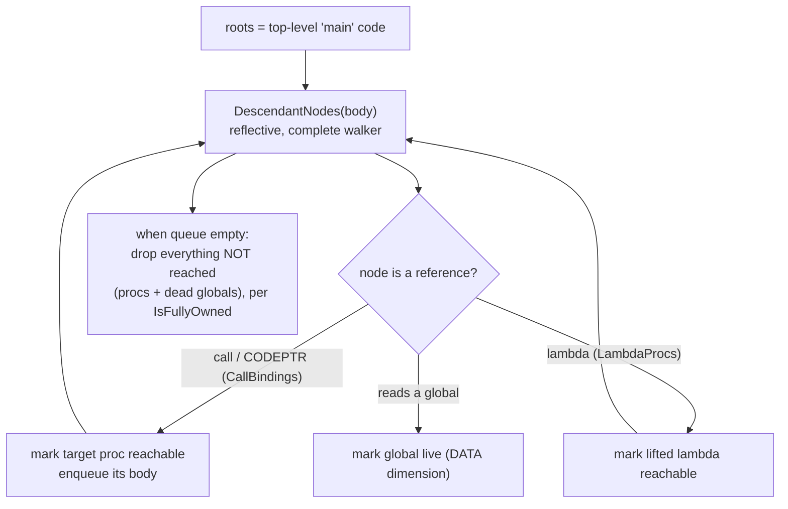
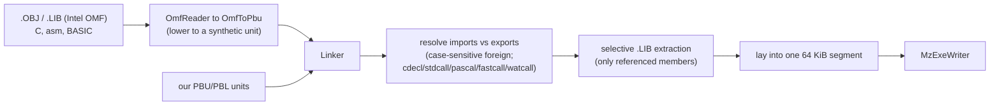

# Compilation pipeline & where optimization happens

How a `.BAS` becomes a DOS `.EXE`, and **what is optimized in which stage**. For the
exhaustive per-optimization list see `docs/PB36.md`; this document is the map.

## 1. The pipeline end to end

The front end (Lexer, Parser, Binder) is **dialect-driven** (`Dialect.Pb35`,
`Pb36`, `qb45`, `gw`, ...) but does **no optimization** — it produces a faithful
`SemanticModel`. All optimization lives in the **CodeGenerator** and the **Linker**.

## 2. The golden rule that gates everything

- **`Optimize` off** → output must match the genuine vintage compiler byte-for-byte
  (validated by `scripts/run-diff-tests.sh`). Every optimization pass is gated on
  `Optimize`, so the golden gate is never touched.
- **`OptimizeSpeed`** (`$OPTIMIZE SPEED` / `-OZF`) enables the more aggressive,
  size-trading passes on top of `Optimize`.
- pb36 is "pb35 + optimization": with `Optimize` off, pb36 output equals pb35.

## 3. The three optimization tiers inside CodeGenerator

**Tier 1 — model-level pre-passes.** Run once over the whole `SemanticModel`
*before* emission (`EmitExecutable`, the `if (Optimize && !isUnit)` block), in this
exact order: `OptPruner` then `OptFloatDemotion` then `OptIpcp` then `OptRegParm`
(SPEED), and the live-set from `OptReachability` is consumed at the emission loop.
They reshape the AST/model so the later tiers see less, simpler code.

**Tier 2 — per-statement emission.** As each statement/expression is lowered to
8086, the emitter applies local optimizations inline (peephole, strength reduction,
CSE, copy-prop, branch folding, the trivial-function inliner, etc.), most gated on
`Optimize`, the aggressive ones additionally on `OptimizeSpeed`. There is also an
SSA mid-end (CFG / dominators / SSA / SCCP) feeding O17 and O2 dead-store elimination.

**Tier 3 — layout/output.** After the body is emitted: the runtime is appended and
**trimmed to only the sections the program reaches**, data is laid out on demand,
BSS is reserved, the image is right-sized, and trivial programs collapse to a tiny
COM-style image.

## 4. Who may be optimized — the ownership model

Some Tier-1 passes change the calling ABI or *remove* code, so they may only touch
procedures the compiler **fully owns** (sees every caller, nothing external can reach):

`IsFullyOwned(proc) = proc.IsNested || (!isUnit && !allowExternalCalls)`.

- **Whole self-contained main**: everything is owned, full freedom.
- **`$COMPILE UNIT/LIB`**: its top-level procedures are **exported** — their *bodies*
  are still optimized (Pruner + FloatDemotion run in `EmitUnit`, and inlining
  applies), but their calling convention is preserved and they are never removed.
  **Nested** procedures inside a unit are private, so they remain fully owned
  (inlinable / purgeable / ABI-changeable).
- IPCP, register-param passing (O21) and dead-procedure elimination (O22) consume
  this predicate; the body-local passes (Tier 2, Pruner, FloatDemotion) apply to
  any procedure.

## 5. O22 reachability — the tree-shaker (and the data dimension)

- **Transitive**: a procedure reached only from other dead procedures is dead; a
  nested function inside a dead-end procedure is purged with it.
- **Sound by construction**: `OptReachability.DescendantNodes` visits *every*
  statement and expression (reflection over the AST, flattening lists/tuples), so no
  reference is ever missed — a missed reference would wrongly drop live code.
- **Data dimension** (O23, `OptDeadGlobals`): a global that is never *read* is dead → its
  data slot and its pure-write assignments are removed; and the **CODEPTR cascade** —
  `g = CODEPTR(P)` where `g` is never read → the store is dead → `P` loses its only
  reference → `P` is purged too. Dead globals, dead stores and live procedures are solved
  together to a fixpoint. Conservative guards keep any `VARPTR`-aliased / `COMMON` /
  `SHARED` / array / UDT / `AT` global, or any store whose RHS could trap (a call, a deref,
  or arithmetic under `$ERROR NUMERIC/OVERFLOW/BOUNDS`).

## 6. The Linker stage (foreign code)

The linker resolves a BASIC program's `DECLARE ... ALIAS` calls against third-party
OMF objects/libraries, honouring the calling convention, pulling only the library
members actually referenced, and laying everything into the single real-mode segment
the MZ writer emits. See `docs/LINKER.md`.

---

## 7. Listing output (`--list`)

`pbc --list <source.bas>` compiles the program normally (unit or EXE) and then,
instead of writing the binary artifact, renders a deterministic human-readable
map of the emitted image to `<source>.LST` (override with `-O <file>`):

- a header: source name, dialect, target, CPU/feature flags, and code / data /
  bss sizes;
- a procedure table: each SUB/FUNCTION (and any link-resolved `EXTERN`) with its
  code offset, kind and canonical signature;
- the bound runtime labels (`rt_*`) the program reaches, each with its offset;
- the module data layout (variable slots with offset and size);
- for a `$COMPILE UNIT`, the unit's exports and imports.

It is pure reporting: `Listing.Render` (in `PowerBasic.Compiler/Emit/Listing.cs`)
is a side-effect-free formatter fed by `CodeGenerator.DescribeImage()`, a
read-only post-emission snapshot. Code generation is never altered.

## 8. Back-emitter (`--emit-basic`) — turning any dialect back into PB 3.5

`pbc --emit-basic <source.bas>` un-parses the bound program back to readable,
**PB 3.5-compatible** PowerBASIC source (to `-O <file>` or stdout).
`BasicWriter.Render` (in `PowerBasic.Compiler/Emit/BasicWriter.cs`) draws from two
inputs so the result is both faithful and complete:

- **Declarations and procedure signatures** come from the surface `CompilationUnit`
  — the binder routes `TYPE`/`UNION`/`ENUM`/`DECLARE`/`DEF FN`/`SUB`/`FUNCTION`,
  `%`-equates and `DEF`-type statements out of the executable body, so they have to
  be re-emitted from the unit (with the return-type suffix preserved — `FUNCTION F%`,
  not `FUNCTION F`).
- **Executable statements** come from the bound model's `MainBody` / procedure bodies
  — the post-splice surface tree that carries the binder's own **pb36 → pb35 lowering**
  in its side-tables. Consulting `Desugared`, `DesugaredStatements`, `RewrittenIndex`,
  `ResolvedConstants` and `ReorderedArguments` emits the desugared core form: an
  interpolated string comes back as concatenation, `arr(^1)` as `UBOUND(arr)-1+1`, an
  enum reference as its literal, a member-call statement as a plain call, named
  arguments in positional order. Integer literals are spelled so they round-trip
  exactly — a magnitude beyond `LONG` keeps a `&&` suffix (so it is not promoted to a
  float), and a boundary negative such as `INTEGER -32768` is emitted as the
  two's-complement `&H8000` pattern (the only way PB can spell it).

Anything not yet modelled degrades to a `' [unsupported: ...]` comment, never a
dropped statement.

**`$COMPAT` — replicating a dialect's runtime under pb35.** Cross-family dialects
(QB/PDS/BASICA/GW/TB and the older PB versions) have a *different* runtime than pb35 —
distinct `PRINT` float formatting (exponent `E`/`D` marker and pad width, significant
digits, fixed/scientific threshold), 16-bit integer arithmetic (`32767+1` wraps to
`-32768`), `CINT` round-half-away, `VAL` radix wrapping (`VAL("&H10000")=0`), a
`^Z`-on-close EOF marker, and dialect constant-folding quirks. So the back-emitter emits
a **`$COMPAT <dialect>`** directive (for every non-pb35 dialect) that makes the pb35
recompile reproduce exactly those behaviours: `SemanticModel.CompatDialect` drives an
`EffectiveDialect` (the `$COMPAT` override else the compile dialect) consulted by the
runtime float formatter and `^Z`/`VAL` paths and by the binder's integer-arithmetic
promotion — while the binder's compile dialect still gates *syntax* (the emitted source
is pb35). The back-emitter also narrows single-precision observables with `CSNG` (those
families compute `SINGLE` expressions in single throughout) and re-emits equates by their
folded value (reproducing folding quirks).

**What round-trips, and how far.** The back-emitter always produces *compile-clean* pb35
for every dialect (the `scripts/roundtrip-check.sh` gate recompiles every corpus program's
emitted source under the pb35 dialect — 246/246 batteries, zero fallback markers, run in
CI). *Runtime-identical* output — the emitted source recompiled under pb35 **with
`--optimize`**, executed, and diffed against the genuine oracle — holds for the whole pb35
battery and pb36 (same programs, optimizer on), and, via `$COMPAT`, for the cross-family
batteries: **24 of 26** dialect programs reproduce the oracle byte-for-byte (up from 4
before the compatibility work). The residual two are a single QB transcendental edge
(`LOG(2.718281828459045#)`) that differs in the 16th significant digit — a sub-ULP x87
evaluation difference between the pb35 and QB code paths, the floating-point floor.

This is the dual of the optimizer axis: every dialect *may be fully optimized*
(`--optimize`, on by default only for pb36 but valid for all — see the
`OptimizeAllDialectsTests` matrix), and every dialect *can be turned back into pb35*
that runs the same.

---

### Stage cheat-sheet

| Stage | Runs | Gated by | Examples |
|-------|------|----------|----------|
| Front end | always | dialect | lex / parse / bind (no opt) |
| Tier 1 pre-passes | once, pre-emission | `Optimize` (+ ownership, SPEED, pb36) | Pruner, FloatDemotion, IPCP, RegParm, Reachability |
| Tier 2 emission | per statement | `Optimize` / `OptimizeSpeed` | fold, CSE, peephole, inline, tail-call, SCCP |
| Tier 3 layout | post-emission | `Optimize` (+ self-contained) | runtime trim, BSS, .COM, trivial-I/O |
| Linker | always (foreign when `$LINK`) | — | OMF read, convention, selective extraction |
