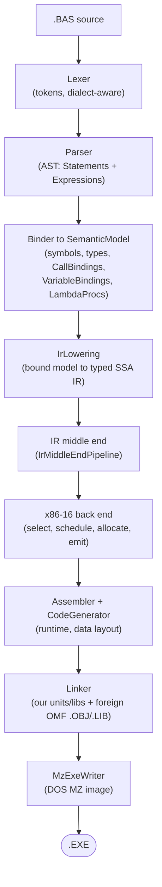
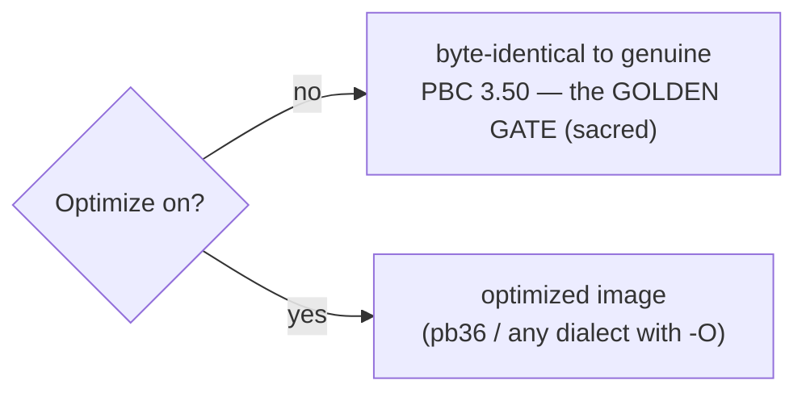
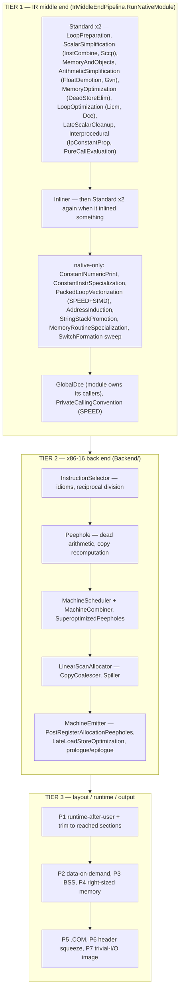
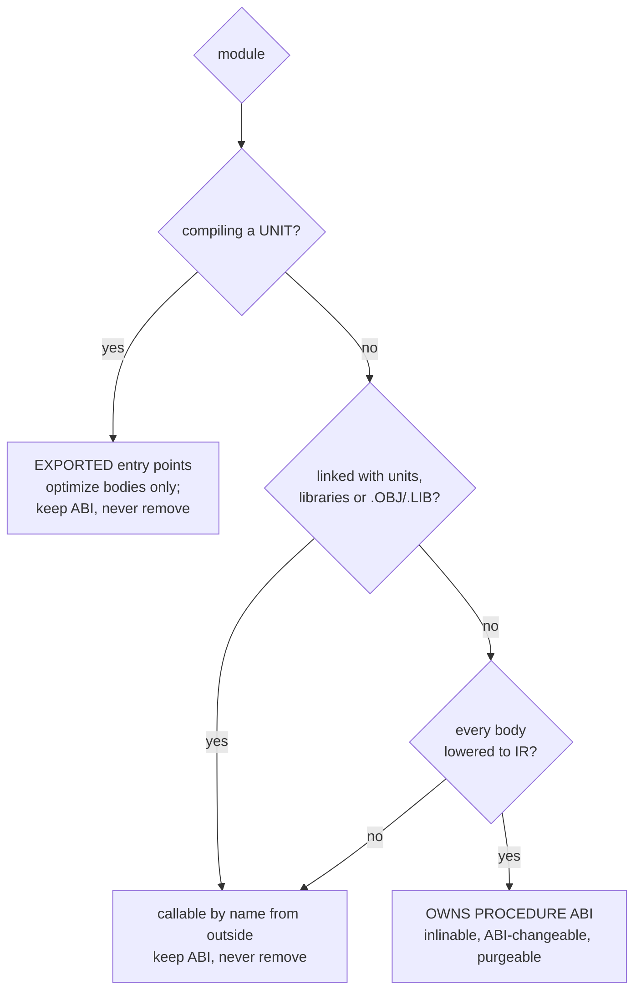
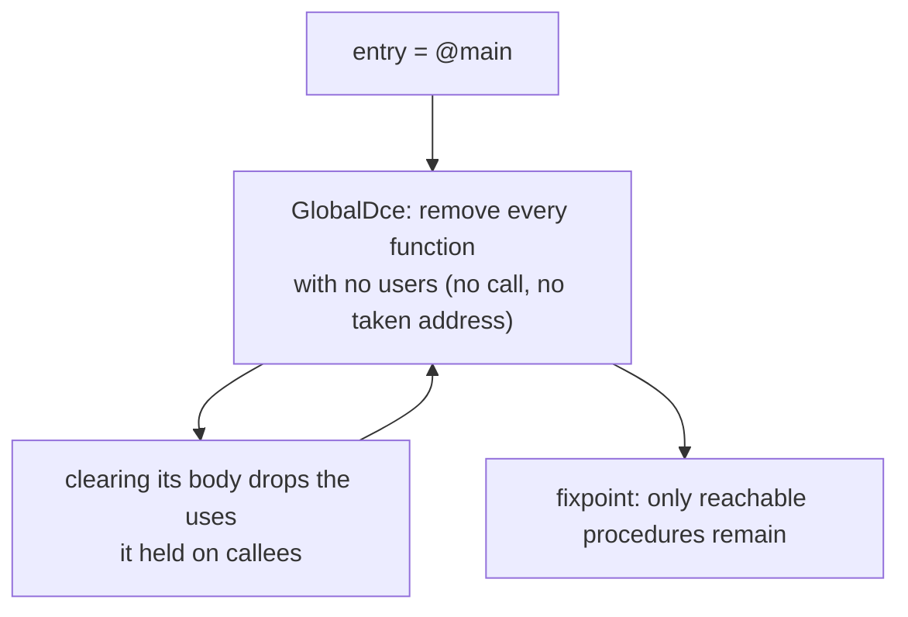
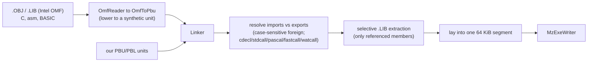

# Compilation pipeline & where optimization happens

How a `.BAS` becomes a DOS `.EXE`, and **what is optimized in which stage**. For the
exhaustive per-optimization list see `docs/PB36.md`; this document is the map.

## 1. The pipeline end to end

The front end (Lexer, Parser, Binder) is **dialect-driven** (`Dialect.Pb35`,
`Pb36`, `qb45`, `gw`, ...) but does **no optimization** — it produces a faithful
`SemanticModel`. There is one code generator: every procedure body is lowered to
the IR, optimized there, and compiled by the x86-16 back end. Routing is mandatory —
a body the back end declines is a compile error ("routing is mandatory and 'X' was
not taken by the x86-16 back end: …"), never a silent fallback. All optimization
lives in the IR middle end, the back end, the image layout and the **Linker**.

## 2. The golden rule that gates everything

- **`Optimize` off** → the program must behave exactly like the genuine vintage
  compiler's (validated by `scripts/run-diff-tests.sh`, which compares each
  program's observable output, `RESULT.TXT`, byte for byte). Unoptimized, the middle
  end runs only `IrMiddleEndPipeline.Legalize`, so no optimization touches the gate.
- **`OptimizeSpeed`** (`$OPTIMIZE SPEED` / `-OZF`) enables the more aggressive,
  size-trading passes on top of `Optimize`.
- pb36 is "pb35 + optimization": with `Optimize` off, pb36 output equals pb35.

## 3. The three optimization tiers

**Tier 1 — the IR middle end.** `Ir/IrLowering.cs` turns the bound model into typed
SSA IR; `Ir/Passes/IrMiddleEndPipeline.cs` then optimizes the whole module.
`RunNativeModule` runs `Standard(...)` twice (unoptimized: `Legalize(...)` twice), then
the `Inliner`, and `Standard` twice more when it inlined something. `Standard` is
organized in named phases — LoopPreparation, ScalarSimplification, MemoryAndObjects,
ArithmeticSimplification, MemoryOptimization, LoopOptimization, LateScalarCleanup and
the module-level Interprocedural phase (read `IrMiddleEndPipeline.cs` for the exact
pass list). After it come the passes that are only right for the DOS target:
`ConstantNumericPrint`, `ConstantInstrSpecialization`, `PackedLoopVectorization`
(SPEED with SIMD), `AddressInduction` (steps array addresses; runs
`AddressOffsetNarrowing` first), `StringStackPromotion`, `MemoryRoutineSpecialization`,
a `SwitchFormation` sweep, `GlobalDce` when the module owns its callers, and
`PrivateCallingConvention` under SPEED. Value ranges and known bits come from
`Ir/Analysis/IrRangeAnalysis.cs` and `Ir/Analysis/IrKnownBitsAnalysis.cs`.

**Tier 2 — the x86-16 back end.** `Backend/InstructionSelector` turns each IR function
into machine instructions over virtual registers; `Peephole` (including dead-arithmetic
removal and copy recomputation), `MachineScheduler` (with `MachineCombiner` and
`SuperoptimizedPeepholes`), `LinearScanAllocator` (`CopyCoalescer`, `Spiller`) and
`MachineEmitter` (`PostRegisterAllocationPeepholes`, `LateLoadStoreOptimization`,
prologue/epilogue) follow, and `Asm/Assembler` encodes the result. Optimizing rewrites
are gated on `Optimize`, the aggressive ones additionally on `OptimizeSpeed`.

**Tier 3 — layout/output.** After the bodies are emitted: the runtime is appended and
**trimmed to only the sections the program reaches**, data is laid out on demand,
BSS is reserved, the image is right-sized, and trivial programs collapse to a tiny
COM-style image.

## 4. Who may be optimized — the ownership model

Some interprocedural passes change the calling ABI or *remove* procedures, so they
may only run when the compiler **owns** every procedure (sees every caller, nothing
external can reach one):

`IrModule.OwnsProcedureAbi` (set in `CodeGen/CodeGenerator.Backend.cs`) is true only for
a self-contained main program linked with no unit, library or object file, whose every procedure body is in
the module.

- **Whole self-contained main**: everything is owned, full freedom.
- **`$COMPILE UNIT/LIB`**: its procedures are **exported** — their *bodies* are still
  optimized, but their calling convention is preserved and they are never removed.
- `GlobalDce` (O22), `PrivateCallingConvention` (O0282/O21), dead-parameter elimination
  and argument-structure reduction consume this flag; the function passes apply to any
  procedure.

## 5. O22 reachability — the tree-shaker (and the data dimension)

- **Transitive**: a procedure reached only from other dead procedures is dead — its
  last caller's removal leaves it without users, and the next sweep takes it. A
  procedure inlined into every caller goes the same way.
- **Runs last**: `RunNativeModule` runs `GlobalDce` after inlining and the native-only
  passes, and only when `IrModule.OwnsProcedureAbi` holds.
- **Data dimension** (O23): on the native build a global gets a data slot only once
  emitted code references it, and `LocalizeGlobals` turns a write-first global used by
  one procedure into a local that `Mem2Reg`/`Dce` then remove. `GlobalDce`'s own sweep of
  unreferenced globals runs only on the C/LLVM path (`removeGlobals: false` natively),
  because the DOS build resolves IR globals by name. See
  `docs/optimizations/O0023-dead-global-elimination.md`.

## 6. The Linker stage (foreign code)

The linker resolves a BASIC program's `DECLARE ... ALIAS` calls against third-party
OMF objects/libraries, honouring the calling convention, pulling only the library
members actually referenced, and laying everything into the single real-mode segment
the MZ writer emits. See `docs/LINKER.md`.

---

## 7. Listing output (`--list`)

`pbc --list <source.bas>` compiles the program normally (unit or EXE) and then,
instead of writing the binary artifact, renders a deterministic human-readable
map of the emitted image to `<source>.LST` (override with `-O <file>`):

- a header: source name, dialect, target, CPU/feature flags, and code / data /
  bss sizes;
- a procedure table: each SUB/FUNCTION (and any link-resolved `EXTERN`) with its
  code offset, kind and canonical signature;
- the bound runtime labels (`rt_*`) the program reaches, each with its offset;
- the module data layout (variable slots with offset and size);
- for a `$COMPILE UNIT`, the unit's exports and imports.

It is pure reporting: `Listing.Render` (in `PowerBasic.Compiler/Emit/Listing.cs`)
is a side-effect-free formatter fed by `CodeGenerator.DescribeImage()`, a
read-only post-emission snapshot. Code generation is never altered.

## 8. Back-emitter (`--emit-basic`) — turning any dialect back into PB 3.5

`pbc --emit-basic <source.bas>` un-parses the bound program back to readable,
**PB 3.5-compatible** PowerBASIC source (to `-O <file>` or stdout).
`PowerBasic35Emitter.Render` (in `PowerBasic.Compiler/Emit/PowerBasic35Emitter.cs`) draws from two
inputs so the result is both faithful and complete:

- **Declarations and procedure signatures** come from the surface `CompilationUnit`
  — the binder routes `TYPE`/`UNION`/`ENUM`/`DECLARE`/`DEF FN`/`SUB`/`FUNCTION`,
  `%`-equates and `DEF`-type statements out of the executable body, so they have to
  be re-emitted from the unit (with the return-type suffix preserved — `FUNCTION F%`,
  not `FUNCTION F`).
- **Executable statements** come from the bound model's `MainBody` / procedure bodies
  — the post-splice surface tree that carries the binder's own **pb36 → pb35 lowering**
  in its side-tables. Consulting `Desugared`, `DesugaredStatements`, `RewrittenIndex`,
  `ResolvedConstants` and `ReorderedArguments` emits the desugared core form: an
  interpolated string comes back as concatenation, `arr(^1)` as `UBOUND(arr)-1+1`, an
  enum reference as its literal, a member-call statement as a plain call, named
  arguments in positional order. Integer literals are spelled so they round-trip
  exactly — a magnitude beyond `LONG` keeps a `&&` suffix (so it is not promoted to a
  float), and a boundary negative such as `INTEGER -32768` is emitted as the
  two's-complement `&H8000` pattern (the only way PB can spell it).

Anything not yet modelled degrades to a `' [unsupported: ...]` comment, never a
dropped statement.

**`$COMPAT` — replicating a dialect's runtime under pb35.** Cross-family dialects
(QB/PDS/BASICA/GW/TB and the older PB versions) have a *different* runtime than pb35 —
distinct `PRINT` float formatting (exponent `E`/`D` marker and pad width, significant
digits, fixed/scientific threshold), 16-bit integer arithmetic (`32767+1` wraps to
`-32768`), `CINT` round-half-away, `VAL` radix wrapping (`VAL("&H10000")=0`), a
`^Z`-on-close EOF marker, and dialect constant-folding quirks. So the back-emitter emits
a **`$COMPAT <dialect>`** directive (for every non-pb35 dialect) that makes the pb35
recompile reproduce exactly those behaviours: `SemanticModel.CompatDialect` drives an
`EffectiveDialect` (the `$COMPAT` override else the compile dialect) consulted by the
runtime float formatter and `^Z`/`VAL` paths, by the binder's integer-arithmetic promotion
and intrinsic return typing, and by codegen's math-intrinsic result narrowing
(`RoundFpuToIntrinsicType` — the Microsoft family has no 80-bit extended type, so it narrows
the extended `FYL2X` result to its declared 64-/32-bit precision; without it `LOG(e#)` prints
the extended `.9999999999999999` instead of `1`) — while the binder's compile dialect still
gates *syntax* (the emitted source is pb35). The back-emitter also narrows single-precision
observables with `CSNG` (those families compute `SINGLE` expressions in single throughout)
and re-emits equates by their folded value (reproducing folding quirks).

**What round-trips, and how far.** The back-emitter always produces *compile-clean* pb35
for every dialect (the `scripts/roundtrip-check.sh` gate recompiles every corpus program's
emitted source under the pb35 dialect — 246/246 batteries, zero fallback markers, run in
CI). *Runtime-identical* output — the emitted source recompiled under pb35 **with
`--optimize`**, executed, and diffed against the genuine oracle — holds for the whole pb35
battery and pb36 (same programs, optimizer on), and, via `$COMPAT`, for **every** cross-family
battery: all **26 of 26** dialect programs (BASICA/GW/QB 1.0–4.5/QBasic/PDS 7.0–7.1/TB 1.0–1.1
and the older PB versions) reproduce the genuine oracle byte-for-byte — up from 4 before the
compatibility work.

This is the dual of the optimizer axis: every dialect *may be fully optimized*
(`--optimize`, on by default only for pb36 but valid for all — see the
`OptimizeAllDialectsTests` matrix), and every dialect *can be turned back into pb35*
that runs the same.

---

### Stage cheat-sheet

| Stage | Runs | Gated by | Examples |
|-------|------|----------|----------|
| Front end | always | dialect | lex / parse / bind (no opt) |
| Tier 1 IR middle end | per module | `Optimize` (+ ownership, SPEED) | InstCombine, SCCP, GVN, LICM, FloatDemotion, IpConstantProp, Inliner, GlobalDce, PrivateCallingConvention |
| Tier 2 x86-16 back end | per procedure | `Optimize` / `OptimizeSpeed` | selection idioms, peephole, scheduling, linear-scan allocation |
| Tier 3 layout | post-emission | `Optimize` (+ self-contained) | runtime trim, BSS, .COM, trivial-I/O |
| Linker | always (foreign when `$LINK`) | — | OMF read, convention, selective extraction |
